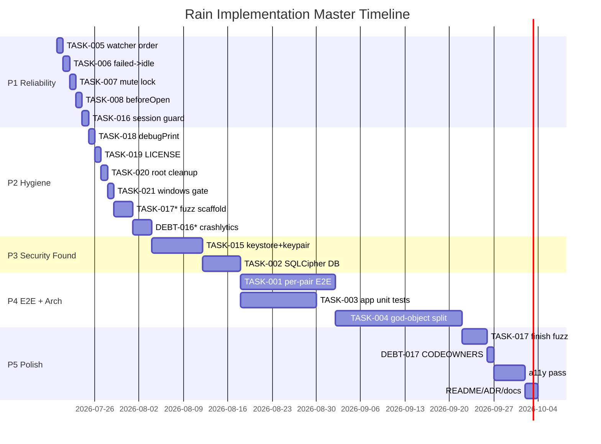

# 01 — IMPLEMENTATION MASTER PLAN

**Single source of truth for executing every TODO in the Rain second-pass audit.**
Upstream inputs (all in repo root): `PROJECT_DEEP_ANALYSIS.md`, `01_EXECUTIVE_ACTION_PLAN.md`, `02_ENGINEERING_BACKLOG.md` (TASK-001…021), `03_ARCHITECTURE_REFACTOR_PLAN.md`, `04_SECURITY_HARDENING.md`, `05_PERFORMANCE_OPTIMIZATION.md`, `06_TECHNICAL_DEBT_REGISTER.md`, `07_PRODUCTION_READINESS_CHECKLIST.md`, `08_IMPLEMENTATION_ROADMAP.md`, `09_SPRINT_PLANNING.md`, `10_FINAL_VERDICT.md`.

**Branch:** execute on `dev` (current HEAD `6ed4a00`). One logical phase per commit, per `CONTINUITY.md`.
**Verification baseline (this plan is planning-only):** No code written yet. `dart analyze .` last passed (first pass). Tests/flutter-build/emulator NOT re-run. Every phase below lists its own validation gate.

---

## 0. How to use this plan
1. Read the phase doc (`02_PHASE_01_*.md` … `06_PHASE_05_*.md`).
2. Each phase has small Tasks (≤ a few hours). Do them in order; each has `Validation` you must pass before `Exit criteria`.
3. Update `PROJECT_PROGRESS_TRACKER.md` after each task (pattern at §9).
4. Do NOT start Phase 3 until Phase 2 (TASK-015) merges — TASK-001/002 have no safe key home without it.
5. Run the repo's standard gate before any push: `dart pub get` → `dart run melos run analyze` → `dart run melos run test` → `flutter test <phase tests>` → `.\scripts\check_obsidian_vault.ps1`.

---

## 1. Phase Summary (logical, not TODO order)

| # | Phase | Goal | Est. | Risk | Key TASKs |
|---|---|---|---|---|---|
| 1 | **Call Reliability Hardening** | Kill cheap high-impact call-correctness bugs + make `failed` terminal | 1 wk | LOW | 005,006,007,008,016 |
| 2 | **Stability & Hygiene** | Close LOW debt; scaffold fuzz + telemetry | 1 wk | LOW | 018,019,020,021,017*,DEBT-016* |
| 3 | **Security Foundation** | OS-backed key store + encrypted DB | 2 wk | MED | 015,002 |
| 4 | **Real E2E + Architecture** | Per-pair signaling; begin god-object extraction; app tests | 4–6 wk | HIGH | 001,003,004 |
| 5 | **Polish & Production Gate** | Clear remaining FAILs; a11y; CODEOWNERS; docs | 1–2 wk | LOW | 017,DEBT-017,a11y,README |

\* = started in P2, finished P5.

---

## 2. Priority Matrix (every TASK, with reasoning)

### Critical (blocks production privacy/security claim)
- **TASK-015** — key store + identity keypair. *Reasoning:* keystone; without it TASK-001/002 cannot store keys safely. Confidence **High**.
- **TASK-002** — SQLCipher DB. *Reasoning:* clears cleartext-DB FAIL. Confidence **High**.
- **TASK-001** — per-pair E2E signaling. *Reasoning:* clears shared-key FAIL; core privacy promise. Confidence **High**.

### High
- **TASK-003** — app-layer unit tests + split 9k test. *Reasoning:* regression net for riskiest layer; dev velocity. Confidence **High**.
- **TASK-004** — god-object split. *Reasoning:* de-risks call surface; long pole. Confidence **High**.

### Medium
- **TASK-005** (watcher order) — *best ratio; do first.* Confidence **High**.
- **TASK-006** (`failed→idle`) — unblocks extraction. Confidence **High**.
- **TASK-007** (mute lock). Confidence **High**.
- **TASK-008** (`beforeOpen`). Confidence **High**.
- **TASK-016** (session reuse guard). Confidence **Medium** (inferred).
- **TASK-017** (rules fuzz). Confidence **High**.
- **DEBT-016** (Crashlytics). Confidence **High**.

### Low
- **TASK-018** (debugPrint cleanup) — *release no-op, so LOW.* Confidence **High**.
- **TASK-019** (LICENSE). Confidence **High**.
- **TASK-020** (root cleanup). Confidence **High**.
- **TASK-021** (Windows merge-gate). Confidence **High**.
- **DEBT-017** (CODEOWNERS). Confidence **High**.

### Nice-to-Have
- Quota reconcile Function (defense-in-depth; quota already server-enforced).
- Accessibility pass (currently UNKNOWN in readiness; needed before store).

---

## 3. Master Timeline

### Critical path
`P1 → P2 → P3(TASK-015) → P3(TASK-002) → P4(TASK-001) → P4(TASK-004)`.
The long pole is **TASK-004** (XL, 20d) and **TASK-001** (L, 15d). Everything else parallelizes around them.

### Parallel work opportunities
- P1's 005/006/007/008/016 are independent — run as 5 parallel branches, merge sequentially.
- P2's 018/019/020/021 independent — parallel.
- P4: TASK-003 (tests) can run **concurrently** with TASK-001 (crypto) since tests are additive.

### Potential blockers
- **P3 TASK-015:** `flutter_secure_storage` on Windows uses a file-backed store (not hardware TPM) — acceptable but document it. If Windows credential API misbehaves, fallback to `flutter_secure_storage` default (encrypted file). Confidence **Medium** for Windows path.
- **P4 TASK-001:** breaking envelope change — needs versioned `v=1`/`v=2` interop; old builds can't decrypt `v=2`. Mitigate with fallback window.
- **P4 TASK-004:** behavior drift during extraction — must golden-test first.

### Risk hotspots
- TASK-001 (crypto, breaking), TASK-002 (irreversible migration), TASK-004 (XL refactor), TASK-016 (inferred interaction).

---

## 4. Global Risk Register (summary; detail per-phase)

| Risk | Type | Mitigation |
|---|---|---|
| Per-pair crypto breaks old builds | Security/Migration | Versioned envelopes `v=1` shared-root fallback for N weeks |
| SQLCipher migration corrupts DB | Migration | Copy plaintext→new cipher file; delete original only after verified copy; `beforeOpen` validates |
| God-object extraction drifts behavior | Architectural | Characterization/golden tests before moving code; feature-flag each coordinator |
| Keystore missing on Windows | Technical | `flutter_secure_storage` default encrypted-file fallback; document |
| TASK-016 wrong assumption | Technical (Medium conf.) | Add explicit reuse-guard test; if disproven, convert to doc-only |

---

## 5. Global Rollback Principle
- Every phase = separate commit/PR on `dev`.
- Feature-flag risky extractions (TASK-004) behind `VoiceCallArchV2` runtime flag; keep old path until new path green 1 week.
- DB migrations (TASK-002) write to a **new** cipher file; never mutate-in-place. Original plaintext preserved until copy verified → one-command revert = delete new file.
- Envelope version is **additive** — revert `signaling_cipher.dart` to `v=1` path if `v=2` interop fails.

---

## 6. Documentation Update Map (applies every phase)
- `README.md` — privacy caveat (L-5), LICENSE link (019).
- `obsidian-vault/03-Architecture/*` — architecture changes per phase.
- `obsidian-vault/11-Technical Debt/*` — close DEBT items as fixed.
- `obsidian-vault/12-Risks/*` — add risk for crypto/migration.
- `obsidian-vault/14-Blockers/*` — record P3 blocking dependency.
- `CONTINUITY.md` — append phase completion + validation evidence.
- `ADR-010` — mark Option B (encryption) in-progress→done.
- Run `.\scripts\check_obsidian_vault.ps1` after every doc change.

---

## 7. Assumptions & Confidence
- **High:** all code-path findings (file:line cited in `02_ENGINEERING_BACKLOG.md`).
- **Medium:** TASK-016 (interaction inferred, not executed); Windows `flutter_secure_storage` behavior (not built yet).
- **Not executed this plan:** `flutter test`, emulator contract tests, `flutter build`. Claims of "passing" are from prior `CONTINUITY.md`, not re-run.
- **Assumption:** `dart run melos run analyze`/`test` are the repo's real gates (AGENTS.md cites them); `melos.yaml` location not confirmed at plan time — verify with `dart run melos list` before P1 Task 1.

---

## 8. Phase Docs (companion files)
- `02_PHASE_01_RELIABILITY.md`
- `03_PHASE_02_STABILITY_HYGIENE.md`
- `04_PHASE_03_SECURITY_FOUNDATION.md`
- `05_PHASE_04_E2E_ARCHITECTURE.md`
- `06_PHASE_05_POLISH_PROD_GATE.md`
- `PROJECT_PROGRESS_TRACKER.md` (live status)

---

## 9. Progress Tracker Format (see `PROJECT_PROGRESS_TRACKER.md`)
Maintain: overall %, per-phase %, task checklist (TODO/IN-PROGRESS/DONE), blockers, risks, notes, decisions, change-log, next actions. Update after every task.

---

## 10. Go / No-Go Gates (between phases)
- **After P1:** Go if `melos test` green + integration proves fast-answer + no terminal resurrection.
- **After P2:** Go if merge-gate fails on missing Windows file + >0 raw prints.
- **After P3:** Go if keystore round-trips on Android+Windows + DB file non-plaintext + full row copy.
- **After P4:** Go if `signaling_cipher_test` proves per-pair keys differ + random salt; no `lib/` file >800 lines; coverage floor 40%.
- **After P5:** Go if `07_PRODUCTION_READINESS_CHECKLIST.md` shows 0 FAIL + a11y PASS/FAIL recorded + vault validator green.

> This master plan is the execution blueprint. Each phase doc is self-contained for a senior engineer. No further planning required to start P1.
