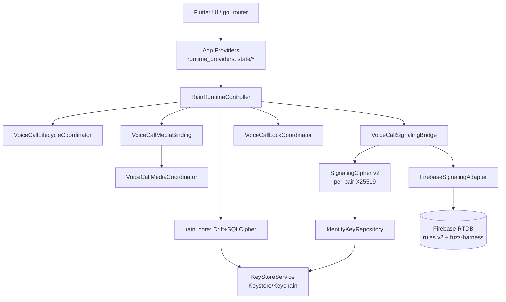

# 03 — Architecture Refactor Plan

**Goal:** Document every area that should be refactored, with current design → target design, migration steps, risk, and rollback. All tied to `PROJECT_DEEP_ANALYSIS.md` findings (H-1..H-4, M-1..M-6, L-3/L-4).

---

## R-1 — Call Engine God-Object Split  (TASK-004)
**Current design:** `apps/rain/lib/application/runtime/voice_call_runtime.dart` = **3,106 lines** owning command orchestration, room reconciliation, lock coordination, state mutation, and terminal cleanup. `firebase_adapter.dart` (2,912) and `rain_runtime_controller.dart` (2,573) similarly monolithic.

**Problems:**
- A single class owns the entire call FSM + Firebase I/O + media lifecycle.
- Last 3 commits all fixed races *inside* this file — concentrated risk.
- No mirror unit tests → every change is a full-integration gamble.
- `voice_call_runtime.dart` **grew** 3,084→3,106 since the last audit despite extraction.

**Target design:** One coordinator per concern, each behind a narrow interface, wired in `RainRuntimeController`:
```
voice_call_runtime.dart (orchestrator, <400 lines)
 ├── VoiceCallLifecycleCoordinator   (FSM: preflight→ringing→connecting→active→ending→failed)
 ├── VoiceCallMediaBinding         (media session create/dispose, owns VoiceCallMediaCoordinator)
 ├── VoiceCallSignalingBridge     (Firebase watch/offer/answer/ICE send + cleanup)
 ├── VoiceCallLockCoordinator     (activeVoicePairs/activeVoiceUsers claim/reclaim)
 └── VoiceCallTerminalReconciler (terminal room state + late-Firebase echo handling)
```
`firebase_adapter.dart` → `presence_adapter.dart`, `session_adapter.dart`, `voice_lock_adapter.dart`, `ice_adapter.dart`.

**Migration steps:**
1. Add **characterization/golden tests** for current behavior (no code change).
2. Extract `VoiceCallMediaBinding` (media create/dispose) — covered by `voice_call_runtime_media_path_test`.
3. Extract `VoiceCallLockCoordinator` (already partly in `voice_lock_reclaim_policy.dart`).
4. Extract `VoiceCallSignalingBridge` from `_watchFirebaseVoiceCall` + send paths.
5. Extract `VoiceCallLifecycleCoordinator` (FSM) — requires TASK-006 (`failed→idle` removed) first.
6. Add CI line-limit gate (fail > 1,000).

**Risk:** HIGH. Behavior drift during move.
**Rollback:** Feature-flag each extraction behind a `VoiceCallArchV2` runtime flag; keep old path until new path's golden tests pass in CI for 1 week. Git revert per-coordinator is clean because each is a new file.

---

## R-2 — Per-Pair Cryptography & Secure Key Store  (TASK-001 + TASK-002 + TASK-015)
**Current design:** `SignalingCipher.fromKeyMaterial(singleBuildKey)` (shared, baked via `RAIN_SIGNALING_ENCRYPTION_KEY`). No key store. `Identity` = username/displayName/gender only. DB opened with plain `driftDatabase` (no SQLCipher).

**Problems:** Shared key = obfuscation, not E2E (H-1). Constant HKDF salt (M-6). Cleartext local DB (H-2). No OS-backed secret store to anchor either fix.

**Target design:** `KeyStoreService` (Keystore/Keychain via `flutter_secure_storage`) → `IdentityKeyRepository` (per-user X25519 keypair; **private key never leaves secure store**). On friendship: X25519 ECDH → per-pair root. HKDF derives signaling/media keys bound to `(usernameA, usernameB, sessionId, randomSalt)`. DB opened with SQLCipher key from secure store.

**Migration steps:**
1. TASK-015: add `flutter_secure_storage`; `Identity` migration adds `signingPublicKey` + (encrypted) `signingPrivateKeyRef`; `KeyStoreService` round-trips on Android/Windows.
2. TASK-002: SQLCipher open + one-time plaintext→ciphertext copy migration; delete plaintext.
3. TASK-001: envelope gains `kex` field (per-pair ephemeral pubkey or pre-shared pair key id); old `v=1` envelopes still decryptable (shared-root fallback) for N weeks; `v=2` uses pair key. Bump `SignalingCipher.envelopeVersion` to 2 with interop shim.

**Risk:** HIGH (breaking crypto change). Trade-off: per-pair E2E vs. backward-compat with already-shipped builds — mitigated by versioned envelopes + fallback window.
**Rollback:** Envelope version is additive; revert `signaling_cipher.dart` to `v=1` path if `v=2` shows interop failures. DB migration must write ciphertext to a *new* file and keep plaintext until copy verified, so a failed migration leaves the original intact.

---

## R-3 — App-Layer Testability  (TASK-003)
**Current design:** 112 `lib/` source files, **0** mirror unit tests. All coverage in 3+ giant `test/` suites (`friend_flow_test.dart` = 9,212 lines).

**Problems:** Regressions caught only by heavy integration; unlocalized failures; the 9k-line file means one assertion failure reruns everything.

**Target design:** Mirror structure `lib/application/**` ↔ `test/application/**`. Per-provider unit tests with `ProviderContainer` overrides; per-screen widget tests; flow tests split into `friend_add/remove/block`, `file_transfer_*`, `voice_call_*`.

**Migration steps:** 1) Add `test/application/state/runtime_providers_test.dart` (highest value). 2) Add `test/application/runtime/*_test.dart` per coordinator as R-1 extracts them. 3) Split `friend_flow_test.dart`. 4) CI coverage floor 40% on `apps/rain/lib`.

**Risk:** LOW. **Rollback:** tests only; no production code touched.

---

## R-4 — Call Session State Machine Hardening  (TASK-006 + TASK-016)
**Current design:** `voice_call_session.dart:1095-1135` `switch` allows `failed→idle`, `ending→idle`, `incomingRinging→idle`.

**Problems:** `failed` not strictly terminal → resurrection of media-disposed session (M-2). Compounds with TASK-004 extraction.

**Target design:** `failed`, `ended` strictly terminal. New call = new `VoiceCallSession` instance. `VoiceCallRuntime` rejects reuse of a terminal session.

**Migration steps:** 1) Delete the 3 `→idle` edges. 2) Add `VoiceCallRuntime.assertFreshSession()` guard. 3) Update teardown tests to construct fresh instances.

**Risk:** LOW. **Rollback:** one-line revert.

---

## R-5 — RTDB Rules as Documented + Fuzzed Source  (TASK-017)
**Current design:** `database.rules.json` ~776 lines of dense single-expression booleans; contract tests enumerate cases only.

**Problems:** Correctness blind spot; hard to extend; no property coverage.

**Target design:** `database.rules.template.json` (commented, sectioned) → build step strips comments → deployed `database.rules.json`. Property/fuzz harness in emulator generates random transitions + time-boundary probes vs a spec table.

**Migration steps:** 1) Mirror current rules into templated source. 2) Add fuzz harness. 3) CI runs it against emulator.

**Risk:** LOW. **Rollback:** generated file is byte-identical to current; revert to hand-maintained if build step fails.

---

## R-6 — CI Gate Completeness  (TASK-021, supports R-1/R-2)
**Current design:** Quality gate builds Android only (`flutter build apk`). Windows only in release `build-artifacts.yml`.

**Target design:** Merge-gate adds `windows-config-check` + `windows-build --config-only`; line-limit lint gate; coverage gate.

**Migration steps:** Add jobs to `ci.yml` + `main-merge-gate.yml`; reuse `build-artifacts.yml:149` Windows job pattern.

**Risk:** LOW. **Rollback:** remove job from workflow.

---

## Architecture Diagram (target, R-1/R-2)


