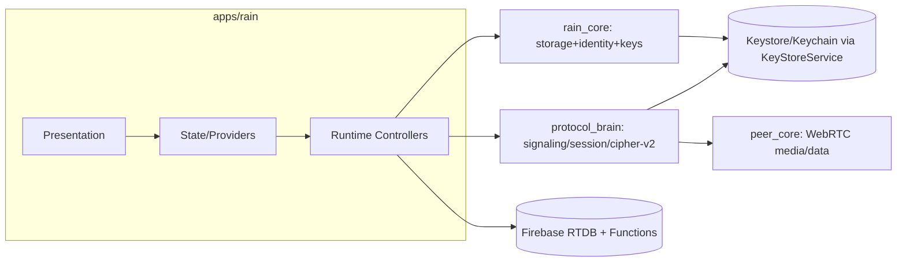
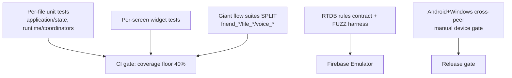

# 08 — Implementation Roadmap (Ideal Architecture)

Target design derived from `PROJECT_DEEP_ANALYSIS.md` + refactoring plan (R-1..R-6). All Mermaid.

---

## 8.1 Ideal Folder Structure

```text
apps/rain/
  lib/
    application/
      runtime/
        voice_call/
          voice_call_lifecycle_coordinator.dart     # FSM owner (<400)
          voice_call_media_binding.dart
          voice_call_signaling_bridge.dart
          voice_call_lock_coordinator.dart
          voice_call_terminal_reconciler.dart
      state/        # mirrored unit tests
      audio/
    infrastructure/
      security/key_store_service.dart          # NEW: Keystore/Keychain
      signaling/  # firebase_adapter split into presence/session/lock/ice
      firebase/
      notifications/
      services/    # sanitizer stays; debug routing via it
    presentation/
      screens/  # each screen <800 lines
      widgets/
      theme/ navigation/ performance/ branding/
    core/config/  # app_environment.dart (per-pair key wiring)
packages/
  peer_core/      # WebRTC primitives (mute lock already added)
  protocol_brain/ # signaling_cipher v2 (per-pair), session FSM (terminal), adapters split
  rain_core/
    identity/      # Identity + IdentityKeyRepository (NEW keypair cols)
    database/       # SQLCipher open + beforeOpen validation
    friends/messages/file_transfer/
backend/firebase/
  database.rules.template.json   # commented source -> generated rules.json
  functions/  # + connectionRequestQuotaReconcile.js (defense-in-depth)
```

## 8.2 Layer Boundaries



Rules: UI renders + forwards intent only. Runtime owns side-effects + conflict decisions. `rain_core` owns persistence + identity keys. `protocol_brain` owns signaling/session policy + envelope crypto. `peer_core` owns WebRTC. Firebase coordinates, never stores chat.

## 8.3 Module Responsibilities

| Module | Owns |
|---|---|
| `KeyStoreService` (new) | OS-backed secret round-trip (identity priv key, DB key, per-pair roots) |
| `IdentityKeyRepository` (new) | X25519 keypair gen/persist; publish pub key to `users/$username` |
| `SignalingCipher v2` | per-pair HKDF key derive + random-salt envelope encrypt/decrypt |
| `VoiceCallLifecycleCoordinator` | call FSM (strictly terminal `failed`/`ended`) |
| `VoiceCallMediaBinding` | media session create/dispose (no leak) |
| `VoiceCallSignalingBridge` | Firebase watch/offer/answer/ICE + cleanup |
| `RainDatabase` | SQLCipher open + `beforeOpen` schema validation |

## 8.4 Design Patterns

- **Coordinator per concern** (extracted from god-objects) — each behind a narrow interface.
- **Strict terminal FSM** for call/session (no `failed→idle`).
- **Serialized mutation queue** (`SerializedRuntimeMutations`, already present) for all runtime state writes.
- **Result/Sealed types** (freezed) for signaling outcomes; no thrown-control-flow.
- **Repository pattern** for `rain_core` (already drift-backed).

## 8.5 Dependency Injection Improvements

- Today: `RuntimeController` constructs adapters directly; `app_environment` passes `signalingEncryptionKey` singleton.
- Target: introduce a **`RainDependencyContainer`** (or Riverpod `Provider` graph) so `KeyStoreService`, `IdentityKeyRepository`, `SignalingCipher`, and the split adapters are provided once and overridable in tests. Enables TASK-003 mirror tests without `flutter` test bootstrap.
- Per-pair key: `SignalingCipher` becomes a **factory** `forPair(pairKey)` rather than a global singleton.

## 8.6 State Management Improvements

- Keep Riverpod 3 (`Provider`/`Notifier`/`AsyncNotifier`) — already idiomatic.
- Add **generation-scoped providers** for account scope (already begun: `AuthenticatedSession.sessionGeneration`).
- Extract call state into `VoiceCallLifecycleCoordinator` exposed via one `voiceCallStateProvider` (single source of truth) — kills the multi-writer mute/state races (M-2/M-3).

## 8.7 Error Handling Strategy

- `SignalingEncryptionException` (already exists) → extend with `keyNotFound` / `peerKeyMissing` for per-pair model.
- Rule violations → typed `ConnectionRequestInputError` (already in `connectionRequestGuardrails.js`) — mirror a Dart equivalent.
- Never swallow: zero empty `catch` (verified). Keep `unawaited()` discipline (110× present).

## 8.8 Logging Strategy

- Single sink: `RainDebugLogService` + `DiagnosticsSanitizer` (already sanitizes).
- **Replace 27 `debugPrint`** (TASK-018) with `RainDebugLogService.log(...)` so release builds route consistently and CI can assert 0 raw prints.
- Remote: add **Crashlytics behind the same sanitizer** (DEBT-016) so field crashes are diagnosable without leaking PII.

## 8.9 Configuration Management

- `app_environment.dart` dart-defines: `RAIN_SIGNALING_ENCRYPTION_KEY` (shared, deprecated by per-pair), `RAIN_TURN_BROKER_URL`, `RAIN_ICE_SERVERS`, `RAIN_ALLOW_PUBLIC_TURN`, `RAIN_UPDATE_URL`.
- Target: keep compile-time config, but **per-pair keys come from `IdentityKeyRepository` (runtime, secure store)**, not from build defines. `validateForRelease()` must also reject missing secure-store + missing identity keypair.

## 8.10 Testing Architecture



- Mirror `lib/` ↔ `test/` (TASK-003).
- Split `friend_flow_test.dart` (9,212) into per-flow files.
- Add **property/fuzz** for RTDB rules (TASK-017).
- Keep emulator contract tests; add daily quota reconciliation test.
- Coverage gate in `ci.yml` (currently only `dart format` + analyze + test).

> Trade-off: per-pair crypto (8.3/8.5) is a **breaking change** — mitigated by versioned envelopes (`v=1` shared-root fallback for N weeks, `v=2` per-pair). SQLCipher migration (8.3) is **irreversible** — mitigate by copying plaintext into a *new* cipher file and deleting original only after verified copy.
