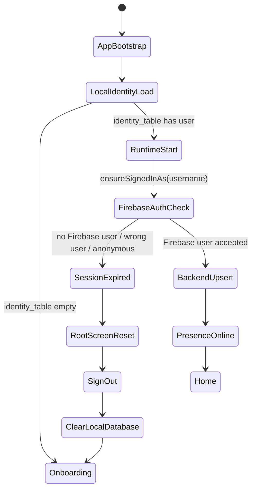
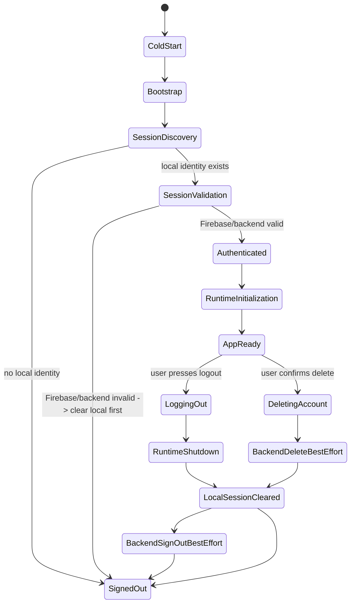

# Account Lifecycle Analysis

Date: 2026-06-03

## Current Lifecycle Summary

Rain does not currently have one account lifecycle. It has several partial lifecycles that interact:

1. Local identity lifecycle in Drift.
2. Firebase Auth lifecycle.
3. RTDB user profile lifecycle.
4. RTDB presence lifecycle.
5. Runtime controller lifecycle.
6. Router/UI lifecycle.

These lifecycle parts are not owned by one coordinator, so they can become inconsistent.

## Current Source-Of-Truth Map

| Question | Current Source Used | Problem |
| --- | --- | --- |
| Should app show signed-in UI? | Drift `identity_table` through `identityProvider`. | Does not prove Firebase/backend account is valid. |
| Can backend operations run? | Firebase Auth current user through `ensureAuthenticated()`. | Can disagree with local identity or backend user row. |
| Which username is active? | Local `RainIdentity.username`. | Can survive backend deletion/reset. |
| Which Firebase user owns username? | Firebase Auth email comparison in `_ensureSignedInAsUsername()`. | Only compares cached email; backend account existence is separate. |
| Does backend profile exist? | RTDB `users/{username}`. | Runtime startup writes it from local identity. |
| Is user online? | RTDB `presence/{username}`. | Runtime startup writes it from local identity. |
| Are providers clean after logout? | Manual invalidation in `RuntimeController.logOut()`. | Only executes after runtime logout completes successfully. |

## Current Lifecycle Diagram

Weak point: `BackendUpsert` can recreate deleted backend profile data from `identity_table`.

## Expected Lifecycle Diagram

Required rule: local session clearing must not depend on backend sign-out succeeding.

## Sign-In Flow

### Current Behavior

- `IdentityController.login()` calls `adapter.login(username, password)`.
- It fetches backend identity.
- It saves a local `RainIdentity`.
- It upserts backend identity and presence.

### Root Cause

Sign-in writes local identity and backend identity in one method but does not produce a durable `AuthenticatedSession` object. Later startup reuses local identity without repeating the same backend validation.

### Recommended Fix

Return an authenticated session result from login/register and store a session validation marker:

- username
- Firebase uid
- backend identity version/existence
- validatedAt
- sessionId

## Sign-Out Flow

### Current Behavior

- `SettingsScreen` calls `runtimeControllerProvider.notifier.logOut()`.
- `RuntimeController.logOut()` calls `controller.logOut()`.
- `RainRuntimeController.logOut()` runs `_shutdown(signOut: true, clearLocalSession: true)`.
- `_runShutdown()` signs out Firebase before clearing local DB.
- Provider invalidation happens after `controller.logOut()` returns.

### Root Cause

Logout is backend-first for critical clearing. If backend sign-out fails, local identity may remain. Also provider/session cleanup is manual and occurs after runtime cleanup succeeds.

### Recommended Fix

Logout order should be:

1. Set global session state to `loggingOut`.
2. Stop user interactions.
3. Dispose runtime best effort.
4. Clear local session in `finally`.
5. Invalidate/recreate session-scoped provider container.
6. Sign out Firebase best effort.
7. Route to auth flow.

## Session Restoration

### Current Behavior

`identityProvider` restores the local identity row. Runtime validation occurs later.

### Root Cause

Session restoration starts from local identity and only later discovers backend invalidity. UI can observe the stale identity while runtime is still validating or failing.

### Recommended Fix

Session restoration should have a separate `validating` state that does not expose signed-in UI until Firebase/backend validation passes.

## Account Deletion

### Current Behavior

No first-class account deletion path exists in the app or `SignalingAdapter`.

### Root Cause

The app has logout/reset but no domain operation for deleting Firebase Auth, RTDB profile, presence, friendships, requests, rooms, locks, and local data.

### Recommended Fix

Add an app-owned account deletion workflow with explicit server/data ownership:

- Re-authenticate if Firebase Auth deletion requires it.
- Delete or tombstone account-owned RTDB data.
- Mark presence offline.
- Release call/request locks owned by the user.
- Clear local session regardless of backend cleanup result.
- Show precise user-facing messages for partial backend failures.

## Anonymous Account Migration

### Current Behavior

Current Firebase adapter rejects anonymous auth in `ensureAuthenticated()`. If an anonymous user is present, it signs out and throws session expired.

### Root Cause

Anonymous migration is not implemented as a first-class flow. That is acceptable if Rain does not support anonymous accounts, but it should be documented and tested.

### Recommended Fix

Choose one:

- Explicitly disallow anonymous accounts and remove migration language from UX/docs.
- Or implement anonymous-to-email linking as a separate phase.

## Identity Bootstrap

### Current Behavior

`AppBootstrapper` can seed a smoke identity when `RAIN_SMOKE_MODE` and smoke credentials are enabled.

### Root Cause

Smoke autoprovision is useful for automation but can make account reset look broken if enabled in a tester build because startup writes identity automatically.

### Recommended Fix

Add diagnostics/build metadata showing whether smoke autoprovision is enabled. Hard-block smoke autoprovision in production/stable builds.

## Components That Become Inconsistent

| Component | Inconsistent State |
| --- | --- |
| Drift identity | Has user after backend/user data is deleted. |
| Firebase Auth | May have cached current user after RTDB data reset. |
| RTDB users | Can be missing, then recreated by runtime startup. |
| RTDB presence | Can be written online for a user that was intended to be deleted. |
| Runtime controller | Can start from stale local identity. |
| Router | Can render protected screens while identity validation is incomplete. |
| Settings UI | Can show `Unknown` profile when identity value is null/loading/error. |

## Production Remediation Roadmap

1. Add failing tests for deleted backend account with surviving local identity.
2. Add `AuthSessionCoordinator`.
3. Move session restoration to `validating -> authenticated/signedOut`.
4. Make logout local-clear-first and backend-cleanup-best-effort.
5. Add account deletion operation.
6. Key provider scope by authenticated session.
7. Move route guards to session state, not raw identity state.
8. Add release-gate tests for startup/logout/delete/session-expired.
