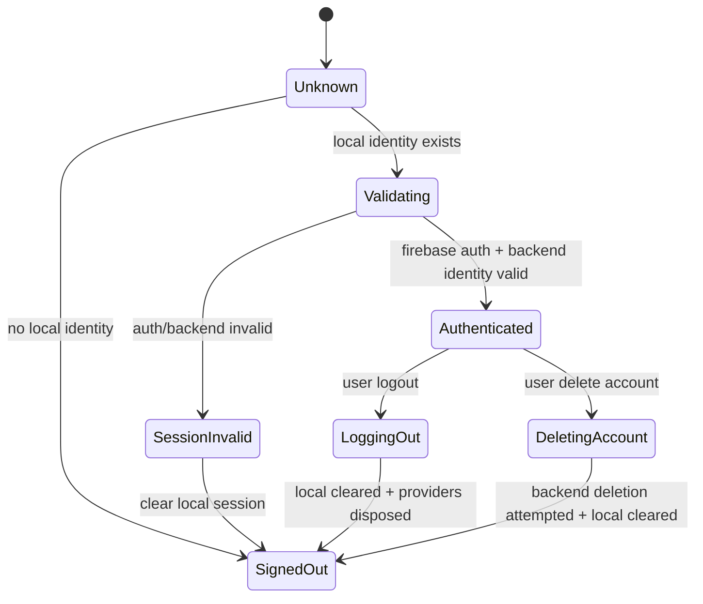

# Authentication Audit

Date: 2026-06-03

Scope: Flutter app authentication, Firebase Auth integration, local identity persistence, logout/session reset behavior, and the first authenticated runtime start.

## Executive Finding

Rain currently has multiple authentication truths:

- Local Drift `identity_table` decides whether the app should behave as signed in.
- Firebase Auth decides whether backend calls are allowed.
- RTDB `users/{username}` and `presence/{username}` are recreated from local identity during runtime startup.
- Riverpod provider state decides which UI tree is rendered.

That split explains the reported behavior: if account data is deleted outside the app but the local `identity_table` and/or cached Firebase Auth user remain, startup can still treat the user as authenticated and can recreate backend identity records.

## Evidence

| Component | Evidence |
| --- | --- |
| `apps/rain/lib/application/state/identity_providers.dart` | `identityProvider` loads from `IdentityRepository.watchIdentity()` / `loadIdentity()` and does not validate Firebase Auth before returning a signed-in identity. |
| `packages/rain_core/lib/identity/identity.dart` | `IdentityRepository` stores exactly one local identity row and exposes it as nullable auth state. |
| `apps/rain/lib/application/runtime/rain_runtime_controller.dart` | `start()` calls `adapter.ensureSignedInAs(selfIdentity.username)`, then writes `adapter.upsertIdentity(...)` and `adapter.setPresence(..., true)`. |
| `packages/protocol_brain/lib/adapters/firebase_adapter.dart` | `ensureAuthenticated()` only accepts a non-anonymous `FirebaseAuth.currentUser`; `_ensureSignedInAsUsername()` compares current user email to username. |
| `apps/rain/lib/application/runtime/rain_runtime_controller.dart` | `logOut()` calls `_shutdown(markOffline: true, signOut: true, clearLocalSession: true)`. `_runShutdown()` signs out before clearing local session. |
| `apps/rain/lib/application/state/identity_providers.dart` | `resetExpiredSession()` also signs out before clearing the local database. |
| `packages/protocol_brain/lib/adapters/signaling_adapter.dart` | The public adapter interface has no account deletion method. |
| `apps/rain/test/runtime_startup_test.dart` | Existing test documents that expired Firebase session during runtime startup does not clear local identity inside the runtime. |

## Root-Cause Analysis

### Issue 1: Logout Appears Broken

#### Symptom

After account data was deleted/reset and the app reopened, the app still behaved as authenticated and old account information appeared.

#### Root Cause

The app accepts persisted local identity as the signed-in UI source before proving that the Firebase Auth user and backend account are still valid. Runtime startup then uses that local identity to upsert backend identity and presence again.

The logout path has another ordering risk: local session clearing happens after backend sign-out. If sign-out or earlier shutdown cleanup throws, local identity can remain persisted.

#### Affected Components

- `IdentityController`
- `IdentityRepository`
- `RainRuntimeController.start`
- `RainRuntimeController.logOut`
- `FirebaseSignalingAdapter.ensureAuthenticated`
- `FirebaseSignalingAdapter.upsertIdentity`
- `RootScreen`
- `RuntimeController`

#### Reproduction Steps

1. Sign in as an existing user.
2. Leave local app data intact.
3. Delete RTDB `users/{username}` / presence / related account data externally.
4. Reopen the app.
5. `identityProvider` reads the old local row.
6. `runtimeControllerProvider` starts for that local identity.
7. Runtime verifies cached Firebase Auth email and writes backend identity/presence again.
8. App shows the old account.

Variant:

1. Trigger logout while backend cleanup/sign-out fails.
2. `_runShutdown()` can throw before `database.clearSessionData`.
3. Reopen the app.
4. Local identity still exists.

#### Severity

Critical.

#### Risk

Users cannot trust logout/account reset. Deleted or reset backend data can be recreated from local cache. Old identity can survive and confuse presence, call, connection, and update flows.

#### Recommended Fix

Introduce one `AuthSessionCoordinator` that owns logout, reset, and session validation. It must clear local session first or in a guaranteed `finally` block, then perform backend sign-out/cleanup best effort. It must also validate cached Firebase Auth before accepting local identity as active.

Minimum behavior:

- On logout: stop runtime, mark presence offline best effort, clear local DB, invalidate provider scope/session key, then sign out Firebase best effort.
- On startup: local identity alone is not enough. Validate Firebase Auth user, username ownership, and backend identity existence before creating runtime.
- If validation fails: clear local session and route to auth flow before rendering protected UI.

#### Long-Term Architectural Fix

Make `AuthenticatedSession` the single source of truth:

All UI, routing, runtime, calls, files, friends, and settings should depend on this single session state, not directly on `RainIdentity?`.

### Issue 2: Account Lifecycle Is Broken

#### Symptom

There is no reliable distinction between sign-in, sign-out, reset, account deletion, and backend data deletion.

#### Root Cause

Account lifecycle is split across local storage, Firebase Auth, RTDB identity, presence, runtime state, and manual provider invalidation. There is no app-owned account deletion contract and no atomic session teardown.

#### Affected Components

- `SignalingAdapter`
- `FirebaseSignalingAdapter`
- `IdentityController`
- `RainRuntimeController`
- `RuntimeController`
- `SettingsScreen`
- Drift `identity_table`
- Firebase `users`, `presence`, friendships, requests, rooms, call locks

#### Reproduction Steps

1. Sign in.
2. Delete backend data or reset accounts outside the app.
3. Keep the app installation/local storage.
4. Start the app.
5. Local identity and/or Firebase cached auth can still drive startup.

#### Severity

Critical.

#### Risk

External account deletion is not a valid lifecycle event in the app. Backend and local state can diverge, causing stale identity, stale relationships, presence writes for deleted users, permission-denied errors, and confusing UI.

#### Recommended Fix

Add explicit lifecycle operations:

- `validateSession()`
- `signIn()`
- `signOut()`
- `resetLocalSession()`
- `deleteAccount()`
- `handleRemoteAccountMissing()`

Each operation must define ownership, order, rollback tolerance, and user-facing result.

#### Long-Term Architectural Fix

Create an `AccountLifecycleService` that coordinates:

- Firebase Auth account.
- RTDB user profile.
- RTDB presence.
- Local Drift identity and account-owned tables.
- Shared preferences that are account-scoped.
- Runtime/controller disposal.
- Provider/session-scope reset.

## Critical Architecture Defects

| Defect | Status | Impact |
| --- | --- | --- |
| Multiple sources of truth exist | Confirmed | Local identity can say signed in while Firebase/backend disagree. |
| Authentication state is duplicated | Confirmed | Firebase Auth, local Drift, RTDB user profile, and provider state can diverge. |
| Runtime state can survive failed logout | Confirmed risk | `RuntimeController.logOut()` only invalidates providers after `controller.logOut()` completes successfully. |
| Controllers outlive sessions | Confirmed risk | The root `ProviderScope` is not keyed by authenticated session; cleanup depends on manual invalidation. |
| Cached state can be restored incorrectly | Confirmed | `identityProvider` restores local identity before backend validation. |
| Startup sequence is out of order | Confirmed | Runtime can create backend profile from local identity before account validity is resolved. |
| Anonymous auth masking account failures | Not confirmed in current code | `ensureAuthenticated()` rejects anonymous users. Smoke autoprovision remains a separate risk if enabled. |

## Remediation Roadmap

### Phase 00: Auth Evidence Lock

- Add tests that reproduce stale local identity after backend account deletion.
- Add tests for Firebase Auth user deleted/invalid but local identity present.
- Add tests for sign-out failure before local clear.

Success: failing tests prove the bug without changing production code.

### Phase 01: Session State Contract

- Define `AuthSessionState`: unknown, signedOut, validating, authenticated, invalid, loggingOut, deleting.
- Define `AuthenticatedSession`: local identity, Firebase uid, backend identity, validation timestamp.
- Document one owner for session state.

Success: no UI/runtime provider consumes raw `RainIdentity?` as auth truth.

### Phase 02: Deterministic Logout

- Clear local session in a guaranteed path.
- Make Firebase sign-out and presence cleanup best-effort after local teardown.
- Invalidate or recreate a session-keyed `ProviderScope`.

Success: local identity is gone even if backend sign-out/presence cleanup fails.

### Phase 03: Startup Auth Validation

- Validate cached Firebase user with reload/token check where possible.
- Verify username ownership and backend identity existence before runtime start.
- If backend account is missing, clear local identity and show auth flow.

Success: deleted backend account cannot be recreated from local cache unless the user explicitly signs in/registers again.

### Phase 04: Account Deletion Lifecycle

- Add `deleteAccount()` to the app-level account service.
- Decide whether Firebase Auth account deletion is supported directly or requires re-authentication.
- Delete/terminalize RTDB account-owned data according to Firebase rules.
- Clear local session regardless of backend deletion result, with clear diagnostics.

Success: app-owned account deletion is a first-class workflow.

### Phase 05: Provider Session Scope

- Key app providers by authenticated session id.
- On logout/account deletion/session invalidation, dispose all session-scoped providers automatically.

Success: no manual invalidation list can miss stale controllers or cached state.

### Phase 06: Regression Gate

- Widget tests for startup, logout, account deletion, session expired, and protected route access.
- Runtime tests for teardown ordering and failed backend cleanup.
- Firebase emulator tests for deleted/missing backend identity.

Success: release gate fails if logout/account deletion/session reset regresses.
