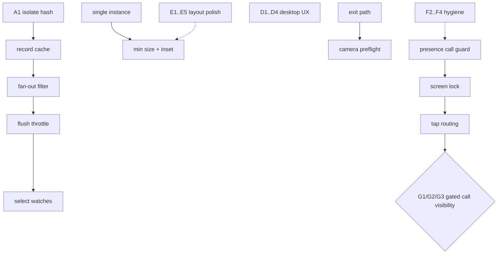

# Cross-Platform Remediation Plan

Created: 2026-08-26
Source audit: static cross-platform audit of HEAD `0a65568` (branch `main`, clean tree).
Scope: all findings from the 2026-08-26 cross-platform audit (mobile, desktop, responsive, performance, security, build/release).
Status: **NOT STARTED** — every task below is unchecked.

Purpose: this file is the executable orchestration contract for fixing the audited issues. Any future session (AI or human) picks the highest-priority unchecked task, executes exactly one task slice, validates it, syncs documentation, and commits. Do not batch multiple phases into one commit. Do not skip validation claims — never report a check as passed unless it was actually executed.

---

## 0. Operating Rules For Every Session Executing This Plan

Follow `AGENTS.md`. Per-task loop:

1. Read this file + `CONTINUITY.md` + `obsidian-vault/AI-Memory/Project Memory.md`.
2. `git status --short --branch` — must be clean before starting a task.
3. Re-read the exact files listed in the task (line numbers may have drifted from earlier commits).
4. Implement the smallest safe change that satisfies the task's acceptance criteria.
5. Run the task's validation commands. Record real output in `CONTINUITY.md`.
6. Apply the Post-Code Documentation Gate (AGENTS.md): affected vault notes + debt/risk updates + `.\scripts\check_obsidian_vault.ps1`.
7. Commit one focused commit per task: `fix(<area>): <task-id> 
`.
8. Check off the task in this file (`[ ]` → `[x]`) with date + evidence note in the same commit.

Hard constraints (from AGENTS.md / Project Memory):
- No paid Firebase dependencies unless owner changes the free-tier constraint.
- No secrets, tokens, or raw SDP/ICE/message content in code, logs, tests, or diagnostics.
- Diagnostics additions must pass through `DiagnosticsSanitizer`.
- Runtime backends limited to Firebase and noop.
- PowerShell only for local commands.
- Do not claim builds/tests/vault validation succeeded unless executed.

Decision gates (owner input required — pause and ask, do not improvise):
- G1: Add Firebase Cloud Messaging for killed-app incoming-call invites? (free-tier compatible, adds plugin + backend write)
- G2: Foreground service during calls on Android? (changes battery/UX posture)
- G3: Video call behavior on backgrounding: keep force-end vs allow audio-downgrade continuation?
- G4: Relocate Windows Drift DB from Documents to support dir (requires migration for existing installs)?
- G5: Target `file_picker` version for the beta escape?
- G6: iOS stance: confirm permanently out of scope (then prune dead iOS branches) or schedule support?

---

## Phase A — Shared Hot-Loop Performance Fixes (All Platforms) [P0]

Goal: eliminate main-isolate blocking and per-chunk storage/state churn in file transfer. Highest leverage slice in the whole plan; benefits both Android and Windows immediately.

### A1. Move SHA-256 hashing off the main isolate ✅ DONE 2026-08-26 (commit 6e3d18c)
- Files: `apps/rain/lib/application/runtime/file_transfer_runtime.dart`
  - Receiver final-hash: `_handleFileComplete` (~L452–481) calls `_sha256File` (~L856–867).
  - Sender inline hash: send loop ~L625–627, finalize ~L687–688.
- Problem: up-to-cap-size files hashed synchronously on UI isolate; repo-wide zero `compute()`/`Isolate.run` usage.
- Steps:
  1. Replace `_sha256File` internals with `Isolate.run(() => ...)` (read bytes/stream + digest inside the isolate; stream the file in bounded chunks to avoid loading whole file in memory).
  2. Sender: precompute hash in isolate before/during send (compute once per offer, not inline per loop iteration if it currently re-reads; verify actual current behavior first).
  3. Preserve error taxonomy: isolate failure maps to existing disk/hash failure classification.
- Acceptance:
  - No synchronous file-read+digest on the UI isolate for >threshold files.
  - Existing focused tests still pass: large receive, slow receiver/backpressure, cancel cleanup, hash mismatch cleanup.
  - New regression test proves hashing runs off-main-thread (e.g., injectable hasher + fake verifying isolate usage or timing-free structural assertion).
- Validate: `dart run melos run analyze`; `dart run melos run test`.

### A2. Cache transfer record across chunks (remove per-chunk `loadById`) ✅ DONE 2026-08-26 (commit 6e3d18c)
- Files: `apps/rain/lib/application/runtime/file_transfer_runtime.dart` (`_handleFileChunkPacket` ~L291), store API in `packages/rain_core/lib/file_transfer/file_transfer_store.dart`.
- Problem: one serialized SQLite read per received 32 KiB chunk.
- Steps:
  1. Maintain in-runtime `Map<String, FileTransferRecord>` for active receives; hydrate once at accept, mutate progress in memory, persist at throttled intervals (state transitions + periodic tick, e.g., every N chunks or T ms) and on terminal states.
  2. Invalidate cache entry on complete/fail/cancel/network-loss; re-load on recovery paths.
  3. Keep persistence semantics identical for non-chunk events (offer/accept/complete/fail must persist immediately).
- Acceptance: chunk hot path performs zero store reads; progress still visible in DB after throttle tick; recovery after simulated restart mid-transfer works (existing recovery tests).
- Validate: melos analyze + full melos test.

### A3. Stop connectivity fan-out on binary frames ✅ DONE 2026-08-26
- Files:
  - `packages/protocol_brain/lib/src/protocol_brain_impl.dart` (~L490–491, `onPeerMessage` carries binary chunks),
  - `apps/rain/lib/application/state/runtime_providers.dart` (~L368–393, `PeerConnectivityController._refresh` subscription),
  - `apps/rain/lib/application/runtime/rain_runtime_controller.dart` (~L942 `_recordDataEvent` → `_notifyPeerConnectivityChanged()` ~L566–574).
- Problem: full peer-snapshot rebuild + emit per 32 KiB chunk (two triggers).
- Steps:
  1. Classify frames at the brain boundary (chat/control/file-meta vs binary chunk payload). Expose typed event or kind flag if absent.
  2. Connectivity refresh subscribes only to non-binary events; file-transfer progress changes propagate through its own narrow signal (existing transfer-state provider), not the peer snapshot.
  3. Coalesce remaining triggers (e.g., dedupe emissions within a short window) rather than dropping semantics.
- Acceptance: transferring a multi-chunk file causes O(1) peer-snapshot rebuilds (test counts emissions); chat/control messages still trigger immediate refresh.
- Validate: melos analyze + melos test; add emission-count regression test.

### A4. Throttle receive sink flushes ✅ DONE 2026-08-26

### A3/A4 implementation notes (2026-08-26)
- Provider subscription filters binary-only messages (`runtime_providers.dart`); runtime `_recordDataEvent` uses leading-edge 250 ms throttle + trailing flush so burst timestamps still reach the UI within one window. Timer cancelled in shutdown and dispose.
- Flush policy lives in rain_core next to the protocol constants: `FileTransferFlushPolicy` + `fileTransferFlushThresholdBytes` (512 KiB). First write always flushes — this preserved the fail-fast semantics that `incoming disk write failure fails transfer` encodes (directory-as-tempPath surfaces at first flush); later writes batch; terminal close covers remainders.
- New regression coverage: `data_event_throttle_test.dart` (emission counts: 6-chunk burst → 1 immediate + 1 trailing), policy unit tests (sub-linear scaling, threshold boundaries), plus existing large-receive/disk-failure suites unchanged.
- Files: `apps/rain/lib/application/runtime/file_transfer_runtime.dart` (~L869–876).
- Problem: `sink.add + await flush()` per 32 KiB chunk serializes disk round-trips.
- Steps:
  1. Flush on: completion, cancel, failure, network-loss, backpressure wait boundaries, and time/chunk threshold (e.g., every ≥1 MiB or ≥250 ms) — durability parity with today's worst case preserved at boundaries.
  2. Ensure close paths (`closeAllReceiveSinks`) flush before close (already exists — verify ordering).
- Acceptance: existing large-receive + disk-failure tests pass unchanged; new test asserts flush count scales sub-linearly with chunk count (fake IOSink counter).
- Validate: melos analyze + melos test.

### A5. Narrow HomeScreen provider watches ⏸️ DEFERRED 2026-08-26 — consumer extraction caused shell body height collapse (320×0 probe: SizedBox/ListView height 0) and requires separate layout investigation. Reverted to HEAD; full suite green. Keep as follow-up: use `select` projections + minimal Consumer wrappers instead of wrapping Row.
- Files: `apps/rain/lib/presentation/screens/home_screen.dart` (~L782–788 watches 7 broad providers).
- Problem: any call-phase tick rebuilds header + rail + chat tree.
- Steps:
  1. Convert broad `ref.watch(xProvider)` to `.select()` projections for each consuming subtree (e.g., select only `phase`, `isVideoActive`, unread counts, request count).
  2. Move volatile widgets (call overlay/dock) behind their own consumer widgets so rebuilds stay local.
  3. Do not change public provider APIs; projection-only refactor.
- Acceptance: widget tests prove friend-list does not rebuild on call phase ticks (rebuild counter harness); visual behavior unchanged per existing widget tests.
- Validate: melos analyze + melos test.
- Status: DEFERRED — see CONTINUITY 2026-08-26 entry for probe details (Stack→Container→Column→Expanded height 0 via Consumer wrapper). Next attempt will use in-Row Consumer builders instead of wrapping Row, preserving original constraints.

---

## Phase B — Desktop Operating-System Citizenship (Windows First) [P0/P1]

### B1. Single-instance guard [P0] ✅ DONE 2026-08-26 (commit pending)
- Files: `apps/rain/windows/runner/main.cpp`, optionally `win32_window.cpp`; new tiny method channel if focusing the existing window.
- Problem: dual instances duplicate presence heartbeats, signaling subscriptions, notifications; SQLite survives mechanically, app state does not.
- Steps:
  1. In `wWinMain` before window creation: `CreateMutexW(nullptr, TRUE, L"Local\\Rain.SingleInstance")`; on `ERROR_ALREADY_EXISTS`: show a native MessageBox ("Rain is already running") and return 0.
  2. Stretch goal (only if trivially safe): second launch signals first instance via named event + Flutter-side handler calling `window_manager.show()/focus()`; otherwise ship MessageBox-only.
  3. Add runner smoke note to docs; no Dart-side behavior change.
- Acceptance: launching two copies shows message/exit for the second; first instance unaffected; `flutter build windows --debug` passes.
- Validate: build windows debug locally (allowed: platform build needed for runner change — get owner OK or run in CI).

### B2. Wire desktop camera preflight into call start [P1]
- Files: `apps/rain/lib/application/runtime/media_device_settings.dart` (`validateVideoInputAsync` ~L745–849 — currently dead code), `voice_call/voice_call_preflight_coordinator.dart`, `voice_call_runtime.dart` start path.
- Steps:
  1. In video-mode call start on desktop profiles, invoke preflight before media connection creation.
  2. Map `VideoPreflightResult` classifications to existing `CallErrorClassifier` failure reasons + user messages; record sanitized diagnostic.
  3. Skip on Android (permission flow already handled by `rain/media_permissions` + device proof path).
- Acceptance: unit test with fake device settings: no-camera/busy/permission-denied produce classified failures before any Firebase room write; happy path proceeds.
- Validate: melos analyze + melos test.

### B3. Repair exit path + close Drift on exit [P1]
- Files: `apps/rain/lib/infrastructure/window/desktop_shell_controller.dart` (~L48–116), `application/runtime/app_exit_coordinator.dart` (~L67–103), `application/state/runtime_providers.dart` (~L613–615 registration), `packages/rain_core` DB handle exposure, `application/bootstrap/app_bootstrap.dart` (~L117 only closer today), `rain_runtime_controller.dart` `_shutdown` (~L1692–1703, 2387+).
- Problems: (a) `unawaited(bestEffort)` followed by synchronous `exit(0)` kills the future; (b) nothing registered at `critical` priority; (c) Drift DB never closed outside bootstrap failure.
- Steps:
  1. Register the runtime close handler with `AppExitPriority.critical`; keep sound handler bestEffort.
  2. Sequence: await critical handlers under the 1.5 s budget → run best-effort under a small residual budget (await with timeout, not unawaited) → `destroy()` (drop unconditional `exit(0)`; destroy terminates the process; keep process-exit fallback only if destroy fails its timeout).
  3. Add DB close to runtime teardown: expose `Future<void> closeDatabase()` from the runtime/bootstrap composition; call last in `_shutdown` after sinks/sessions; make it idempotent and guarded against double-close during logout-vs-exit races.
- Acceptance: contract test simulating windowClose verifies order (offline write → sessions disposed → DB closed) within budget; double-close safe; existing shutdown/logout/account-deletion tests unchanged.
- Validate: melos analyze + melos test; manual X-click smoke on Windows debug build.

### B4. Minimum window size + focus-rail inset [P1]
- Files: `apps/rain/lib/infrastructure/window/desktop_shell_controller.dart` (~L36–44), `apps/rain/lib/presentation/screens/home_screen.dart` (~L894 inset, ~L1145 rail width), `windows/runner/win32_window.cpp` (optional `WM_GETMINMAXINFO`).
- Steps:
  1. `WindowOptions(minimumSize: Size(420, 520))` (values tunable; must clear R5's 260 min-width clip with margin) + keep existing options.
  2. Replace hardcoded `contentLeftInset: 321` with the live panel width (320 normal / 64 focus mode / 0 compact) sourced from the same constant driving the `SizedBox(width:)`.
  3. Optional native floor via `WM_GETMINMAXINFO` only if Flutter-side proves insufficient (skip unless needed).
- Acceptance: widget test asserts inset equals panel width in both modes; manual resize smoke shows no clip at minimum size.
- Validate: melos analyze + melos test.

---

## Phase C — Mobile Background & Call Reliability [P0]

Order matters: C1+C2+C4 are safe local slices; C3 depends on gates G1/G2/G3.

### C1. Active-call guard on presence-offline [P0]
- Files: `apps/rain/lib/application/runtime/rain_runtime_controller.dart` (`_setPresenceOfflineSafely` ~L1078–1083; lifecycle hook ~L2353–2385).
- Problem: backgrounding mid-call writes presence=offline while WebRTC continues → peer sees ghost-offline callee.
- Steps:
  1. If an active (audio or video) call session exists when hidden/paused fires, skip the offline write and keep heartbeat paused as today.
  2. When call ends while still backgrounded, evaluate then: if still paused, perform the deferred offline write (single-shot).
  3. Cover reconnect/recovery interplay: deferred write must not fight auto-recovery or `presenceExpired` terminal intent.
- Acceptance: unit tests: backgrounded-during-audio-call keeps online; post-call backgrounded writes offline; foreground resume clears pending flag.
- Validate: melos analyze + melos test.

### C2. Keep screen awake during calls (no new dependency) [P0]
- Files: `apps/rain/android/app/src/main/java/com/rainapp/rain/MainActivity.java` (new method alongside `rain/media_permissions`), new thin Dart service in `infrastructure/`, call start/end hooks in `voice_call_media_coordinator.dart` or runtime start/terminal paths.
- Steps:
  1. Native channel `rain/screen_lock`: `setKeepScreenOn(bool)` toggling `FLAG_KEEP_SCREEN_ON` on the window.
  2. Acquire on call start (both modes), release on every terminal path (reuse existing terminal/cleanup funnel so no leak).
  3. Windows/desktop: no-op.
- Acceptance: unit test hooks fire acquire/release symmetrically on start + each terminal classification; manual smoke: screen stays on during 2-min idle call, releases after hangup.
- Validate: melos analyze + melos test (+ device smoke if emulator available).

### C3. Incoming-call visibility when backgrounded/killed [P0 — GATED]
- Prereqs: decide G1 (FCM), G2 (foreground service), G3 (video bg policy).
- Variant 1 — no new backend deps (covers screen-off/app-backgrounded only, NOT killed):
  1. Foreground service of type `microphone|camera` (or `phoneCall`) active during ongoing calls; manifest permission + `<service>` declaration; start/stop bound to call lifecycle.
  2. While service lives, incoming-call RTDB watcher remains armed → reuse existing in-app ring UI + add heads-up notification with call actions (accept/decline via activity intent extras).
  3. Document killed-app limitation honestly in vault risk note.
- Variant 2 — FCM enabled (covers killed too):
  1. Add `firebase_messaging`; caller's call-create path writes an FCM data message trigger (Cloud Function or direct Admin — respect free-tier; functions already exist for connection requests).
  2. Background message handler posts full-screen-intent call notification (channel `rain_calls`, alarm-ish importance).
  3. Tap → cold-start route directly into incoming-call surface (router deep-link param).
- Either variant must also fix M4 tap-routing baseline below first.
- Acceptance (both): emulator proof script: caller rings → callee (backgrounded) sees actionable call UI; decline/accept round-trips.
- Validate: melos analyze + melos test + `scripts/run_device_media_proof.ps1`-style emulator scenario if available.

### C4. Notification tap routing (connection requests) [P0]
- Files: `apps/rain/lib/infrastructure/services/rain_notification_service.dart` (`initialize` ~L414–425 — no response callback today), request-tray reveal path in presentation layer.
- Steps:
  1. Register `onDidReceiveNotificationResponse` (+ `onDidReceiveBackgroundNotificationResponse` top-level fn for Android).
  2. Payload carries request id (already built for skip/dedupe logic); route: app launched/resumed → navigate/select peer + open request tray; suppressed/muted ids must not route.
  3. Windows: same callback path via plugin; verify toast click focuses window (window_manager focus already available).
- Acceptance: widget/unit test proves routing dispatch with payload id; muted/blocked ids ignored; cold-start and warm-tap both covered (simulate plugin response objects).
- Validate: melos analyze + melos test.

---

## Phase D — Desktop UX Parity [P1]

Gate all four behind the shared pointer-profile helper (`AdaptiveDeviceProfile`, `media_device_settings.dart:79–92`) so touch devices keep current behavior.

### D1. Scrollbars on desktop scrollables
- Files: primary surfaces — `presentation/widgets/home/chat_panel.dart` (~L784, 802, 892, 909 lists), `presentation/widgets/home/friends_list.dart` (~L53, 79), settings/search scroll views; theme-level option in `theme/rain_theme.dart`.
- Steps: introduce a `RainDesktopScrollbar` wrapper (Scrollbar + controller, shown only when profile uses mouse) and apply to the enumerated scrollables; interactive thumb on desktop, none on touch.
- Acceptance: widget tests assert scrollbar presence on desktop profile, absence on touch profile; no behavior change otherwise.
- Validate: melos analyze + melos test.

### D2. Text selection for received messages
- Files: `presentation/widgets/home/chat_panel.dart` transcript area, `presentation/widgets/rain_chat_widgets.dart` bubble (~L390–462).
- Steps:
  1. Wrap transcript list in `SelectionArea` on desktop profile; ensure bubble GestureDetectors don't swallow selection (adjust hit behavior; keep long-press actions on touch).
  2. Verify timestamps/meta row unaffected; context menu styling minimal.
- Acceptance: widget test: selection controllers expose copied text equal to message body on desktop; touch profile unchanged (long-press opens actions).
- Validate: melos analyze + melos test.

### D3. Cursor-anchored context menus replace bottom sheets (desktop)
- Files: `chat_panel.dart` (~L1010–1012 `showModalBottomSheet`), bubble secondary-tap wiring (`rain_chat_widgets.dart:390–392`), `friends_list.dart` items (~L310–312, 366–368).
- Steps:
  1. Extract message actions into a reusable item model; render via `showMenu` at `onSecondaryTapUp` position on desktop; keep bottom sheet on touch.
  2. Add friend-item right-click menu (Open profile / Connect / Disconnect / Block / Remove — mirror existing sheet actions).
- Acceptance: golden/widget checks: desktop shows popup menu with expected items wired to same callbacks as sheet; touch path unchanged.
- Validate: melos analyze + melos test.

### D4. Escape semantics
- Minimal scope (avoid product creep): Escape exits fullscreen (exists) AND cancels an *outgoing ringing* call; active connected call still requires explicit button (prevents accidental ends).
- Files: `home_screen.dart` (~L1011–1021), call surface controller.
- Validate: melos test with focused widget case.

---

## Phase E — Responsive & Layout Polish [P2]

### E1. Breakpoint seam 860/900
- Files: `home_screen.dart:765` (`_compactBreakpoint = 860`), `rain_navigation_shell.dart:24` (`_railBreakpoint = 900`).
- Steps: hoist both to one constants source (new `presentation/layout/rain_breakpoints.dart`); align thresholds so nav mode and pane layout flip together (choose 900 for both, verify 860-band visually on resized window + landscape tablet width).
- Validate: melos test + widget test asserting consistency at 850/870/910 widths.

### E2. Bubble meta-row overflow safety
- Files: `rain_chat_widgets.dart` (~L415–462).
- Steps: wrap delivery label + time in `Flexible` with ellipsis; icon button shrink-safe; verify at 1.3×/2.0× font scale in widget test.
- Validate: melos test (font-scale matrix case).

### E3. Generic dialog scroll wrappers
- Files: `presentation/widgets/app_dialogs.dart` (~L21–41, 152–188), `chat_panel.dart` offline-request confirm (~L1747–1768).
- Steps: wrap `content` in `SingleChildScrollView` + `ConstrainedBox(maxHeight: 0.7 * screenH)` mirroring the Link-status dialog pattern (`chat_panel.dart:651–729`); extract tiny shared helper.
- Validate: melos test short-viewport case.

### E4. Ended-call card minWidth clip
- Files: `calls/rain_call_ended_surface.dart` (~L35–38).
- Steps: drop `minWidth: 260` (let content shrink) or clamp with `FittedBox(fit: scaleDown)`; rely on B4 window floor as belt-and-braces.
- Validate: widget test at 300 px viewport.

### E5. Dead-code removal sweep
- Targets: `rain_chat_widgets.dart` duplicate stage (~L675–822) + deprecated `RainVoiceCallPanel` (~L1180); `rain_call_overlay.dart` unreferenced `RainFullscreenCallWorkspace` (~L502–633); `rain_runtime_controller.dart` `_backgroundOfflineTimer` field + 6 cancel sites (~L376, 1678, 1897, 2363, 2376, 2381, 2486); unused `dart:io` import `home_screen.dart:11`.
- Rule: grep for references before each deletion; delete only zero-reference symbols; run full tests after.
- Validate: melos analyze + melos test.

---

## Phase F — Dependency, Config & Consistency Hygiene [P2]

### F1. Escape `file_picker` beta [GATED G5]
- Files: `apps/rain/pubspec.yaml:17`, `crash_diagnostics_service.dart:799–843` (raw `'save'` channel workaround), `received_file_export_service.dart` (desktop picker path).
- Steps: survey latest stable `file_picker` release notes for the Android-bytes bug fix; if fixed: bump, delete workaround branch (keep own SAF channel for received-file save), rerun Android export test on emulator; if not fixed: pin latest beta, document why in Technical Debt Register with revisit date.
- Validate: melos analyze + melos test + emulator diagnostics-export smoke.

### F2. Heartbeat timer true suspension
- Files: `rain_runtime_controller.dart` (~L231, 783–785, 1020–1024, 2361–2377).
- Steps: on hidden/paused → `timer.cancel()`; on resumed → restart. Removes reliance on boolean-gate + keeps CPU silent in background even if gate misses. Coordinate with C1 guard (call-active case: keep timer running if we choose presence-online during call — align semantics with C1 outcome).
- Validate: melos test lifecycle cases.

### F3. Deduplicate Windows ICE-pruning logic
- Files: `core/config/app_environment.dart` (~L550–582), `infrastructure/services/turn_credential_service.dart` (~L287–318).
- Steps: extract single helper (one platform API choice — prefer `Platform.isWindows` in infrastructure, or pass a bool from environment layer); both call sites consume it; add divergence-guard test.
- Validate: melos analyze + melos test.

### F4. Fail fast on test cipher key default
- Files: `rain_runtime_controller.dart` (~L263–265), construction sites (`runtime_providers.dart:554–556`, tests).
- Steps: make encryption key a required parameter (remove literal default); update test constructions to pass explicit test key; production wiring unchanged (already passes env key); bootstrap validation already throws on weak keys — keep.
- Validate: melos analyze + melos test (compile errors guide updates).

### F5. DB location migration (Windows Documents → support dir) [GATED G4]
- Only after G4 approval. Design: detect legacy file in Documents; migrate-on-open (copy + verify page count/integrity, WAL checkpoint) then delete-or-archive original; failure keeps legacy path usable; telemetry-free diagnostics event. Defer until after A/B phases to avoid churn.

### F6. Runner.rc version drift note
- Low effort: document that CI injects `FLUTTER_VERSION_*`; optionally fail local release builds when rc version != pubspec. Skip unless touching runner anyway.

---

## Phase G — Scope Confirmations [Docs-only once decided]

- G6 resolution: if iOS confirmed out of scope → prune unreachable iOS branches (`chat_composer` platform switch, notification-service unavailable branches) ONLY where deletion is zero-risk, and record ADR-style note; else open roadmap item.
- linux/macos folders: declare unmaintained in README/vault Repository Map (already partially documented) — no code churn.

---

## Execution Order & Dependencies

Recommended session slicing (one slice per session/commit):
1. A1+A2 (same subsystem, one review) → 2. A3+A4 → 3. A5 → 4. B1 → 5. B3 → 6. B2+B4 → 7. C1 → 8. C2 → 9. C4 → 10. D1+D2 → 11. D3+D4 → 12. E1+E2 → 13. E3+E4 → 14. E5+F2+F3+F4 → 15. Gates G1/G2/G3/G5/G4 decisions → C3/F1/F5.

## Global Definition Of Done (per task)

- [ ] Code implemented per steps; smallest safe change.
- [ ] `dart pub get` + `dart run melos run analyze` pass.
- [ ] `dart run melos run test` passes (full suite, not just targeted).
- [ ] New/regression tests included per task acceptance.
- [ ] Vault updated: affected feature/architecture note; Technical Debt/Risk/BLOCKERS entries adjusted; Project Memory durable facts; Recommended Next Actions refreshed.
- [ ] `.\scripts\check_obsidian_vault.ps1` passes.
- [ ] `CONTINUITY.md` updated with real validation evidence.
- [ ] One focused commit; checkbox in this file flipped with date + evidence pointer.

### A1 implementation notes (2026-08-26)
- Receiver `_sha256File` now runs the streamed digest inside `Isolate.run` (path passed, `File` rebuilt inside the isolate).
- Sender-side incremental hashing **stays on the main isolate by accepted design** (deviation from the original A1 sketch): verified sender never re-reads the file — it digests bytes already in hand via chunked conversion; per-event cost is micro-scale and the loop yields every chunk through awaited sends/backpressure. Offloading would need cross-isolate streaming infrastructure disproportionate to benefit. Recorded in TD-008 progress note; revisit only on profiling evidence.
- A2 hydration is lazy at first chunk (post-accept state snapshot); invalidation funnels exclusively through `clearTransferRuntimeState`; network-loss cleanup also clears the cache map.
- Regression test: `chunk hot path reads the transfer record once, not per chunk` asserts exactly 1 store read across 8 chunks + complete.

## Unplanned Repairs Executed During Slice 1

| ID | What | Why it was needed | Commit |
|----|------|-------------------|--------|
| R1 | Added `library;` after doc headers in 254 files + backticked generics in `ice_candidate_batcher.dart` | HEAD 0a65568 added `///` file headers without directives → 254 `dangling_library_doc_comments` infos failing CI's `--fatal-infos` gate; blocked every future slice. Verified pre-existing via stash baseline. | 595a0fe |
| T1 | Supplied non-demo `RAIN_SIGNALING_ENCRYPTION_KEY` to `_runtimeProviderContainer` | Pre-existing: harness environment omitted the key so `SignalingCipher.fromKeyMaterial` hard-rejected the demo default, failing 7 account-deletion/logout tests. Not env-var fixable (test builds explicit runtime map). Verified pre-existing via stash baseline. | 30c46cc |

## Current Progress Log

| Date | Task | Commit | Evidence |
|------|------|--------|----------|
| 2026-08-26 | R1 lint sweep | 595a0fe | `melos analyze` SUCCESS all packages |
| 2026-08-26 | A1+A2 isolate hash + record cache | 6e3d18c | friend_flow_test 127 passed incl. new regression; melos analyze + melos test SUCCESS |
| 2026-08-26 | T1 startup test harness key | 30c46cc | runtime_startup_test 24 passed; full melos test SUCCESS |
| 2026-08-26 | A3 binary fan-out filter + data-event throttle | (slice 2) | data_event_throttle_test 1 passed; melos analyze SUCCESS |
| 2026-08-26 | A4 flush policy in rain_core | (slice 2) | policy unit tests passed; friend_flow 130 incl. disk-failure; full melos test SUCCESS |
| 2026-08-26 | A5 HomeScreen watch scoping | DEFERRED | Consumer extraction caused body height 0 (320×0 probe); reverted, full suite green. Next: in-Row Consumer + select |
| 2026-08-26 | B1 single-instance mutex | pending | windows/runner/main.cpp CreateMutexW Local\Rain.SingleInstance |
