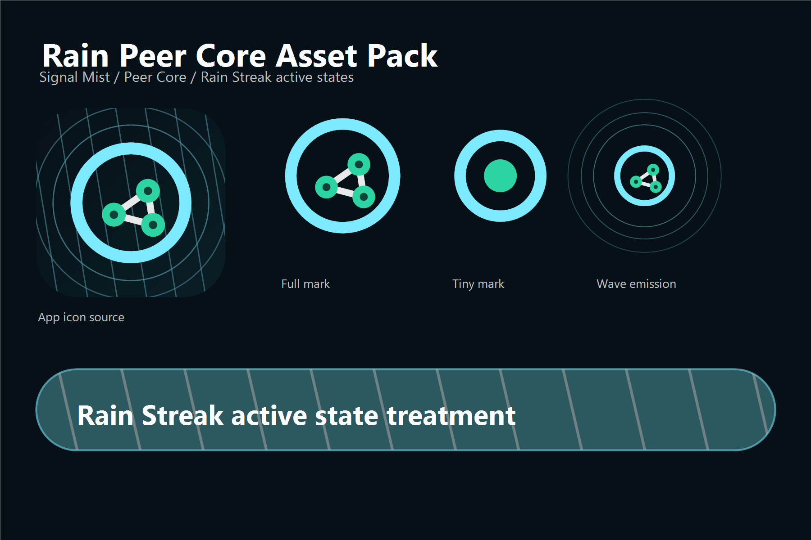
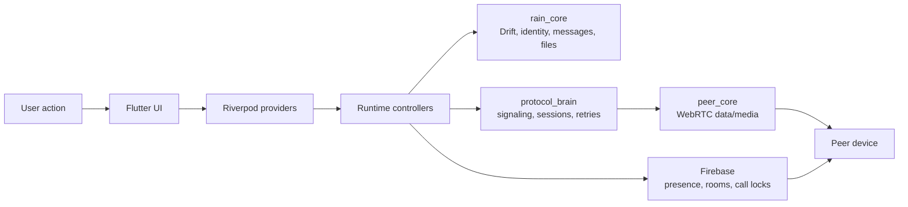

# Rain

Private peer chat for Android and Windows.



[](https://github.com/EslamNabawy/Rain/actions/workflows/ci.yml)
[](https://github.com/EslamNabawy/Rain/actions/workflows/main-merge-gate.yml)
[](https://github.com/EslamNabawy/Rain/actions/workflows/build-artifacts.yml)

Rain is a focused peer-to-peer messenger for people who already trust each
other. It keeps the product surface small: accepted friends, direct chat, file
transfer, voice calls, video calls, and clear connection state.

No public feed. No follower graph. No noisy social layer. The app is built
around one question: can this peer lane safely carry the thing the user is
trying to do right now?

## Why Rain Exists

Most chat apps hide the transport behind vague online indicators. Rain exposes
the important parts without turning the UI into a network console:

| User Need | Rain Behavior |
| --- | --- |
| Know if a friend is reachable | Shows accepted friends, presence, direct/relay route state, and offline blocks |
| Send messages reliably | Queues, ACKs, retries, and keeps local conversation state in Drift |
| Move files peer to peer | Uses explicit offer/accept, chunk progress, cancel, and export flows |
| Start calls safely | Uses dedicated voice/video call state, Firebase call locks, and WebRTC media |
| Avoid confusing recovery | Manual Disconnect means stay disconnected until the user presses Connect |
| Test builds quickly | Publishes separate v7a, v8/v9, and Windows artifacts for device testing |

Rain should feel quiet, premium, and controlled: dark ink surfaces, cyan/mint
signal accents, restrained motion, and direct messages when something is
offline, busy, blocked, stale, or unsafe.

## Current Scope

Maintained targets:

- Android phones
- Windows desktop

Working feature areas:

- username sign-in and account ownership
- friend search, requests, accepted friendships, and blocking
- peer chat over WebRTC data channels
- connection diagnostics and direct/relay visibility
- one-to-one file transfer
- one-to-one voice calls
- one-to-one video calls
- global call/file conflict guards
- Android ARM v7 and ARM v8/v9 release artifacts
- Windows portable release artifact

Not in scope yet:

- push-notification call wakeups
- background Android call service
- group calls
- web, Linux, or macOS releases
- formal third-party security audit
- app-store packaging

## Architecture At A Glance

Rain separates app state, signaling, data transport, media transport, and local
storage. That split matters because chat can stay alive while media calls fail,
end, or restart.



Ownership rules:

- UI renders state and forwards explicit intent.
- Runtime controllers own side effects and conflict decisions.
- `rain_core` owns persistence, identity, friends, messages, and files.
- `protocol_brain` owns signaling/session policy and Firebase contracts.
- `peer_core` owns WebRTC primitives, data channels, media tracks, and platform
  bridges.
- Firebase coordinates presence, friendship, SDP/ICE exchange, and temporary
  call locks. It is not the chat message store.

## Transport Model

```text
Firebase Realtime Database
  users, presence, friendships, blocks
  data-peer signaling rooms
  voice/video call rooms
  active pair locks
  active user locks
  terminal cleanup support

WebRTC data peer connection
  rain.chat    message envelopes
  rain.ctrl    ACKs, control frames, diagnostics
  rain.file    file transfer frames

WebRTC media peer connection
  microphone tracks
  camera tracks
  RTP/RTCP media
  DTLS-SRTP transport
```

Calls use a dedicated media path so a failed camera or microphone negotiation
does not have to destroy the chat/data lane.

## Runtime Guarantees

These are product rules the app is expected to enforce:

- A user can have multiple peer chat lanes, but only one active/ringing call.
- Incoming calls during an active call return busy instead of opening a second
  call UI.
- Active calls block new file sends and incoming file accepts.
- Active file transfers block starting or accepting calls.
- Failed/stale calls must release their Firebase pair and user locks.
- Pressing Disconnect records local manual intent and disables automatic
  reconnect for that peer.
- Network loss does not count as a manual disconnect.
- Closing the app should release runtime resources and stop active connections.
- Offline peers are blocked before Connect starts a spinner.

## Repository Map

| Path | Purpose |
| --- | --- |
| [apps/rain](apps/rain) | Flutter Android and Windows app |
| [packages/rain_core](packages/rain_core) | Drift storage, identity, friends, messages, file metadata, frame models |
| [packages/protocol_brain](packages/protocol_brain) | Firebase signaling, peer sessions, retry policy, call contracts |
| [packages/peer_core](packages/peer_core) | WebRTC data/media primitives and platform bridge |
| [backend/firebase](backend/firebase) | Realtime Database rules and cleanup functions |
| [scripts](scripts) | Build, icon sync, Firebase emulator, and release helpers |
| [docs/architecture](docs/architecture) | Connection algorithms, widget map, app context, architecture notes |
| [docs/qa](docs/qa) | Manual gates and release validation records |
| [docs/superpowers](docs/superpowers) | Planning specs used during feature development |

Useful starting documents:

- [Connection algorithms](docs/architecture/connection-algorithms.md)
- [Widget map](docs/architecture/widget-map.md)
- [App context](docs/architecture/app-context.md)
- [GitHub CI/CD guide](docs/github-ci-cd.md)
- [Firebase backend guide](backend/firebase/README.md)
- [Video-call manual device gate](docs/qa/video-call-manual-device-gate.md)

## Quick Start

Required local tools:

- Flutter `3.44.0`
- Dart SDK compatible with `^3.10.4`
- JDK 21 for Android builds
- Android SDK cmdline-tools for Android builds
- Windows desktop toolchain for Windows builds
- Firebase CLI for backend deployment

Install workspace dependencies:

```powershell
dart pub get
dart run melos bootstrap
```

Run static analysis and tests:

```powershell
dart run melos run analyze
dart run melos run test
```

Run the Windows app with the checked-in demo defines:

```powershell
cd apps/rain
flutter run -d windows --dart-define-from-file=tool/dart_defines.example.json
```

Use local overrides when needed:

```powershell
cd apps/rain
Copy-Item tool/dart_defines.example.json tool/dart_defines.local.json
flutter run -d windows --dart-define-from-file=tool/dart_defines.local.json
```

Do not commit `apps/rain/tool/dart_defines.local.json`.

## Backend Setup

Rain's maintained backend is Firebase.

Enable these Firebase products:

- Authentication
- Realtime Database
- Remote Config
- Cloud Functions

Deploy backend rules and functions:

```powershell
cd backend/firebase
firebase use --add
firebase deploy --only database

cd functions
npm install
npm run lint
cd ..
firebase deploy --only functions
```

Important database paths:

| Path | Purpose |
| --- | --- |
| `users/<username>` | account ownership and presence |
| `friendRequests/<to>/<from>` | friend request inbox |
| `friendships/<a>/<b>` | accepted friendship edges |
| `blocks/<blocker>/<blocked>` | block enforcement |
| `rooms/<pairId>` | temporary data-peer signaling |
| `voiceCalls/<callId>` | temporary voice/video signaling state |
| `activeVoicePairs/<pairId>` | same-pair call lock |
| `activeVoiceUsers/<username>` | cross-peer user call lock |

Cleanup functions remove expired rooms, stale presence, abandoned call rooms,
and terminal call locks.

## Dart Defines

Common compile-time keys:

| Key | Purpose |
| --- | --- |
| `RAIN_BACKEND` | `firebase` or `noop` |
| `RAIN_BACKGROUND_HEARTBEAT_SECONDS` | foreground presence heartbeat interval |
| `RAIN_ALLOW_PUBLIC_TURN` | demo-only switch for public TURN |
| `RAIN_TURN_BROKER_URL` | optional production TURN credential broker |
| `RAIN_ICE_SERVERS` | JSON array of WebRTC ICE server objects |
| `RAIN_SIGNALING_ENCRYPTION_KEY` | key material for encrypted signaling payloads |
| `RAIN_UPDATE_URL` | fallback update/release URL |
| `FIREBASE_DATABASE_URL` | Firebase Realtime Database URL |

Production release builds intentionally reject the demo signaling encryption
key and public OpenRelay TURN configuration unless the build path is explicitly
marked as demo.

## Test Builds For Devices

For phone testing, use the manual GitHub workflow instead of building locally:

```powershell
gh workflow run build-artifacts.yml `
  --ref dev `
  -f platform=all `
  -f build_profile=demo `
  -f publish_test_release=true
```

When `publish_test_release` is enabled, the workflow creates a `rain-test-*`
GitHub pre-release with direct downloads:

| Artifact | Intended Device |
| --- | --- |
| `Rain-Demo-Android-v7a.apk` | older ARM v7 Android phones |
| `Rain-Demo-Android-v8-v9.apk` | modern ARM64 Android phones |
| `Rain-Demo-Windows-x64.zip` | Windows x64 test machines |

The same workflow can build production artifacts when the required production
secrets are configured.

## Production Release Requirements

Production Android builds require these GitHub Actions secrets:

- `RAIN_RELEASE_DART_DEFINES_JSON`
- `RAIN_RELEASE_KEYSTORE_BASE64`
- `RAIN_RELEASE_STORE_PASSWORD`
- `RAIN_RELEASE_KEY_ALIAS`
- `RAIN_RELEASE_KEY_PASSWORD`

`RAIN_RELEASE_DART_DEFINES_JSON` must include a non-demo
`RAIN_SIGNALING_ENCRYPTION_KEY` and either `RAIN_TURN_BROKER_URL` or
project-owned TURN/TURNS entries in `RAIN_ICE_SERVERS`.

The release workflow publishes:

- `Rain-windows-portable.zip`
- `Rain-release-android-armeabi-v7a.apk`
- `Rain-release-android-arm64-v8a.apk`

## Validation Policy

Normal code changes:

```powershell
dart pub get
dart run melos run analyze
dart run melos run test
```

Connection, call, media, Firebase, or release changes also require manual
device validation:

- Android to Android chat, file, voice, and video checks
- Android to Windows chat, file, voice, and video checks
- Windows to Android call initiation
- direct and relay route behavior when possible
- app close during connection and during calls
- manual Disconnect followed by network recovery
- repeated calls without app restart
- file transfer blocked during active calls
- call blocked during active file transfer
- Android v7a APK install
- Android v8/v9 APK install
- Windows portable launch

Automated tests protect logic. Real devices prove WebRTC, permissions, audio,
camera, routing, lifecycle, and OS integration.

## Security And Privacy Boundaries

Rain is designed to minimize what Firebase carries, but this README is not a
security audit.

- Chat message bodies and file bytes are intended to move over WebRTC, not
  Firebase rooms.
- Firebase rules enforce authenticated ownership, friendship, block checks, and
  call lock permissions.
- SDP and ICE signaling payloads are encrypted before storage.
- WebRTC media and data channels use encrypted transports.
- Production builds reject known demo signaling keys.
- TURN reliability and metadata exposure depend on the configured TURN
  infrastructure.

## Development Notes

- Keep runtime backends limited to Firebase and noop unless the architecture is
  explicitly changed.
- Keep manual disconnect intent separate from network loss and automatic
  recovery.
- Keep call UI surfaces driven by one shared call-control model.
- Keep media connection teardown separate from chat/data teardown.
- Keep docs, Firebase rules, fake adapters, and tests aligned when signaling
  schema changes.

## License

No root repository license file is currently declared.
