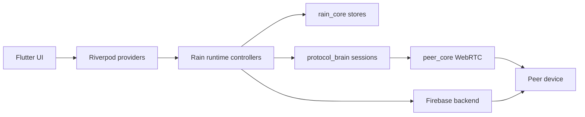

# Rain


[](https://github.com/EslamNabawy/Rain/actions/workflows/ci.yml)
[](https://github.com/EslamNabawy/Rain/actions/workflows/main-merge-gate.yml)
[](https://github.com/EslamNabawy/Rain/actions/workflows/build-artifacts.yml)

Rain is a private peer-to-peer chat app for Android and Windows.

It is built for accepted friends who want a clean, direct way to talk, send
files, and start voice or video calls without a feed, public profile game, or
social-network noise. The app focuses on one relationship at a time: who you are
talking to, whether the peer link is healthy, and what action is safe right now.

## What Rain Does

| Area | Capability |
| --- | --- |
| Private friends | Username accounts, friend requests, accepted friendships, blocking, and search |
| Chat | Ordered peer messages with ACKs, local queueing, retry, and recovery |
| Connection visibility | Direct/relay route status, peer presence, diagnostics, and clear offline states |
| Voice calls | One-to-one audio calls with microphone handling, mute, deafen, and output routing |
| Video calls | One-to-one camera calls with dedicated media connections and fullscreen call UI |
| File transfer | Offer, accept/reject, chunked transfer, progress, cancel, and export |
| Safety rules | One active call globally, call/file conflict blocking, stale call cleanup |
| Polish | Rain visual identity, Peer Core mark, ripple halo states, and sound settings |

Rain currently targets foreground use on Android phones and Windows desktop.
Background ringing, push call wakeups, group calls, web, Linux, and macOS are
outside the maintained release scope right now.

## Product Direction

Rain should feel like a private signal between people who already know each
other:

- calm dark surfaces instead of busy feed layouts
- cyan and mint signal accents instead of loud notification chrome
- clear user actions instead of hidden automatic behavior
- explicit errors when a peer is offline, busy, disconnected, or blocked
- app-level call controls that keep chat usable without losing call state

The important UX rule is simple: the app should never leave the user guessing
whether they are connected, calling, transferring, muted, blocked, or offline.

## How It Works

Rain separates chat/data transport from call media.

```text
Firebase:
  account identity
  presence
  friendship state
  encrypted SDP/ICE signaling
  ephemeral call locks and inbox pointers

WebRTC data peer connection:
  rain.chat    message envelopes
  rain.ctrl    ACKs and control frames
  rain.file    file transfer frames

WebRTC media peer connection:
  microphone/camera tracks
  RTP/RTCP media
  DTLS-SRTP transport
```

Chat messages and file bytes are not stored in Firebase signaling rooms.
Firebase coordinates who can connect and exchanges signaling data; WebRTC carries
the real peer traffic.

## Architecture

Rain is a Flutter monorepo with small ownership boundaries.

```text
apps/rain/               Flutter Android and Windows app
packages/rain_core/      Drift storage, identity, friends, messages, files
packages/protocol_brain/ Firebase signaling, sessions, retry, call contracts
packages/peer_core/      WebRTC data/media primitives and platform bridge
backend/firebase/        Realtime Database rules and cleanup functions
docs/                    Architecture, QA, release, and planning notes
scripts/                 Local automation and release helpers
```

Runtime ownership:



The main rule: UI renders state, runtime owns side effects, `protocol_brain`
owns signaling/session policy, `peer_core` owns raw WebRTC behavior, and
`rain_core` owns local persistence rules.

## Repository Map

- [Connection algorithms](docs/architecture/connection-algorithms.md)
- [Widget map](docs/architecture/widget-map.md)
- [App context](docs/architecture/app-context.md)
- [Firebase backend](backend/firebase/README.md)
- [Manual video-call gate](docs/qa/video-call-manual-device-gate.md)
- [Build artifacts workflow](.github/workflows/build-artifacts.yml)

## Quick Start

Prerequisites:

- Flutter `3.44.0`
- Dart SDK compatible with `^3.10.4`
- Melos `7.x`
- Windows desktop toolchain for Windows runs
- Android SDK cmdline-tools and accepted licenses for Android builds
- Firebase CLI for backend deployment

Bootstrap and validate the workspace:

```powershell
dart pub get
dart run melos bootstrap
dart run melos run analyze
dart run melos run test
```

Run the app in local noop/demo mode:

```powershell
cd apps/rain
flutter run -d windows --dart-define=RAIN_BACKEND=noop
```

Run with Firebase defines:

```powershell
cd apps/rain
Copy-Item tool/dart_defines.example.json tool/dart_defines.local.json
flutter run -d windows --dart-define-from-file=tool/dart_defines.local.json
```

Do not commit `apps/rain/tool/dart_defines.local.json`. It is ignored because
local define files may contain project-specific secrets.

## Firebase Setup

Rain's maintained backend is Firebase.

Enable:

- Firebase Auth
- Realtime Database
- Remote Config
- Cloud Functions

Deploy backend assets:

```powershell
cd backend/firebase
firebase use --add
firebase deploy --only database

cd functions
npm install
npm run lint
cd ..
firebase deploy --only functions
```

Backend data is intentionally split:

- `users/<username>` stores identity ownership and presence
- `friendRequests/<to>/<from>` stores request inboxes
- `rooms/<roomId>` stores temporary data-peer signaling
- `voiceCalls/<callId>` stores temporary call signaling state
- `activeVoicePairs/<pairId>` and `activeVoiceUsers/<username>` enforce call locks

Voice call rooms are not call history. Cleanup functions remove abandoned rooms,
inbox pointers, stale presence, and terminal call locks.

## Dart Defines

Common compile-time keys:

| Key | Purpose |
| --- | --- |
| `RAIN_BACKEND` | `firebase` or `noop` |
| `RAIN_SIGNALING_ENCRYPTION_KEY` | Key material for encrypted signaling payloads |
| `RAIN_ICE_SERVERS` | JSON array of WebRTC ICE server objects |
| `RAIN_ALLOW_PUBLIC_TURN` | Local/demo-only escape hatch for public TURN |
| `RAIN_TURN_BROKER_URL` | Optional production TURN credential broker |
| `RAIN_UPDATE_URL` | Force-update fallback URL |
| `FIREBASE_DATABASE_URL` | Firebase Realtime Database URL |

Production release builds must not use demo signaling keys. Production Android
builds also require release signing secrets in GitHub Actions.

## Build And Test Artifacts

For direct Android and Windows test downloads, run the manual workflow:

```powershell
gh workflow run build-artifacts.yml `
  --ref dev `
  -f platform=all `
  -f build_profile=demo `
  -f publish_test_release=true
```

The workflow publishes direct pre-release assets:

- `Rain-Demo-Android-v7a.apk`
- `Rain-Demo-Android-v8-v9.apk`
- `Rain-Demo-Windows-x64.zip`

Production release artifacts are built through `.github/workflows/release.yml`
and require production dart defines plus Android signing secrets.

## Validation Policy

Normal code changes:

```powershell
dart pub get
dart run melos run analyze
dart run melos run test
```

Call, media, connection, or release changes also require real-device proof:

- Android to Android chat and calls
- Android to Windows chat and calls
- Windows to Android chat and calls
- direct and relay route behavior when possible
- app close during connection and during calls
- disconnect/reconnect intent behavior
- repeated calls without app restart
- file transfer blocking during active calls
- Android v7 and v8/v9 APK install checks
- Windows portable app launch check

Automated tests protect the logic. Real devices prove the WebRTC, permission,
audio, camera, and OS integration behavior.

## Security And Privacy Notes

- Firebase signaling rooms do not store chat message bodies.
- SDP and ICE signaling payloads are encrypted before storage.
- WebRTC carries peer traffic over encrypted transport.
- Blocking and friendship checks are enforced in the app and Firebase rules.
- Release builds reject demo signaling keys.
- No README should be treated as a formal security audit or cryptographic
  guarantee.

## Current Constraints

- One active voice/video call globally.
- One-to-one calls only.
- Android and Windows are the maintained targets.
- The app is designed for foreground calling.
- TURN reliability depends on configured ICE/TURN infrastructure.
- Manual device validation remains required before trusting a release build.

## License

No root repository license file is currently declared. Individual packages may
carry their own license files.
