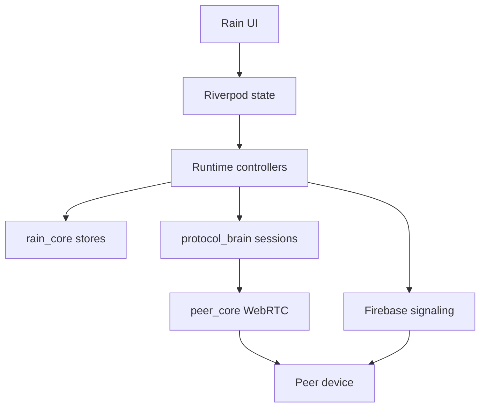

# Rain


Rain is a private peer-to-peer chat app for Android and Windows. It is built for
accepted friends who want direct conversations, file sharing, and real-time
voice/video calls without turning the app into a noisy social network.

[](https://github.com/EslamNabawy/Rain/actions/workflows/ci.yml)
[](https://github.com/EslamNabawy/Rain/actions/workflows/main-merge-gate.yml)

## Why Rain

Rain is designed around one idea: a private signal between people who already
know each other.

- Direct peer chat over WebRTC data channels.
- One-to-one voice and video calls with dedicated media connections.
- File sharing inside the conversation.
- Friend requests, accepted friendships, blocking, and user search.
- Clear direct/relay route status so users know what kind of link they have.
- Local persistence for messages, queues, settings, and transfer state.
- Firebase only coordinates accounts, presence, friendship, and signaling.

The product direction is calm, premium, and minimal: dark ink surfaces,
cyan/mint signal accents, restrained motion, and no feed-style distractions.

## Product Scope

Rain currently targets:

- Android phones.
- Windows desktop.
- Foreground app usage.
- One-to-one friendships.
- One active call globally.

Rain does not currently promise background ringing, group calls, web support,
or push-notification call wakeups.

## Feature Snapshot

| Area | What Rain does |
| --- | --- |
| Chat | Sends ordered peer messages with ACKs, queueing, and recovery |
| Connection | Uses WebRTC peer sessions with direct route first and relay fallback |
| Calls | Uses fresh WebRTC media connections for voice and video calls |
| Files | Sends file offers, accepts/rejects, chunks, progress, cancel, and export |
| Safety | Blocks new file transfers during active calls and clears stale call state |
| Settings | Handles profile, blocked users, sound, mic, route, and diagnostics |
| Branding | Uses the Peer Core mark, signal mist, ripple halo states, and Rain sounds |

## Architecture

Rain is a Flutter monorepo with strict ownership boundaries:

```text
apps/rain/              Flutter Android and Windows app
packages/rain_core/     Drift storage, identity, friends, messages, files
packages/protocol_brain/ Firebase signaling, sessions, retry, call signaling
packages/peer_core/     WebRTC data/media primitives and platform bridge
backend/firebase/       Realtime Database rules and cleanup functions
docs/                   Architecture, QA, release, and planning notes
scripts/                Local automation and build helpers
```

Runtime flow:



The important rule is simple: UI shows state, runtime owns side effects,
`protocol_brain` owns session policy, and `peer_core` owns raw WebRTC behavior.

## Connection Model

Rain separates chat/data transport from call media:

```text
Data peer connection:
  rain.chat    messages
  rain.ctrl    ACKs and control frames
  rain.file    file transfer frames

Call media connection:
  microphone/camera -> WebRTC media tracks -> RTP/RTCP -> DTLS-SRTP
```

Voice and video calls do not send audio/video packets over data channels.
Firebase carries encrypted signaling payloads for SDP/ICE and ephemeral call
state. WebRTC handles the real-time media transport.

For deeper details, read:

- [Connection algorithms](docs/architecture/connection-algorithms.md)
- [Widget map](docs/architecture/widget-map.md)
- [App context](docs/architecture/app-context.md)

## Quick Start

Prerequisites:

- Flutter `3.44.0`
- Dart `3.12.0`
- Melos `7.x`
- Windows desktop toolchain for Windows runs
- Android SDK cmdline-tools and accepted licenses for Android validation
- Firebase CLI for backend deployment

Bootstrap:

```powershell
dart pub get
dart run melos bootstrap
dart run melos run analyze
dart run melos run test
```

Run the Windows app with Firebase defines:

```powershell
cd apps/rain
Copy-Item tool/dart_defines.example.json tool/dart_defines.local.json
flutter run -d windows --dart-define-from-file=tool/dart_defines.local.json
```

Run local noop/demo mode:

```powershell
cd apps/rain
flutter run -d windows --dart-define=RAIN_BACKEND=noop
```

Do not commit `apps/rain/tool/dart_defines.local.json`. It is gitignored
because it may contain local secrets.

## Firebase Setup

Rain's active backend is Firebase:

1. Create a Firebase project.
2. Enable Email/Password Authentication and Realtime Database.
3. Configure FlutterFire inside `apps/rain`.
4. Set `FIREBASE_DATABASE_URL` in the app defines.
5. Deploy [Realtime Database rules](backend/firebase/database.rules.json).
6. Deploy [cleanup functions](backend/firebase/functions/index.js).

More backend details live in [backend/firebase/README.md](backend/firebase/README.md).

## Dart Defines

Common compile-time keys:

| Key | Purpose |
| --- | --- |
| `RAIN_BACKEND` | `firebase` or `noop` |
| `RAIN_ICE_SERVERS` | JSON array of WebRTC ICE server objects |
| `RAIN_ALLOW_PUBLIC_TURN` | Local/demo escape hatch for public TURN |
| `RAIN_TURN_BROKER_URL` | Optional production TURN credential broker |
| `RAIN_UPDATE_URL` | Force-update fallback URL |
| `FIREBASE_DATABASE_URL` | Firebase Realtime Database URL |

Production release builds must not use demo signaling encryption keys. Android
production builds also require signing secrets in CI.

## Validation

Normal validation:

```powershell
dart pub get
dart run melos run analyze
dart run melos run test
```

Release-sensitive call and connection changes also need manual device proof:

- Windows to Android data connection.
- Android to Windows data connection.
- Android to Android data connection.
- Voice call both directions.
- Video call both directions.
- Disconnect and reconnect both sides.
- App close during active connection.
- Repeat calls without restarting either app.
- File transfer blocking during active calls.

## Build Artifacts

CI workflows can produce direct Android and Windows test artifacts:

- `.github/workflows/ci.yml`
- `.github/workflows/main-merge-gate.yml`
- `.github/workflows/build-artifacts.yml`
- `.github/workflows/release.yml`

The app supports split Android APK outputs for device testing, including
`armeabi-v7a` and `arm64-v8a` where configured.

## Project Notes

- Message bodies are not stored in Firebase signaling rooms.
- Call rooms and pair locks are ephemeral and must be cleaned after terminal
  states.
- Local persistence and queue operations live behind Drift stores.
- Direct WebRTC routes are preferred, but relay fallback remains necessary for
  real-world networks.
- Manual device testing is required for call/media changes because emulator and
  unit tests cannot fully prove Android/Windows WebRTC behavior.

## License

No root repository license file is currently declared. Individual packages may
carry their own license files.
