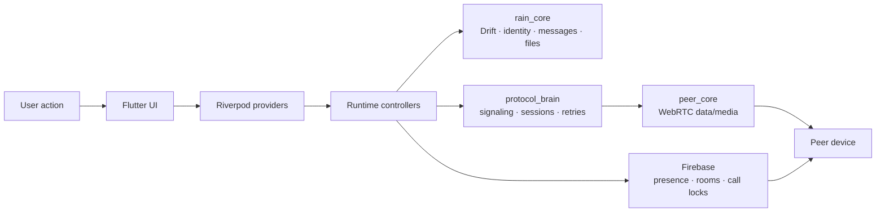

# Rain

> Private peer-to-peer chat for Android and Windows.


[](https://github.com/EslamNabawy/Rain/actions/workflows/ci.yml)
[](https://github.com/EslamNabawy/Rain/actions/workflows/main-merge-gate.yml)
[](https://github.com/EslamNabawy/Rain/actions/workflows/build-artifacts.yml)

---

Rain is a focused peer-to-peer messenger built for people who already trust each other. No public feeds, no follower graphs, no noisy social layer — just direct, private communication between accepted contacts.

The product surface is intentionally small: friend management, direct chat, file transfer, voice calls, video calls, and transparent connection state. Every design decision circles back to one question: **can this peer lane safely carry what the user is trying to do right now?**

---

## Why Rain?

Most chat apps bury the transport behind vague "online" indicators. Rain surfaces what actually matters — without turning the UI into a network console.

| User Need | Rain Behavior |
|---|---|
| Know if a friend is reachable | Shows accepted friends, presence, direct/relay route state, and offline blocks |
| Send messages reliably | Queues, ACKs, retries, and persists conversation state in Drift |
| Move files peer to peer | Explicit offer/accept flow with chunk progress, cancel, and export |
| Start calls safely | Dedicated voice/video state, Firebase call locks, and WebRTC media |
| Avoid confusing recovery states | Manual Disconnect stays disconnected until the user explicitly reconnects |
| Test builds quickly | Publishes separate v7a, v8/v9, and Windows artifacts for device testing |

Rain should feel **quiet, premium, and controlled**: dark ink surfaces, cyan/mint signal accents, restrained motion, and direct messaging when something is offline, busy, blocked, stale, or unsafe.

---

## Feature Scope

### ✅ Supported

- Android phones (ARM v7 and ARM v8/v9)
- Windows desktop (x64)
- Username sign-in and account ownership
- Friend search, requests, accepted friendships, and blocking
- Peer chat over WebRTC data channels
- Connection diagnostics with direct/relay route visibility
- One-to-one file transfer
- One-to-one voice calls
- One-to-one video calls
- Global call/file conflict guards

### 🚧 Not Yet In Scope

- Push-notification call wakeups
- Background Android call service
- Group calls
- Web, Linux, or macOS releases
- Formal third-party security audit
- App-store packaging

---

## Architecture

Rain separates app state, signaling, data transport, media transport, and local storage. This split is deliberate: chat can stay alive while media calls fail, end, or restart.



### Ownership Rules

| Layer | Responsibility |
|---|---|
| **UI** | Renders state and forwards explicit user intent |
| **Runtime controllers** | Own side effects and conflict decisions |
| **`rain_core`** | Persistence, identity, friends, messages, and files |
| **`protocol_brain`** | Signaling/session policy and Firebase contracts |
| **`peer_core`** | WebRTC primitives, data channels, media tracks, and platform bridges |
| **Firebase** | Presence, friendship, SDP/ICE exchange, and temporary call locks — *not* the chat message store |

---

## Transport Model

```
Firebase Realtime Database
  ├── users, presence, friendships, blocks
  ├── data-peer signaling rooms
  ├── voice/video call rooms
  ├── active pair locks & user locks
  └── terminal cleanup support

WebRTC Data Peer Connection
  ├── rain.chat    — message envelopes
  ├── rain.ctrl    — ACKs, control frames, diagnostics
  └── rain.file    — file transfer frames

WebRTC Media Peer Connection
  ├── microphone tracks
  ├── camera tracks
  └── RTP/RTCP over DTLS-SRTP
```

Calls use a **dedicated media path** so a failed camera or microphone negotiation never destroys the chat/data lane.

---

## Runtime Guarantees

Rain enforces these product-level rules at runtime:

- A user can have multiple peer chat lanes but only **one active or ringing call** at a time.
- Incoming calls during an active call return **busy** instead of opening a second call UI.
- Active calls **block new file sends** and incoming file accepts.
- Active file transfers **block starting or accepting calls**.
- Failed or stale calls **must release** their Firebase pair and user locks.
- Pressing **Disconnect** records local manual intent and disables automatic reconnect for that peer.
- Network loss does **not** count as a manual disconnect.
- Closing the app releases runtime resources and stops active connections.
- Offline peers are **blocked before** Connect starts a spinner.

---

## Repository Structure

```
rain/
├── apps/rain                  Flutter Android & Windows app
├── packages/
│   ├── rain_core              Drift storage · identity · friends · messages · file metadata · frame models
│   ├── protocol_brain         Firebase signaling · peer sessions · retry policy · call contracts
│   └── peer_core              WebRTC data/media primitives and platform bridge
├── backend/firebase           Realtime Database rules and cleanup functions
├── scripts/                   Build · icon sync · Firebase emulator · release helpers
├── docs/
│   ├── architecture/          Connection algorithms · widget map · app context · architecture notes
│   ├── qa/                    Manual gates and release validation records
│   └── superpowers/           Planning specs used during feature development
```

### Key Documents

| Document | Purpose |
|---|---|
| [Connection algorithms](docs/architecture/connection-algorithms.md) | How peers connect, retry, and recover |
| [Widget map](docs/architecture/widget-map.md) | Flutter widget structure overview |
| [App context](docs/architecture/app-context.md) | Runtime context and provider tree |
| [GitHub CI/CD guide](docs/github-ci-cd.md) | Workflow structure and secrets setup |
| [Firebase backend guide](backend/firebase/README.md) | Database rules and function deployment |
| [Video-call device gate](docs/qa/video-call-manual-device-gate.md) | Manual QA checklist for video calls |

---

## Quick Start

**Required tools:**

| Tool | Version |
|---|---|
| Flutter | `3.44.0` |
| Dart SDK | `^3.10.4` |
| JDK | 21 (Android builds) |
| Android SDK cmdline-tools | Latest (Android builds) |
| Windows desktop toolchain | (Windows builds) |
| Firebase CLI | Latest |

**Install dependencies:**

```powershell
dart pub get
dart run melos bootstrap
```

**Run analysis and tests:**

```powershell
dart run melos run analyze
dart run melos run test
```

**Run the Windows app:**

```powershell
cd apps/rain
flutter run -d windows --dart-define-from-file=tool/dart_defines.example.json
```

**Using local overrides:**

```powershell
cd apps/rain
Copy-Item tool/dart_defines.example.json tool/dart_defines.local.json
flutter run -d windows --dart-define-from-file=tool/dart_defines.local.json
```

> ⚠️ Never commit `apps/rain/tool/dart_defines.local.json`.

---

## Backend Setup

Rain's maintained backend is Firebase. Enable the following products in your Firebase project:

- Authentication
- Realtime Database
- Remote Config
- Cloud Functions

**Deploy rules and functions:**

```powershell
cd backend/firebase
firebase use --add
firebase deploy --only database

cd functions
npm install
npm run lint
cd ..
firebase deploy --only functions
```

### Database Schema

| Path | Purpose |
|---|---|
| `users/<username>` | Account ownership and presence |
| `friendRequests/<to>/<from>` | Friend request inbox |
| `friendships/<a>/<b>` | Accepted friendship edges |
| `blocks/<blocker>/<blocked>` | Block enforcement |
| `rooms/<pairId>` | Temporary data-peer signaling |
| `voiceCalls/<callId>` | Temporary voice/video signaling state |
| `activeVoicePairs/<pairId>` | Same-pair call lock |
| `activeVoiceUsers/<username>` | Cross-peer user call lock |

Cleanup functions automatically remove expired rooms, stale presence, abandoned call rooms, and terminal call locks.

---

## Dart Defines

Compile-time configuration keys:

| Key | Purpose |
|---|---|
| `RAIN_BACKEND` | `firebase` or `noop` |
| `RAIN_BACKGROUND_HEARTBEAT_SECONDS` | Foreground presence heartbeat interval |
| `RAIN_ALLOW_PUBLIC_TURN` | Demo-only switch for public TURN |
| `RAIN_TURN_BROKER_URL` | Optional production TURN credential broker |
| `RAIN_ICE_SERVERS` | JSON array of WebRTC ICE server objects |
| `RAIN_SIGNALING_ENCRYPTION_KEY` | Key material for encrypted signaling payloads |
| `RAIN_UPDATE_URL` | Fallback update/release URL |
| `FIREBASE_DATABASE_URL` | Firebase Realtime Database URL |

> Production release builds intentionally reject the demo signaling encryption key and public OpenRelay TURN configuration unless the build path is explicitly marked as demo.

---

## Test Builds

For device testing, use the manual GitHub Actions workflow instead of building locally:

```powershell
gh workflow run build-artifacts.yml `
  --ref dev `
  -f platform=all `
  -f build_profile=demo `
  -f publish_test_release=true
```

When `publish_test_release` is enabled, the workflow creates a `rain-test-*` GitHub pre-release with direct downloads:

| Artifact | Target Device |
|---|---|
| `Rain-Demo-Android-v7a.apk` | Older ARM v7 Android phones |
| `Rain-Demo-Android-v8-v9.apk` | Modern ARM64 Android phones |
| `Rain-Demo-Windows-x64.zip` | Windows x64 machines |

The same workflow supports production artifact builds when the required secrets are configured.

---

## Production Release

Production Android builds require these GitHub Actions secrets:

| Secret | Purpose |
|---|---|
| `RAIN_RELEASE_DART_DEFINES_JSON` | Full production Dart defines (must include non-demo key) |
| `RAIN_RELEASE_KEYSTORE_BASE64` | Base64-encoded Android keystore |
| `RAIN_RELEASE_STORE_PASSWORD` | Keystore password |
| `RAIN_RELEASE_KEY_ALIAS` | Key alias |
| `RAIN_RELEASE_KEY_PASSWORD` | Key password |

`RAIN_RELEASE_DART_DEFINES_JSON` must include a non-demo `RAIN_SIGNALING_ENCRYPTION_KEY` and either `RAIN_TURN_BROKER_URL` or project-owned TURN/TURNS entries in `RAIN_ICE_SERVERS`.

**Release artifacts:**

- `Rain-windows-portable.zip`
- `Rain-release-android-armeabi-v7a.apk`
- `Rain-release-android-arm64-v8a.apk`

---

## Validation Policy

**All code changes:**

```powershell
dart pub get
dart run melos run analyze
dart run melos run test
```

**Connection, call, media, Firebase, or release changes additionally require manual device validation:**

| Scenario | Check |
|---|---|
| Cross-platform chat | Android ↔ Android, Android ↔ Windows |
| Cross-platform file transfer | Android ↔ Android, Android ↔ Windows |
| Cross-platform voice/video | Android ↔ Android, Android ↔ Windows |
| Call initiation | Windows → Android |
| Routing | Direct and relay route behavior |
| App lifecycle | Close during active connection and during calls |
| Disconnect recovery | Manual Disconnect followed by network recovery |
| Call stability | Repeated calls without app restart |
| Conflict guards | File transfer blocked during call; call blocked during file transfer |
| Android v7a | APK install and run |
| Android v8/v9 | APK install and run |
| Windows | Portable launch |

Automated tests cover logic. Real devices prove WebRTC, permissions, audio, camera, routing, lifecycle, and OS integration.

---

## Security & Privacy

Rain is designed to minimize what Firebase carries. Key boundaries:

- **Chat messages and file bytes** travel over WebRTC, not Firebase rooms.
- **Firebase rules** enforce authenticated ownership, friendship checks, block enforcement, and call lock permissions.
- **SDP and ICE signaling payloads** are encrypted before storage.
- **WebRTC media and data channels** use encrypted transports (DTLS-SRTP).
- **Production builds** reject known demo signaling keys.
- **TURN metadata exposure** depends on the configured TURN infrastructure.

> This README is not a security audit. A formal third-party audit is not yet in scope.

---

## Development Guidelines

- Keep runtime backends limited to **Firebase** and **noop** unless the architecture is explicitly changed.
- Keep **manual disconnect intent** separate from network loss and automatic recovery.
- Keep **call UI surfaces** driven by one shared call-control model.
- Keep **media connection teardown** separate from chat/data teardown.
- Keep **docs, Firebase rules, fake adapters, and tests** aligned whenever the signaling schema changes.

---

## License

No root repository license file is currently declared.
