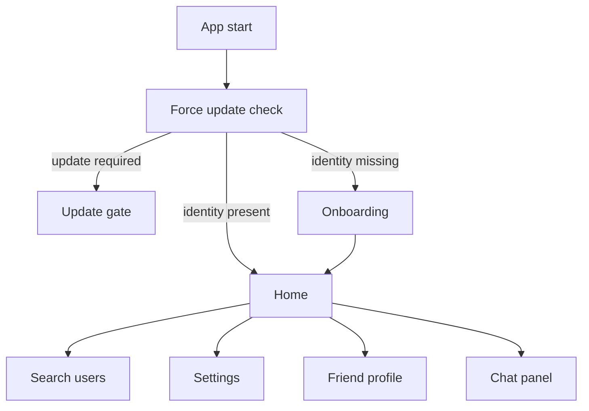

# Rain

Rain is a Melos-based Flutter monorepo for a peer-to-peer chat MVP. The codebase is split into transport, protocol, domain, and app layers so desktop and Android clients can share the same core behavior.

## Workspace Layout

- `apps/rain`: Flutter app shell for desktop and Android.
- `packages/peer_core`: WebRTC wrapper, state machine, channel lifecycle, and message chunking.
- `packages/protocol_brain`: Signaling adapters, session manager, retry logic, and connection memory.
- `packages/rain_core`: Drift database, identity, friends, messages, offline queue, and delivery rules.
- `backend/firebase`: Firebase Realtime Database rules and scheduled cleanup functions.
- `backend/supabase`: Supabase schema, RLS policies, and Edge Function cleanup job.

## Prerequisites

- Flutter `3.38.5`
- Dart `3.10.4`
- Melos `7.x`
- Windows desktop toolchain for local desktop development
- Android SDK cmdline-tools and accepted licenses before Android validation
- Firebase CLI for Firebase deployment
- Supabase CLI for Supabase deployment

## Bootstrap

```powershell
dart pub global activate melos
melos bootstrap
melos run analyze
melos run test
```

## Run Locally

Firebase is the default signaling backend for this app. Copy the example defines file and run the app:

```powershell
cd apps/rain
Copy-Item tool/dart_defines.example.json tool/dart_defines.local.json
flutter run -d windows --dart-define-from-file=tool/dart_defines.local.json
```

Do not commit `tool/dart_defines.local.json`; it is gitignored because it holds secrets.

If you want the local demo mode with no backend, run:

```powershell
cd apps/rain
flutter run -d windows --dart-define=RAIN_BACKEND=noop
```

## UI And Navigation

Rain uses a simple gated entry flow:



- `RootScreen` decides whether the app shows the update gate, onboarding, or the main shell.
- `OnboardingScreen` creates or logs in the local identity, then saves it to Drift.
- `HomeScreen` is the main hub. It shows the friend list, conversation panel, and the top-bar actions.
- `SearchScreen` is used to find users and send friend requests.
- `SettingsScreen` handles display name changes, theme selection, and blocked users.
- `FriendProfileScreen` exposes the same friend actions from a detail view.

Navigation behavior inside the shell is intentionally compact:

- Selecting a friend opens the chat panel.
- On narrow widths, the chat panel replaces the friend list and uses an in-panel back button.
- Long-pressing a friend opens the profile page.
- The add-friend, search, settings, and logout actions all live in the `HomeScreen` header.

## Dart Defines

The app reads compile-time configuration from `apps/rain/tool/dart_defines.local.json`. The supported keys are:

- `RAIN_BACKEND`: `firebase`, `noop`, or `supabase`
- `RAIN_ICE_SERVERS`: JSON array of WebRTC ICE server objects
- `RAIN_UPDATE_URL`: fallback update page used by the force-update gate
- `FIREBASE_DATABASE_URL`
- `SUPABASE_URL`
- `SUPABASE_ANON_KEY`

## Backend Setup

### Firebase

1. Create a Firebase project and enable:
   - Anonymous Authentication
   - Realtime Database
   - Remote Config
2. Run `flutterfire configure --project=rain-8fb4b` inside `apps/rain`. This repo already includes the generated [apps/rain/lib/firebase_options.dart](apps/rain/lib/firebase_options.dart) for project `rain-8fb4b`.
3. Create or verify the Realtime Database instance and set `FIREBASE_DATABASE_URL`. The current project URL is `https://rain-8fb4b-default-rtdb.firebaseio.com`.
4. Deploy the Realtime Database rules from [backend/firebase/database.rules.json](backend/firebase/database.rules.json).
5. Deploy the cleanup functions from [backend/firebase/functions/index.js](backend/firebase/functions/index.js).
6. Set the Remote Config keys:
   - `min_required_version`
   - `update_url` (optional; overrides `RAIN_UPDATE_URL`)

Detailed Firebase instructions live in [backend/firebase/README.md](backend/firebase/README.md).

### Supabase

1. Create a Supabase project and enable anonymous sign-in.
2. Apply [backend/supabase/schema.sql](backend/supabase/schema.sql).
3. Deploy [backend/supabase/functions/presence-cleanup/index.ts](backend/supabase/functions/presence-cleanup/index.ts) with `--no-verify-jwt`.
4. Schedule the function every 3 minutes so stale users are marked offline after 7 minutes without heartbeat.

Detailed Supabase instructions live in [backend/supabase/README.md](backend/supabase/README.md).

## Verification

```powershell
melos run analyze
melos run test
cd apps/rain
flutter build windows --debug --no-pub
```

## Local Testing
- Quick per-package tests:
  - In each Flutter package (rain_core, peer_core): flutter pub get && flutter test
- Full monorepo tests via Melos:
  - melos bootstrap
  - melos test
- Cross-platform local testing:
  - Windows: powershell -ExecutionPolicy Bypass -File scripts/test_all.ps1
  - macOS/Linux: melos test (or implement test_all.sh if desired)

## MVP Notes

- Signaling data never stores message bodies in Firebase or Supabase.
- Rooms are deleted immediately after connect and also cleaned up server-side as a safety net.
- Local persistence and queue operations live behind Drift transactions in `rain_core`.
- Android background execution still requires device validation after Android SDK tooling is fixed on the host machine.
