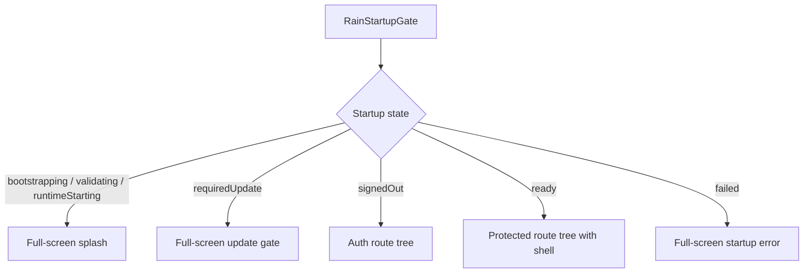

# Splash Screen Investigation

Date: 2026-06-03

## Symptom

Loading/splash UI can appear inside the application shell. The user can see combinations of:

- App shell/backdrop.
- Navigation area.
- Partial app UI.
- Loading/splash surface.

Expected behavior: the splash screen should be the whole app until startup is complete.

## Current Implementation

There are two splash usages:

1. Pre-bootstrap splash:
   - `RainStartupApp` returns a standalone `MaterialApp(home: RainSplashScreen())` while `AppBootstrapper.bootstrap()` is unresolved.
   - This is a true global splash.

2. Post-bootstrap loading splash:
   - `RootScreen._LoadingView` returns `RainSplashScreen()`.
   - This happens after `ProviderScope`, `RainApp`, `MaterialApp.router`, `GoRouter`, `ShellRoute`, and `RainNavigationShell` already exist.

## Root Cause

The splash is used both as a global startup screen and as a route-local loading widget. The route-local version is rendered under the app router/shell rather than before the app shell exists.

## Affected Components

- `RainStartupApp`
- `RainApp`
- `appRouterProvider`
- `RainNavigationShell`
- `RootScreen`
- `SettingsScreen`
- `SearchScreen`
- `FriendProfileScreen`

## Reproduction Steps

### Root Route Loading

1. Start app with a persisted identity.
2. Make `runtimeControllerProvider` remain loading.
3. `RootScreen` returns `RainSplashScreen()`.
4. The splash is rendered as the route child under `ShellRoute`.

The current test asserts no bottom nav for this root case, but the routed shell/backdrop still exists.

### Non-Root Protected Route Loading

1. Open or restore `/settings` while identity/update/runtime is unresolved.
2. `GoRouter.redirect` returns `null` while identity has no value.
3. `ShellRoute` builds `SettingsScreen`.
4. `SettingsScreen` reads `identityProvider.value`, which can be null, and renders profile UI with `Unknown`.

This bypasses `RootScreen._LoadingView` entirely.

## Severity

High.

## Risk

The app can look partially initialized and broken. Protected screens can render with missing state. Users may interact with settings/search before auth/runtime readiness is known. This also makes failure reports harder to interpret because splash state is not a single lifecycle phase.

## Recommended Fix

Move startup/loading responsibility out of `RootScreen` and into a global app gate above `MaterialApp.router` or into a router-level redirect that cannot render protected children while startup is incomplete.

Minimum behavior:

- Pre-bootstrap: global `RainSplashScreen`.
- Session validation/runtime start: global `RainSplashScreen`, not shell child.
- Required update: global update gate.
- Signed out: auth flow only.
- Ready: full routed app shell.

## Long-Term Architectural Fix

Create `RainStartupGate`:

`RootScreen` should no longer own global loading. It should only render home content after startup is ready.

## Critical Architecture Defects

| Defect | Impact |
| --- | --- |
| Splash component has two meanings | Global startup and route loading are conflated. |
| App shell can exist before readiness | Shell/backdrop/scaffold can wrap loading screens. |
| Protected routes do not share splash gate | Settings/search/friend routes can render without RootScreen. |
| UI uses `.value` on async identity | Loading/error/null are collapsed into partial UI. |

## Acceptance Criteria For Repair

- No `NavigationBar` or `NavigationRail` before app ready.
- No `RainNavigationShell` before app ready for protected routes.
- No settings/search/profile content before authenticated session is ready.
- Startup splash owns the full viewport.
- App cannot render `Unknown` profile due to auth loading.
- Widget tests cover `/`, `/settings`, `/search`, and `/friend/:username` during loading.
