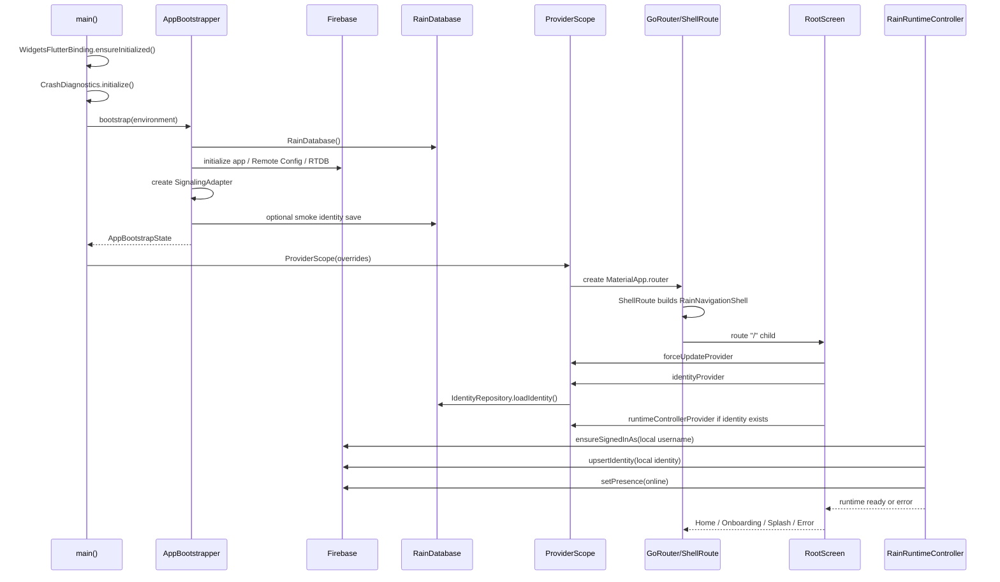
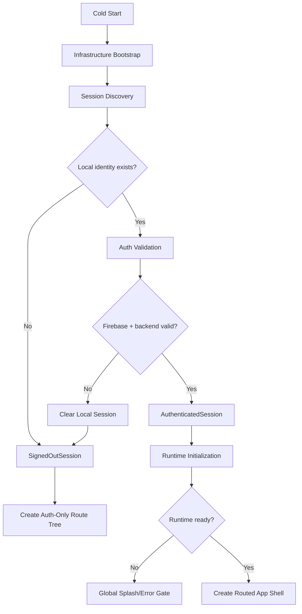

# Startup Sequence Analysis

Date: 2026-06-03

## Actual Startup Trace

## Stage Inventory

| Stage | Inputs | Outputs | Dependencies | Failure Modes | Race Conditions |
| --- | --- | --- | --- | --- | --- |
| Cold start | Dart defines, platform, local files | Flutter binding | Flutter engine | Native init error | None observed |
| Diagnostics setup | local storage path | crash/log handlers | file system | export path or init failure | Errors before handler install can be missed |
| Bootstrap | environment | database, adapter, update service | Firebase Core, RTDB, Remote Config | Firebase init, config validation, DB open | Smoke autoprovision can write identity before auth gate |
| ProviderScope creation | bootstrap state | app providers | bootstrap completion | stale bootstrap state until app restart | ProviderScope is not keyed per auth session |
| Router creation | providers | GoRouter | identity provider refresh only | protected routes exist before auth ready | redirect waits for identity; no force-update/runtime redirect |
| Identity load | local Drift | `RainIdentity?` | local DB | stale identity, corrupt row | UI can read `.value` before validation |
| Runtime start | local identity | runtime controller | Firebase Auth, RTDB, WebRTC prep | session expired, backend permission denied, local identity stale | startup can recreate backend identity from stale local row |
| Route resolution | identity/update/runtime values | screen | router, RootScreen | shell exists before RootScreen gates | non-root routes can render protected screens |
| App ready | runtime ready | Home/settings/search | all services | partial readiness | manual invalidation on logout can miss providers |

## Expected Startup Sequence

The requested sequence is:

Cold Start -> Bootstrap -> Authentication Validation -> Runtime Initialization -> Route Resolution -> App Ready

Current sequence is closer to:

Cold Start -> Bootstrap -> Router/Shell Creation -> Root Route Loading -> Identity Load -> Runtime Validation -> App Ready

The order is wrong because route/shell creation happens before authenticated session validation.

## Confirmed Root Causes

### Root Cause 1: Router/Shell Is Created Before Auth Session Is Validated

`RainApp` creates `MaterialApp.router` immediately after bootstrap. The router builds a `ShellRoute` for all app routes. `RootScreen` handles loading on `/`, but the shell already exists.

### Root Cause 2: Runtime Startup Recreates Backend Account From Local Cache

`RainRuntimeController.start()` validates Firebase Auth ownership, then calls `adapter.upsertIdentity(...)` using local `RainIdentity`. This can recreate backend user data after external deletion.

### Root Cause 3: Auth Validation Is Not A Bootstrap Stage

`AppBootstrapper` creates infrastructure only. It does not return a validated auth/session state. Auth validation occurs inside providers and runtime after routing exists.

### Root Cause 4: Protected Route Access Is Not Centrally Gated

`GoRouter.redirect` only redirects unauthenticated users after `identityProvider` has a value. It does not block while identity is loading, while update is loading, or while runtime is starting. It also does not force all protected paths through a startup gate.

## Critical Architecture Defects

| Defect | Evidence | Severity |
| --- | --- | --- |
| Startup sequence is out of order | `RainApp` creates router before auth/runtime validation. | Critical |
| Route resolution happens before app readiness | `ShellRoute` wraps all routes before `RootScreen` checks state. | High |
| Runtime startup mutates backend before session validity is final | `start()` upserts identity/presence. | Critical |
| Loading state is route-local, not app-global | `_LoadingView` is inside `RootScreen`. | High |
| Provider scope is not session-keyed | One `ProviderScope` is created after bootstrap and reused through logout. | High |

## Recommended Startup Contract

## Remediation Roadmap

### Phase 00: Characterization Tests

- Test stale local identity plus missing backend user.
- Test deleted/invalid Firebase user plus local identity.
- Test `/settings` loaded before identity resolves.
- Test runtime loading renders no `Scaffold`/shell for protected app.

### Phase 01: Startup Coordinator

Add a `StartupCoordinator` that produces:

- `bootstrapping`
- `signedOut`
- `validatingSession`
- `runtimeStarting`
- `ready`
- `blockedByUpdate`
- `failed`

### Phase 02: Global Startup Gate

Render only:

- Splash during bootstrap/validation/runtime start.
- Force update gate if required.
- Auth flow when signed out.
- Full app shell only after ready.

### Phase 03: Route Tree Split

Separate routes:

- Public auth routes.
- Protected app routes.
- Force-update route.
- Startup failure route.

### Phase 04: Runtime Mutation Guard

Runtime must not write `users/{username}` or presence until the session coordinator has validated backend account state.

### Phase 05: Release Gate Tests

Add widget tests proving:

- No navigation before ready.
- No protected route content before ready.
- Missing backend account clears local session before home/settings render.
