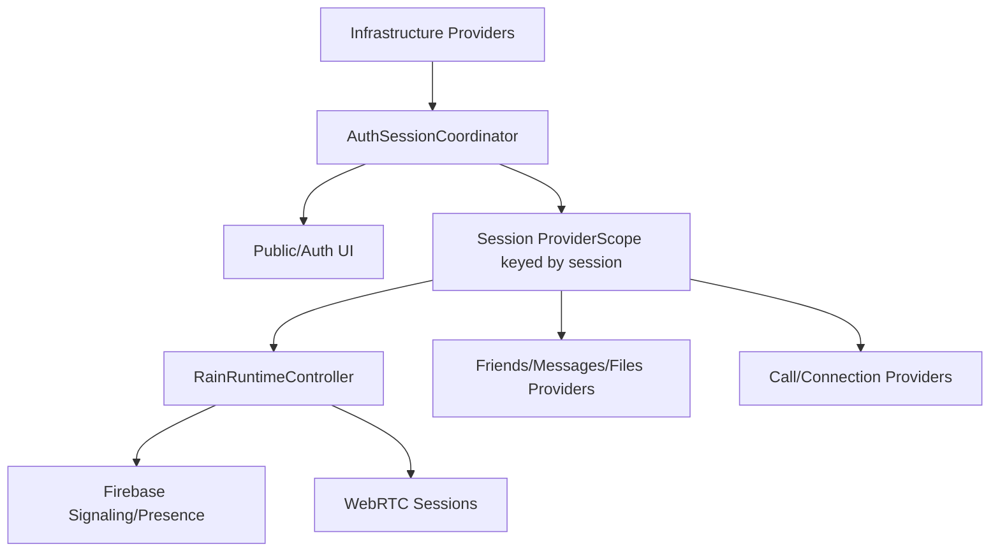

# State Management Failure Analysis

Date: 2026-06-03

## Summary

The auth/startup symptoms are caused by state duplication and missing session ownership. Rain has several long-lived state stores that can disagree:

- Firebase Auth current user.
- RTDB user profile.
- RTDB presence.
- Drift local identity and friends/messages/files.
- SharedPreferences settings.
- Riverpod providers.
- Runtime controller and protocol sessions.
- GoRouter route state.

There is no session-scoped provider container or single session coordinator that disposes/rebuilds everything when the account changes.

## State Inventory

| State | Owner | Lifetime | Problem |
| --- | --- | --- | --- |
| Firebase Auth user | Firebase SDK | App install / SDK persistence | Can remain after backend data reset. |
| Local identity | Drift `identity_table` | App install until `clearSessionData` | Used as signed-in UI truth before backend validation. |
| Backend identity | RTDB `users/{username}` | Backend | Recreated from local identity during runtime start. |
| Presence | RTDB `presence/{username}` | Runtime/session | Written online from local identity. |
| Runtime controller | `runtimeControllerProvider` | ProviderScope/session-ish | Manual invalidation only after successful logout. |
| Friends/messages/files | Drift tables/providers | Local DB | Cleared by `clearSessionData`, but only if reached. |
| Settings | SharedPreferences | Device global | Not account-scoped; selected devices/update dismissal can survive account reset. |
| Router | GoRouter provider | ProviderScope | Created before authenticated readiness. |
| Navigation shell | ShellRoute | Router lifetime | Can wrap loading/protected child routes. |

## Confirmed Failure Patterns

### Pattern 1: Local Identity Is Treated As Authenticated State

`identityProvider` returns `RainIdentity?` from local DB. Signed-in UI and runtime startup branch from that value.

Failure: local cache can outlive account deletion/reset.

### Pattern 2: Runtime Startup Mutates Backend From Stale Local State

`RainRuntimeController.start()` upserts backend identity and sets presence from `selfIdentity`.

Failure: externally deleted backend account data can reappear.

### Pattern 3: Session Reset Is UI-Triggered After Runtime Failure

When runtime startup throws `SignalingSessionExpiredException`, `RootScreen` renders `_SessionExpiredResetView`, schedules a post-frame reset, and shows a splash.

Failure: reset happens after routing/shell/provider initialization. If reset fails, stale state remains.

### Pattern 4: Logout Cleanup Depends On Successful Runtime Shutdown

`RuntimeController.logOut()` invalidates providers only after `controller.logOut()` returns. `controller.logOut()` clears local session after sign-out and other cleanup.

Failure: any thrown backend/sign-out cleanup can prevent local clear and provider invalidation.

### Pattern 5: Protected UI Reads `AsyncValue.value`

Settings/search screens use `.value`, which hides the difference between loading, error, signed-out, and absent identity.

Failure: UI renders partial protected state with `Unknown` identity or late action errors.

### Pattern 6: Manual Provider Invalidation Is Incomplete By Design

Logout invalidates a list:

- identity
- friends
- file transfers
- connection requests
- voice call
- connections
- recent searches

But provider state is broader than that list: settings, update dismissal, user search, sound/audio device settings, message provider families, router state, and services can survive.

Failure: adding a new account-scoped provider can silently leak state unless the list is updated.

## Severity

Critical.

## Risk

State leaks across users and sessions can expose stale profile/friend/message state locally, misroute backend writes, break logout/account deletion, and render protected UI before readiness.

## Recommended Fix

Introduce session-scoped state ownership.

### New State Layers

1. `InfrastructureScope`
   - Firebase initialization.
   - Database handle.
   - Remote Config.
   - Diagnostics.
   - Network status.

2. `AuthSessionScope`
   - Authenticated session.
   - Local identity.
   - Runtime.
   - Friends/messages/files.
   - Calls/connection requests.
   - Account-scoped settings.

3. `PublicScope`
   - Splash.
   - Force update.
   - Onboarding/sign-in/register.

### Session Key

Every authenticated provider should be keyed by:

- username
- Firebase uid
- session generation

On logout/delete/session invalidation, increment the generation and dispose the old session scope.

## Long-Term Architectural Fix

## Required Regression Tests

- Logout clears local identity even when Firebase sign-out throws.
- Session expired clears local identity before protected UI renders.
- Missing backend identity plus local identity routes to auth flow.
- `/settings` does not render profile UI while identity is loading.
- Provider state from user A is not visible after user B signs in.
- Runtime is disposed exactly once on logout.
- New session receives a new provider/session generation.

## Remediation Roadmap

### Phase 00: Failing Tests

Lock current bugs with tests before code changes.

### Phase 01: Session Coordinator

Create one state machine for auth/session readiness.

### Phase 02: Cleanup Ordering

Make local clear guaranteed and backend cleanup best effort.

### Phase 03: Provider Scope Keying

Key all account-scoped providers under an authenticated session generation.

### Phase 04: Router Gate

Block protected route tree until session state is ready.

### Phase 05: Account-Scoped Settings

Separate device-global settings from account-scoped settings and clear/migrate as needed.

### Phase 06: Documentation And Release Gate

Document session state and add tests to the hard release gate.
