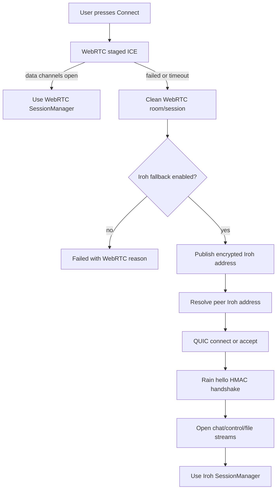

# Rain Iroh Fallback Implementation Plan

> **For agentic workers:** REQUIRED SUB-SKILL: Use superpowers:subagent-driven-development (recommended) or superpowers:executing-plans to implement this plan task-by-task. Steps use checkbox (`- [ ]`) syntax for tracking.

**Goal:** Add Iroh as a reliable QUIC P2P fallback transport for Rain when WebRTC cannot connect across mobile data, VPN, or difficult NATs.

**Architecture:** Keep the current WebRTC stack as the first route because it already supports chat, ACKs, file transfer, route diagnostics, and same-LAN direct links. Add Iroh behind the existing `SessionManager` contract as a second transport that starts only after an explicit user Connect and only after WebRTC fails or times out. Use Firebase only for authenticated, encrypted transport address exchange; no chat bytes or file bytes go through Firebase.

**Tech Stack:** Flutter, Riverpod, Firebase Realtime Database signaling, existing `protocol_brain` `SessionManager`, Rust, Iroh QUIC endpoints, flutter_rust_bridge, Android/Windows release builds.

---

## Current Decision

Use Iroh, not Ixian/QuIXI, as the next transport experiment.

Reason:
- Iroh directly targets Rain's current failure: NAT traversal plus relay fallback for authenticated QUIC connections.
- Iroh gives a cryptographic node ID, QUIC streams, direct path attempts, relay fallback, and path diagnostics.
- Rain can integrate Iroh as a fallback without rewriting the whole app.
- Trystero is excellent for JS/browser/React Native, but Rain is native Flutter and already has Firebase signaling.
- libp2p is too broad for this immediate fix.
- Veilid is strong but heavier and more privacy-network-oriented than Rain needs right now.

## Documentation Checked

- Iroh docs via Context7: `Endpoint::bind(presets::N0)`, `Endpoint::builder(presets::N0).alpns(...).bind()`, `Endpoint::connect(...)`, `conn.open_bi()`, `conn.accept_bi()`, `conn.paths()`, relay mode configuration, graceful `conn.close(...)` and `ep.close().await`.
- flutter_rust_bridge docs via Context7: integrate into an existing Flutter project with `flutter_rust_bridge_codegen integrate`, regenerate bindings with `flutter_rust_bridge_codegen generate`, expose async Rust functions, stream Rust events to Dart through `StreamSink<T>`, and support platform build integration for Android and Windows.

Useful source links:
- https://docs.rs/iroh/latest/index.html
- https://github.com/n0-computer/iroh
- https://github.com/fzyzcjy/flutter_rust_bridge

## Non-Goals

- Do not touch `main`; all work stays on `dev`.
- Do not reintroduce Ixian or QuIXI files.
- Do not replace Firebase auth, presence, friendships, or search.
- Do not send chat message bodies, ACKs, or file bytes through Firebase.
- Do not auto-connect from app startup, presence, chat open, send, refresh, or file transfer.
- Do not change message delivery truth: `Delivered` still requires peer ACK.
- Do not add file resume in this pass.
- Do not make Iroh the default route until it passes manual Android + Windows smoke tests.

## Target Connect Algorithm

1. User presses Connect.
2. Rain tries existing WebRTC staged ICE first.
3. If WebRTC reaches connected data channels, stop. Route shows WebRTC Direct or WebRTC Relay based on selected ICE stats.
4. If WebRTC fails, times out, or reports that all ICE routes failed, Rain disconnects and cleans that WebRTC room.
5. If `RAIN_ENABLE_IROH_FALLBACK=true`, Rain starts or reuses a local Iroh endpoint.
6. Both peers publish encrypted Iroh address payloads into the same Firebase room under the current connect attempt.
7. Deterministic role selection chooses one dialer and one listener so simultaneous Connect does not create duplicate sessions.
8. The dialer connects to the peer's Iroh node address over QUIC using the Rain ALPN.
9. First QUIC frame performs a Rain hello handshake with username, peer username, attempt ID, and HMAC over a Firebase-exchanged attempt secret.
10. Iroh opens three logical channel streams: `rain.chat`, `rain.ctrl`, and `rain.file`.
11. `FallbackSessionManager` exposes one connected `Session` to the app. Existing chat, ACK, offline queue, and file transfer code use the same calls they use today.
12. If Iroh fails too, UI shows `All connection routes failed. WebRTC failed, then Iroh fallback failed: <precise reason>.`



## File Structure

### Existing Files To Modify

- `packages/protocol_brain/lib/src/session_manager.dart`
  - Add `ConnectionType.iroh`.
  - Keep `SessionChannel` unchanged.
  - Keep `SessionManager` as the app-facing transport contract.

- `packages/protocol_brain/lib/adapters/signaling_adapter.dart`
  - Add `IrohAddressPayload`.
  - Add methods for writing and watching Iroh address payloads.

- `packages/protocol_brain/lib/adapters/firebase_adapter.dart`
  - Store encrypted Iroh address payloads under `rooms/<roomId>/iroh/<connectAttemptId>/<username>`.
  - Delete stale Iroh address data with the room.

- `packages/protocol_brain/lib/adapters/supabase_adapter.dart`
  - Implement compatible no-op or explicit unsupported behavior so the package still compiles. Rain app currently uses Firebase only, but exported adapters must not break.

- `apps/rain/lib/infrastructure/signaling/noop_signaling_adapter.dart`
  - Implement the new signaling methods as empty streams / no-op writes for local demo.

- `apps/rain/lib/application/state/app_providers.dart`
  - Wire WebRTC brain plus optional Iroh fallback brain.
  - Add providers for Iroh bridge, Iroh session manager, and fallback session manager.

- `apps/rain/lib/application/state/connection_diagnostics.dart`
  - Add transport label and Iroh path diagnostics.

- `apps/rain/lib/presentation/screens/home_screen.dart`
  - Display `Direct`, `Relay`, `Connecting`, `Recovering`, or `Failed` without layout overflow.
  - Show whether the active transport is WebRTC or Iroh inside the details dialog, not as a second status bar.

- `apps/rain/lib/core/config/app_environment.dart`
  - Add Iroh feature flags.
  - Defaults keep Iroh off until builds are verified.

- `.github/workflows/ci.yml`
  - Add Rust toolchain and Iroh tests only after the Rust bridge lands.

- `.github/workflows/build-artifacts.yml`
  - Build Android and Windows with Rust native library support only after local builds pass.

### New Files To Create

- `packages/protocol_brain/lib/src/iroh_signaling.dart`
  - Pure Dart payload model and JSON roundtrip for Iroh signaling.

- `packages/protocol_brain/test/iroh_signaling_test.dart`
  - Payload validation and stale payload tests.

- `apps/rain/lib/application/transport/fallback_session_manager.dart`
  - `SessionManager` wrapper that tries WebRTC first and Iroh second.

- `apps/rain/test/fallback_session_manager_test.dart`
  - Fake managers prove fallback behavior, no auto-connect, and send routing.

- `apps/rain/lib/infrastructure/iroh/iroh_bridge_client.dart`
  - Dart wrapper around generated Rust bridge functions.

- `apps/rain/lib/infrastructure/iroh/iroh_session_manager.dart`
  - Iroh implementation of `SessionManager`.

- `apps/rain/lib/infrastructure/iroh/iroh_models.dart`
  - Dart models for Iroh endpoint state, path diagnostics, channel events, and errors.

- `apps/rain/test/iroh_session_manager_test.dart`
  - Unit tests with a fake `IrohBridgeClient`.

- `apps/rain/rust/Cargo.toml`
  - Rust crate for Iroh bridge.

- `apps/rain/rust/src/api/iroh_transport.rs`
  - Rust endpoint lifecycle, connect/accept, streams, send, close, diagnostics.

- `apps/rain/rust/src/api/mod.rs`
  - Rust API module export.

- `apps/rain/rust/src/framing.rs`
  - Length-prefixed frame codec and Rain hello frame.

- `apps/rain/rust/src/state.rs`
  - Endpoint/session/channel state maps.

- `apps/rain/rust/src/lib.rs`
  - flutter_rust_bridge module entrypoint.

- `apps/rain/flutter_rust_bridge.yaml`
  - Codegen configuration.

- `docs/architecture/rain-iroh-fallback.md`
  - Architecture decision, threat model, and manual smoke guide.

## Config

Add these compile/runtime flags:

```text
RAIN_ENABLE_IROH_FALLBACK=false
RAIN_IROH_CONNECT_TIMEOUT_SECONDS=25
RAIN_IROH_ALPN=rain.p2p.quic.v1
RAIN_IROH_DISCOVERY=n0
```

Default must remain disabled:

```dart
enableIrohFallback: readBool(
  'RAIN_ENABLE_IROH_FALLBACK',
  compileTimeValue: const String.fromEnvironment('RAIN_ENABLE_IROH_FALLBACK'),
  defaultValue: false,
),
```

## Protocol Contracts

### Firebase Iroh Address Payload

Path:

```text
rooms/<roomId>/iroh/<connectAttemptId>/<normalizedUsername>
```

Payload before encryption:

```json
{
  "protocolVersion": 1,
  "connectAttemptId": "attempt-id",
  "username": "alice",
  "nodeId": "iroh-node-id",
  "endpointAddr": "serialized-endpoint-address",
  "sessionSecret": "base64url-32-byte-secret",
  "createdAt": 1779140000000,
  "expiresAt": 1779140030000
}
```

Rules:
- `expiresAt` is `createdAt + 30 seconds`.
- Username must equal the Firebase authenticated Rain username.
- `connectAttemptId` must match the current Connect.
- Receiver ignores stale payloads, expired payloads, wrong usernames, and wrong attempts.
- `sessionSecret` is random per Connect attempt and only exists inside encrypted signaling.
- Firebase stores no chat text, no ACKs, no file bytes.

### Iroh QUIC Hello

First frame on the control stream:

```json
{
  "type": "rain.iroh.hello",
  "protocolVersion": 1,
  "connectAttemptId": "attempt-id",
  "from": "alice",
  "to": "bob",
  "nodeId": "iroh-node-id",
  "nonce": "base64url-16-byte-nonce",
  "hmac": "base64url-hmac-sha256"
}
```

HMAC input:

```text
rain.iroh.hello.v1|connectAttemptId|from|to|nodeId|nonce
```

HMAC key:

```text
sessionSecret from encrypted Firebase Iroh address payload
```

Reject connection if:
- `to` does not equal local username.
- `from` does not equal expected peer.
- `connectAttemptId` is not current.
- `nodeId` does not match the Firebase payload.
- HMAC does not match.

### Iroh Data Frame

Length-prefixed binary frame:

```json
{
  "type": "rain.iroh.data",
  "protocolVersion": 1,
  "channel": "rain.chat",
  "payloadType": "utf8",
  "payloadLength": 124,
  "payload": "<bytes follow outside json in Rust frame codec>"
}
```

Channels:

```text
rain.chat
rain.ctrl
rain.file
```

Mapping to existing Rain:

```dart
SessionChannel.chat -> rain.chat
SessionChannel.control -> rain.ctrl
SessionChannel.file -> rain.file
```

## Task 0: Branch Guard And Baseline

**Files:**
- Read only: whole repo

- [ ] **Step 1: Verify branch**

Run:

```powershell
git branch --show-current
```

Expected:

```text
dev
```

If output is not `dev`, stop. Do not switch to `main`.

- [ ] **Step 2: Capture current dirty state**

Run:

```powershell
git status --short
```

Expected: existing unrelated dirty files may appear. Do not revert them.

- [ ] **Step 3: Run current focused baseline**

Run:

```powershell
flutter analyze apps/rain
flutter test packages/protocol_brain
flutter test packages/rain_core
flutter test packages/peer_core
flutter test apps/rain
```

Expected:

```text
No issues found!
All tests passed!
```

If a failure is unrelated and already present, save the output in the implementation notes before editing.

## Task 1: Add Iroh Transport Type

**Files:**
- Modify: `packages/protocol_brain/lib/src/session_manager.dart`
- Test: `packages/protocol_brain/test/session_manager_contract_test.dart`

- [ ] **Step 1: Write the failing test**

Create `packages/protocol_brain/test/session_manager_contract_test.dart`:

```dart
import 'package:protocol_brain/protocol_brain.dart';
import 'package:test/test.dart';

void main() {
  test('ConnectionType includes Iroh for fallback transport', () {
    expect(ConnectionType.values, contains(ConnectionType.iroh));
  });

  test('Iroh sessions still use existing Rain channels', () {
    expect(SessionChannel.values, contains(SessionChannel.chat));
    expect(SessionChannel.values, contains(SessionChannel.control));
    expect(SessionChannel.values, contains(SessionChannel.file));
  });
}
```

- [ ] **Step 2: Run test to verify it fails**

Run:

```powershell
flutter test packages/protocol_brain/test/session_manager_contract_test.dart
```

Expected: fail because `ConnectionType.iroh` does not exist.

- [ ] **Step 3: Add transport enum value**

Change in `packages/protocol_brain/lib/src/session_manager.dart`:

```dart
enum ConnectionType { signaling, iroh }
```

- [ ] **Step 4: Run test to verify it passes**

Run:

```powershell
flutter test packages/protocol_brain/test/session_manager_contract_test.dart
```

Expected: pass.

- [ ] **Step 5: Commit**

```powershell
git add packages/protocol_brain/lib/src/session_manager.dart packages/protocol_brain/test/session_manager_contract_test.dart
git commit -m "feat: add iroh transport session type"
```

## Task 2: Add Iroh Signaling Payload Contract

**Files:**
- Create: `packages/protocol_brain/lib/src/iroh_signaling.dart`
- Modify: `packages/protocol_brain/lib/protocol_brain.dart`
- Test: `packages/protocol_brain/test/iroh_signaling_test.dart`

- [ ] **Step 1: Write payload tests**

Create `packages/protocol_brain/test/iroh_signaling_test.dart`:

```dart
import 'package:protocol_brain/protocol_brain.dart';
import 'package:test/test.dart';

void main() {
  test('IrohAddressPayload round trips through json', () {
    const payload = IrohAddressPayload(
      protocolVersion: 1,
      connectAttemptId: 'attempt-1',
      username: 'alice',
      nodeId: 'node-1',
      endpointAddr: 'endpoint-addr-1',
      sessionSecret: 'secret-1',
      createdAt: 1000,
      expiresAt: 31000,
    );

    expect(IrohAddressPayload.fromJson(payload.toJson()), payload);
  });

  test('IrohAddressPayload rejects expired attempts', () {
    const payload = IrohAddressPayload(
      protocolVersion: 1,
      connectAttemptId: 'attempt-1',
      username: 'alice',
      nodeId: 'node-1',
      endpointAddr: 'endpoint-addr-1',
      sessionSecret: 'secret-1',
      createdAt: 1000,
      expiresAt: 31000,
    );

    expect(payload.isUsableAt(30000), isTrue);
    expect(payload.isUsableAt(31001), isFalse);
  });

  test('IrohAddressPayload rejects mismatched attempt or username', () {
    const payload = IrohAddressPayload(
      protocolVersion: 1,
      connectAttemptId: 'attempt-1',
      username: 'alice',
      nodeId: 'node-1',
      endpointAddr: 'endpoint-addr-1',
      sessionSecret: 'secret-1',
      createdAt: 1000,
      expiresAt: 31000,
    );

    expect(
      payload.matches(username: 'alice', connectAttemptId: 'attempt-1'),
      isTrue,
    );
    expect(
      payload.matches(username: 'bob', connectAttemptId: 'attempt-1'),
      isFalse,
    );
    expect(
      payload.matches(username: 'alice', connectAttemptId: 'attempt-2'),
      isFalse,
    );
  });
}
```

- [ ] **Step 2: Run test to verify it fails**

Run:

```powershell
flutter test packages/protocol_brain/test/iroh_signaling_test.dart
```

Expected: fail because `IrohAddressPayload` does not exist.

- [ ] **Step 3: Implement payload model**

Create `packages/protocol_brain/lib/src/iroh_signaling.dart`:

```dart
class IrohAddressPayload {
  const IrohAddressPayload({
    required this.protocolVersion,
    required this.connectAttemptId,
    required this.username,
    required this.nodeId,
    required this.endpointAddr,
    required this.sessionSecret,
    required this.createdAt,
    required this.expiresAt,
  });

  final int protocolVersion;
  final String connectAttemptId;
  final String username;
  final String nodeId;
  final String endpointAddr;
  final String sessionSecret;
  final int createdAt;
  final int expiresAt;

  bool isUsableAt(int nowMs) => protocolVersion == 1 && nowMs <= expiresAt;

  bool matches({required String username, required String connectAttemptId}) {
    return this.username.trim().toLowerCase() ==
            username.trim().toLowerCase() &&
        this.connectAttemptId == connectAttemptId;
  }

  Map<String, Object?> toJson() {
    return <String, Object?>{
      'protocolVersion': protocolVersion,
      'connectAttemptId': connectAttemptId,
      'username': username,
      'nodeId': nodeId,
      'endpointAddr': endpointAddr,
      'sessionSecret': sessionSecret,
      'createdAt': createdAt,
      'expiresAt': expiresAt,
    };
  }

  static IrohAddressPayload fromJson(Map<Object?, Object?> json) {
    return IrohAddressPayload(
      protocolVersion: (json['protocolVersion'] as num?)?.toInt() ?? 1,
      connectAttemptId: json['connectAttemptId']?.toString() ?? '',
      username: json['username']?.toString() ?? '',
      nodeId: json['nodeId']?.toString() ?? '',
      endpointAddr: json['endpointAddr']?.toString() ?? '',
      sessionSecret: json['sessionSecret']?.toString() ?? '',
      createdAt: (json['createdAt'] as num?)?.toInt() ?? 0,
      expiresAt: (json['expiresAt'] as num?)?.toInt() ?? 0,
    );
  }

  @override
  bool operator ==(Object other) {
    return other is IrohAddressPayload &&
        other.protocolVersion == protocolVersion &&
        other.connectAttemptId == connectAttemptId &&
        other.username == username &&
        other.nodeId == nodeId &&
        other.endpointAddr == endpointAddr &&
        other.sessionSecret == sessionSecret &&
        other.createdAt == createdAt &&
        other.expiresAt == expiresAt;
  }

  @override
  int get hashCode => Object.hash(
    protocolVersion,
    connectAttemptId,
    username,
    nodeId,
    endpointAddr,
    sessionSecret,
    createdAt,
    expiresAt,
  );
}
```

Export it in `packages/protocol_brain/lib/protocol_brain.dart`:

```dart
export 'src/iroh_signaling.dart';
```

- [ ] **Step 4: Run test**

Run:

```powershell
flutter test packages/protocol_brain/test/iroh_signaling_test.dart
```

Expected: pass.

- [ ] **Step 5: Commit**

```powershell
git add packages/protocol_brain/lib/src/iroh_signaling.dart packages/protocol_brain/lib/protocol_brain.dart packages/protocol_brain/test/iroh_signaling_test.dart
git commit -m "feat: add iroh signaling payload contract"
```

## Task 3: Extend Signaling Adapter For Iroh Address Exchange

**Files:**
- Modify: `packages/protocol_brain/lib/adapters/signaling_adapter.dart`
- Modify: `packages/protocol_brain/lib/adapters/signaling_cipher.dart`
- Modify: `packages/protocol_brain/lib/adapters/firebase_adapter.dart`
- Modify: `packages/protocol_brain/lib/adapters/supabase_adapter.dart`
- Modify: `apps/rain/lib/infrastructure/signaling/noop_signaling_adapter.dart`
- Test: `packages/protocol_brain/test/iroh_signaling_adapter_test.dart`

- [ ] **Step 1: Write adapter contract test**

Create `packages/protocol_brain/test/iroh_signaling_adapter_test.dart` with a fake adapter that stores payloads in memory:

```dart
import 'dart:async';

import 'package:flutter_webrtc/flutter_webrtc.dart';
import 'package:protocol_brain/protocol_brain.dart';
import 'package:test/test.dart';

class MemorySignalingAdapter implements SignalingAdapter {
  final _iroh = StreamController<IrohAddressPayload>.broadcast();

  @override
  Future<void> writeIrohAddress(String roomId, IrohAddressPayload payload) async {
    _iroh.add(payload);
  }

  @override
  Stream<IrohAddressPayload> onIrohAddress(String roomId) => _iroh.stream;

  @override
  Future<void> ensureAuthenticated() async {}
  @override
  Future<String> currentUid() async => 'uid';
  @override
  Future<void> signOut() async {}
  @override
  Future<String> register(String username, String password) async => 'uid';
  @override
  Future<String> login(String username, String password) async => 'uid';
  @override
  Future<void> writeOffer(String roomId, SDPPayload offer) async {}
  @override
  Future<void> writeAnswer(String roomId, SDPPayload answer) async {}
  @override
  Future<void> writeICE(String roomId, IceRole role, IceCandidatePayload candidate) async {}
  @override
  Stream<SDPPayload> onAnswer(String roomId) => const Stream<SDPPayload>.empty();
  @override
  Stream<IceCandidatePayload> onICE(String roomId, IceRole role) => const Stream<IceCandidatePayload>.empty();
  @override
  Stream<SDPPayload> onOffer(String roomId) => const Stream<SDPPayload>.empty();
  @override
  Future<void> setPresence(String username, bool online) async {}
  @override
  Future<void> sendHeartbeat(String username) async {}
  @override
  Stream<bool> watchPresence(String username) => const Stream<bool>.empty();
  @override
  Future<bool> isUsernameAvailable(String username) async => true;
  @override
  Future<void> upsertIdentity(BackendIdentity identity) async {}
  @override
  Future<BackendIdentity?> fetchIdentity(String username) async => null;
  @override
  Future<void> addToUserSearch(String username) async {}
  @override
  Future<List<BackendIdentity>> searchUsers(String query) async => const <BackendIdentity>[];
  @override
  Future<void> writeFriendRequest(String to, String from) async {}
  @override
  Future<void> deleteFriendRequest(String to, String from) async {}
  @override
  Future<List<String>> loadIncomingFriendRequests(String username) async => const <String>[];
  @override
  Future<List<String>> loadOutgoingFriendRequests(String username) async => const <String>[];
  @override
  Future<List<String>> loadAcceptedFriends(String username) async => const <String>[];
  @override
  Future<List<String>> loadBlockedUsers(String username) async => const <String>[];
  @override
  Future<List<String>> loadUsersBlocking(String username) async => const <String>[];
  @override
  Future<void> upsertFriendship(String firstUser, String secondUser) async {}
  @override
  Future<void> deleteFriendship(String firstUser, String secondUser) async {}
  @override
  Future<void> blockUser(String blocker, String blocked) async {}
  @override
  Future<void> unblockUser(String blocker, String blocked) async {}
  @override
  Stream<String> onFriendRequest(String username) => const Stream<String>.empty();
  @override
  Stream<String> onRelationshipChanged(String username) => const Stream<String>.empty();
  @override
  Future<void> deleteRoom(String roomId) async {}
  @override
  Future<void> dispose() async {
    await _iroh.close();
  }
}

void main() {
  test('adapter streams Iroh address payloads', () async {
    final adapter = MemorySignalingAdapter();
    const payload = IrohAddressPayload(
      protocolVersion: 1,
      connectAttemptId: 'attempt-1',
      username: 'alice',
      nodeId: 'node-1',
      endpointAddr: 'endpoint-1',
      sessionSecret: 'secret-1',
      createdAt: 1000,
      expiresAt: 31000,
    );

    final next = adapter.onIrohAddress('alice:bob').first;
    await adapter.writeIrohAddress('alice:bob', payload);

    expect(await next, payload);
    await adapter.dispose();
  });
}
```

- [ ] **Step 2: Add interface methods**

Add to `SignalingAdapter`:

```dart
Future<void> writeIrohAddress(String roomId, IrohAddressPayload payload);
Stream<IrohAddressPayload> onIrohAddress(String roomId);
```

- [ ] **Step 3: Add cipher purpose**

Add to `SignalingCipher`:

```dart
static const irohAddressPurpose = 'irohAddress';
```

- [ ] **Step 4: Implement Firebase storage**

In `FirebaseSignalingAdapter.writeIrohAddress`:

```dart
@override
Future<void> writeIrohAddress(String roomId, IrohAddressPayload payload) async {
  await ensureAuthenticated();
  final timestamp = DateTime.now().millisecondsSinceEpoch;
  final encrypted = await _signalingCipher.encryptPayload(
    roomId: roomId,
    purpose: SignalingCipher.irohAddressPurpose,
    timestamp: timestamp,
    payload: payload.toJson(),
  );
  await _root.child('rooms/$roomId').update(<String, Object?>{
    ..._roomParticipants(roomId),
    ..._roomLifecycle(roomId: roomId, timestamp: timestamp),
    'iroh/${payload.connectAttemptId}/${payload.username}': encrypted,
  });
}
```

In `FirebaseSignalingAdapter.onIrohAddress`, read children from `rooms/$roomId/iroh`, decrypt each payload, and emit only valid `IrohAddressPayload` values. Follow the existing `onOffer` / `onAnswer` decryption pattern so errors are handled consistently.

- [ ] **Step 5: Implement noop and Supabase compatibility**

Noop adapter:

```dart
@override
Future<void> writeIrohAddress(String roomId, IrohAddressPayload payload) async {}

@override
Stream<IrohAddressPayload> onIrohAddress(String roomId) {
  return const Stream<IrohAddressPayload>.empty();
}
```

Supabase adapter may return the same no-op implementation while archived from app runtime, or a real table-backed implementation if Supabase is restored later. The immediate requirement is compilation safety.

- [ ] **Step 6: Run tests**

Run:

```powershell
flutter test packages/protocol_brain/test/iroh_signaling_adapter_test.dart
flutter analyze packages/protocol_brain
```

Expected: pass.

- [ ] **Step 7: Commit**

```powershell
git add packages/protocol_brain/lib/adapters/signaling_adapter.dart packages/protocol_brain/lib/adapters/signaling_cipher.dart packages/protocol_brain/lib/adapters/firebase_adapter.dart packages/protocol_brain/lib/adapters/supabase_adapter.dart apps/rain/lib/infrastructure/signaling/noop_signaling_adapter.dart packages/protocol_brain/test/iroh_signaling_adapter_test.dart
git commit -m "feat: exchange iroh addresses through signaling"
```

## Task 4: Add App Environment Flags

**Files:**
- Modify: `apps/rain/lib/core/config/app_environment.dart`
- Test: `apps/rain/test/app_environment_test.dart`

- [ ] **Step 1: Write tests**

Add to `apps/rain/test/app_environment_test.dart`:

```dart
test('Iroh fallback is disabled by default', () {
  final environment = AppEnvironment.fromEnvironment(runtimeEnvironment: const {});
  expect(environment.enableIrohFallback, isFalse);
  expect(environment.irohConnectTimeout, const Duration(seconds: 25));
  expect(environment.irohAlpn, 'rain.p2p.quic.v1');
});

test('Iroh fallback can be enabled from runtime environment', () {
  final environment = AppEnvironment.fromEnvironment(
    runtimeEnvironment: const <String, String>{
      'RAIN_ENABLE_IROH_FALLBACK': 'true',
      'RAIN_IROH_CONNECT_TIMEOUT_SECONDS': '35',
      'RAIN_IROH_ALPN': 'rain.test.v1',
    },
  );

  expect(environment.enableIrohFallback, isTrue);
  expect(environment.irohConnectTimeout, const Duration(seconds: 35));
  expect(environment.irohAlpn, 'rain.test.v1');
});
```

- [ ] **Step 2: Run tests to verify failure**

Run:

```powershell
flutter test apps/rain/test/app_environment_test.dart
```

Expected: fail because the new fields do not exist.

- [ ] **Step 3: Implement environment fields**

Add constructor fields:

```dart
required this.enableIrohFallback,
required this.irohConnectTimeoutSeconds,
required this.irohAlpn,
```

Add properties:

```dart
final bool enableIrohFallback;
final int irohConnectTimeoutSeconds;
final String irohAlpn;

Duration get irohConnectTimeout => Duration(
  seconds: irohConnectTimeoutSeconds > 0 ? irohConnectTimeoutSeconds : 25,
);
```

Read values in `fromEnvironment`:

```dart
enableIrohFallback: readBool(
  'RAIN_ENABLE_IROH_FALLBACK',
  compileTimeValue: const String.fromEnvironment('RAIN_ENABLE_IROH_FALLBACK'),
  defaultValue: false,
),
irohConnectTimeoutSeconds: readInt(
  'RAIN_IROH_CONNECT_TIMEOUT_SECONDS',
  compileTimeValue: const String.fromEnvironment(
    'RAIN_IROH_CONNECT_TIMEOUT_SECONDS',
  ),
  defaultValue: 25,
),
irohAlpn: readString(
  'RAIN_IROH_ALPN',
  compileTimeValue: const String.fromEnvironment('RAIN_IROH_ALPN'),
  defaultValue: 'rain.p2p.quic.v1',
),
```

Update `copyWithReleaseDefaults` to preserve the fields.

- [ ] **Step 4: Run tests**

Run:

```powershell
flutter test apps/rain/test/app_environment_test.dart
flutter analyze apps/rain
```

Expected: pass.

- [ ] **Step 5: Commit**

```powershell
git add apps/rain/lib/core/config/app_environment.dart apps/rain/test/app_environment_test.dart
git commit -m "feat: add iroh fallback config flags"
```

## Task 5: Scaffold Rust Bridge

**Files:**
- Create: `apps/rain/rust/Cargo.toml`
- Create: `apps/rain/rust/src/lib.rs`
- Create: `apps/rain/rust/src/api/mod.rs`
- Create: `apps/rain/rust/src/api/iroh_transport.rs`
- Create: `apps/rain/flutter_rust_bridge.yaml`
- Generated later: `apps/rain/lib/src/rust/frb_generated.dart`

- [ ] **Step 1: Install codegen tooling locally**

Run:

```powershell
cargo install flutter_rust_bridge_codegen
```

Expected: `flutter_rust_bridge_codegen` available on PATH.

- [ ] **Step 2: Integrate bridge into existing Flutter app**

Run from `apps/rain`:

```powershell
flutter_rust_bridge_codegen integrate
```

Expected: bridge scaffolding appears under the app without deleting existing Flutter files.

- [ ] **Step 3: Add Rust dependencies**

Run from `apps/rain/rust`:

```powershell
cargo add iroh@0.95 anyhow@1 serde@1 serde_json@1 tokio@1 futures@0.3 tracing@0.1
```

Expected: `Cargo.toml` includes Iroh and async dependencies.

- [ ] **Step 4: Add minimal API**

Create `apps/rain/rust/src/api/iroh_transport.rs`:

```rust
use anyhow::Result;
use serde::{Deserialize, Serialize};

#[derive(Debug, Clone, Serialize, Deserialize)]
pub struct IrohEndpointInfo {
    pub node_id: String,
    pub endpoint_addr: String,
}

pub async fn iroh_start_endpoint(_username: String, _alpn: String) -> Result<IrohEndpointInfo> {
    Ok(IrohEndpointInfo {
        node_id: "not-started".to_string(),
        endpoint_addr: "not-started".to_string(),
    })
}

pub async fn iroh_stop_endpoint() -> Result<()> {
    Ok(())
}
```

Create `apps/rain/rust/src/api/mod.rs`:

```rust
pub mod iroh_transport;
```

Create `apps/rain/rust/src/lib.rs`:

```rust
mod api;
mod frb_generated;

pub use api::iroh_transport::*;
```

- [ ] **Step 5: Generate bindings**

Run from `apps/rain`:

```powershell
flutter_rust_bridge_codegen generate
```

Expected: generated Dart bridge compiles.

- [ ] **Step 6: Run compile checks**

Run:

```powershell
flutter analyze apps/rain
cargo check --manifest-path apps/rain/rust/Cargo.toml
```

Expected: pass.

- [ ] **Step 7: Commit**

```powershell
git add apps/rain/rust apps/rain/flutter_rust_bridge.yaml apps/rain/lib/src/rust
git commit -m "feat: scaffold iroh rust bridge"
```

## Task 6: Implement Rust Endpoint Lifecycle

**Files:**
- Modify: `apps/rain/rust/src/api/iroh_transport.rs`
- Create: `apps/rain/rust/src/state.rs`
- Test: `apps/rain/rust/tests/endpoint_lifecycle.rs`

- [ ] **Step 1: Write Rust endpoint lifecycle test**

Create `apps/rain/rust/tests/endpoint_lifecycle.rs`:

```rust
use rain_rust::iroh_start_endpoint;
use rain_rust::iroh_stop_endpoint;

#[tokio::test]
async fn endpoint_starts_with_node_id_and_address() {
    let info = iroh_start_endpoint(
        "alice".to_string(),
        "rain.p2p.quic.v1".to_string(),
    )
    .await
    .expect("endpoint starts");

    assert!(!info.node_id.trim().is_empty());
    assert!(!info.endpoint_addr.trim().is_empty());

    iroh_stop_endpoint().await.expect("endpoint stops");
}
```

- [ ] **Step 2: Run test to verify failure**

Run:

```powershell
cargo test --manifest-path apps/rain/rust/Cargo.toml endpoint_starts_with_node_id_and_address
```

Expected: fail while endpoint code is still stubbed.

- [ ] **Step 3: Implement endpoint state**

Create `apps/rain/rust/src/state.rs`:

```rust
use std::sync::Arc;

use iroh::Endpoint;
use tokio::sync::Mutex;

#[derive(Default)]
pub struct IrohRuntimeState {
    pub endpoint: Option<Endpoint>,
}

pub type SharedIrohRuntimeState = Arc<Mutex<IrohRuntimeState>>;
```

Update `iroh_transport.rs` to hold a global state with `OnceLock<SharedIrohRuntimeState>`.

- [ ] **Step 4: Implement real endpoint start**

Use the docs-backed shape:

```rust
use anyhow::{Context, Result};
use iroh::{endpoint::presets, Endpoint};

pub async fn iroh_start_endpoint(username: String, alpn: String) -> Result<IrohEndpointInfo> {
    let alpn_bytes = alpn.into_bytes();
    let endpoint = Endpoint::builder(presets::N0)
        .alpns(vec![alpn_bytes])
        .bind()
        .await
        .context("bind iroh endpoint")?;

    let node_id = endpoint.id().to_string();
    let endpoint_addr = endpoint
        .home_relay()
        .initialized()
        .await
        .map(|_| endpoint.node_addr().to_string())
        .unwrap_or_else(|_| node_id.clone());

    let state = runtime_state();
    let mut guard = state.lock().await;
    if let Some(old) = guard.endpoint.take() {
        old.close().await;
    }
    guard.endpoint = Some(endpoint);

    Ok(IrohEndpointInfo { node_id, endpoint_addr })
}
```

Adjust exact Iroh address serialization to the real compiler API while preserving the contract: Dart receives a node ID and a serialized endpoint address string that Rust can parse back.

- [ ] **Step 5: Implement stop**

```rust
pub async fn iroh_stop_endpoint() -> Result<()> {
    let state = runtime_state();
    let mut guard = state.lock().await;
    if let Some(endpoint) = guard.endpoint.take() {
        endpoint.close().await;
    }
    Ok(())
}
```

- [ ] **Step 6: Run tests**

Run:

```powershell
cargo test --manifest-path apps/rain/rust/Cargo.toml
flutter_rust_bridge_codegen generate
flutter analyze apps/rain
```

Expected: pass.

- [ ] **Step 7: Commit**

```powershell
git add apps/rain/rust apps/rain/lib/src/rust
git commit -m "feat: start and stop iroh endpoint"
```

## Task 7: Implement Iroh Frame Codec

**Files:**
- Create: `apps/rain/rust/src/framing.rs`
- Modify: `apps/rain/rust/src/lib.rs`
- Test: `apps/rain/rust/tests/framing.rs`

- [ ] **Step 1: Write frame tests**

Create `apps/rain/rust/tests/framing.rs`:

```rust
use rain_rust::framing::{decode_frame, encode_frame, RainIrohFrame};

#[test]
fn frame_codec_round_trips_chat_payload() {
    let frame = RainIrohFrame::data("rain.chat", b"hello".to_vec());
    let encoded = encode_frame(&frame).expect("encode");
    let decoded = decode_frame(&encoded).expect("decode");

    assert_eq!(decoded.channel, "rain.chat");
    assert_eq!(decoded.payload, b"hello");
}

#[test]
fn frame_codec_rejects_oversized_length() {
    let oversized = vec![0xff, 0xff, 0xff, 0xff];
    assert!(decode_frame(&oversized).is_err());
}
```

- [ ] **Step 2: Implement codec**

Create `apps/rain/rust/src/framing.rs`:

```rust
use anyhow::{bail, Context, Result};
use serde::{Deserialize, Serialize};

const MAX_FRAME_BYTES: usize = 256 * 1024;

#[derive(Debug, Clone, Serialize, Deserialize, PartialEq, Eq)]
pub struct RainIrohFrame {
    pub frame_type: String,
    pub protocol_version: u16,
    pub channel: String,
    pub payload: Vec<u8>,
}

impl RainIrohFrame {
    pub fn data(channel: &str, payload: Vec<u8>) -> Self {
        Self {
            frame_type: "rain.iroh.data".to_string(),
            protocol_version: 1,
            channel: channel.to_string(),
            payload,
        }
    }
}

pub fn encode_frame(frame: &RainIrohFrame) -> Result<Vec<u8>> {
    let body = serde_json::to_vec(frame).context("serialize iroh frame")?;
    if body.len() > MAX_FRAME_BYTES {
        bail!("iroh frame too large");
    }
    let len = u32::try_from(body.len()).context("frame length overflow")?;
    let mut out = len.to_be_bytes().to_vec();
    out.extend(body);
    Ok(out)
}

pub fn decode_frame(bytes: &[u8]) -> Result<RainIrohFrame> {
    if bytes.len() < 4 {
        bail!("iroh frame missing length prefix");
    }
    let mut prefix = [0u8; 4];
    prefix.copy_from_slice(&bytes[..4]);
    let len = u32::from_be_bytes(prefix) as usize;
    if len > MAX_FRAME_BYTES {
        bail!("iroh frame too large");
    }
    if bytes.len() != len + 4 {
        bail!("iroh frame length mismatch");
    }
    serde_json::from_slice(&bytes[4..]).context("decode iroh frame")
}
```

Export module from `lib.rs`:

```rust
pub mod framing;
```

- [ ] **Step 3: Run codec tests**

Run:

```powershell
cargo test --manifest-path apps/rain/rust/Cargo.toml frame_codec
```

Expected: pass.

- [ ] **Step 4: Commit**

```powershell
git add apps/rain/rust/src/framing.rs apps/rain/rust/src/lib.rs apps/rain/rust/tests/framing.rs
git commit -m "feat: add iroh frame codec"
```

## Task 8: Add Dart Iroh Bridge Client

**Files:**
- Create: `apps/rain/lib/infrastructure/iroh/iroh_models.dart`
- Create: `apps/rain/lib/infrastructure/iroh/iroh_bridge_client.dart`
- Test: `apps/rain/test/iroh_bridge_client_test.dart`

- [ ] **Step 1: Write Dart wrapper tests**

Create `apps/rain/test/iroh_bridge_client_test.dart`:

```dart
import 'package:flutter_test/flutter_test.dart';
import 'package:rain/infrastructure/iroh/iroh_bridge_client.dart';
import 'package:rain/infrastructure/iroh/iroh_models.dart';

class FakeIrohNativeApi implements IrohNativeApi {
  var stopped = false;

  @override
  Future<IrohEndpointInfo> startEndpoint({
    required String username,
    required String alpn,
  }) async {
    return const IrohEndpointInfo(
      nodeId: 'node-1',
      endpointAddr: 'endpoint-1',
    );
  }

  @override
  Future<void> stopEndpoint() async {
    stopped = true;
  }
}

void main() {
  test('bridge client starts and stops endpoint', () async {
    final native = FakeIrohNativeApi();
    final client = IrohBridgeClient(native);

    final info = await client.startEndpoint(
      username: 'alice',
      alpn: 'rain.p2p.quic.v1',
    );
    await client.stopEndpoint();

    expect(info.nodeId, 'node-1');
    expect(native.stopped, isTrue);
  });
}
```

- [ ] **Step 2: Implement models**

Create `apps/rain/lib/infrastructure/iroh/iroh_models.dart`:

```dart
import 'dart:typed_data';

class IrohEndpointInfo {
  const IrohEndpointInfo({required this.nodeId, required this.endpointAddr});

  final String nodeId;
  final String endpointAddr;
}

enum IrohConnectionRoute { unknown, direct, relay }

class IrohPathDiagnostics {
  const IrohPathDiagnostics({
    required this.route,
    this.rttMs,
    this.lastError,
  });

  final IrohConnectionRoute route;
  final double? rttMs;
  final String? lastError;
}

class IrohTransportMessage {
  const IrohTransportMessage({
    required this.peerId,
    required this.channel,
    required this.payload,
    required this.receivedAt,
  });

  final String peerId;
  final String channel;
  final Object payload;
  final DateTime receivedAt;

  String? get text => payload is String ? payload as String : null;
  Uint8List? get binary => payload is Uint8List ? payload as Uint8List : null;
}
```

- [ ] **Step 3: Implement bridge client abstraction**

Create `apps/rain/lib/infrastructure/iroh/iroh_bridge_client.dart`:

```dart
import 'iroh_models.dart';

abstract class IrohNativeApi {
  Future<IrohEndpointInfo> startEndpoint({
    required String username,
    required String alpn,
  });

  Future<void> stopEndpoint();

  Future<void> connectPeer({
    required String peerId,
    required String endpointAddr,
    required String expectedNodeId,
    required String alpn,
    required String connectAttemptId,
    required String sessionSecret,
  });

  Future<void> acceptPeer({
    required String peerId,
    required String expectedNodeId,
    required String alpn,
    required String connectAttemptId,
    required String sessionSecret,
  });

  Future<void> send({
    required String peerId,
    required String channel,
    required Object payload,
  });

  Future<int> bufferedAmount({
    required String peerId,
    required String channel,
  });
}

class IrohBridgeClient {
  const IrohBridgeClient(this._native);

  final IrohNativeApi _native;

  Future<IrohEndpointInfo> startEndpoint({
    required String username,
    required String alpn,
  }) {
    return _native.startEndpoint(username: username, alpn: alpn);
  }

  Future<void> stopEndpoint() => _native.stopEndpoint();
}
```

- [ ] **Step 4: Run tests**

Run:

```powershell
flutter test apps/rain/test/iroh_bridge_client_test.dart
flutter analyze apps/rain
```

Expected: pass.

- [ ] **Step 5: Commit**

```powershell
git add apps/rain/lib/infrastructure/iroh apps/rain/test/iroh_bridge_client_test.dart
git commit -m "feat: add iroh dart bridge client"
```

## Task 9: Implement Iroh Session Manager With Fake Bridge First

**Files:**
- Create: `apps/rain/lib/infrastructure/iroh/iroh_session_manager.dart`
- Test: `apps/rain/test/iroh_session_manager_test.dart`

- [ ] **Step 1: Write fake bridge tests**

Create tests proving:
- connect publishes local address,
- waits for remote address,
- only explicit connect starts a session,
- send routes channel payloads,
- disconnect closes the session,
- simultaneous Connect uses deterministic dialer.

Core test example:

```dart
test('IrohSessionManager connects after remote address arrives', () async {
  final adapter = MemoryIrohSignalingAdapter();
  final bridge = FakeIrohBridgeClient();
  final manager = IrohSessionManager(
    selfUsername: 'alice',
    adapter: adapter,
    bridge: bridge,
    alpn: 'rain.p2p.quic.v1',
    connectTimeout: const Duration(seconds: 1),
  );

  final connected = manager.onPeerConnected.first;
  final connectFuture = manager.connect('bob');

  await adapter.writeIrohAddress(
    'alice:bob',
    const IrohAddressPayload(
      protocolVersion: 1,
      connectAttemptId: 'test',
      username: 'bob',
      nodeId: 'bob-node',
      endpointAddr: 'bob-endpoint',
      sessionSecret: 'secret',
      createdAt: 1000,
      expiresAt: 31000,
    ),
  );

  await connectFuture;
  expect((await connected).connectionType, ConnectionType.iroh);
});
```

Adjust the fake attempt ID to match the manager constructor by injecting a deterministic attempt ID factory.

- [ ] **Step 2: Implement manager skeleton**

`IrohSessionManager` implements `SessionManager` and uses:

```dart
final Map<String, Session> _sessions = <String, Session>{};
final StreamController<Session> _connected = StreamController.broadcast();
final StreamController<String> _disconnected = StreamController.broadcast();
final StreamController<SessionMessage> _messages = StreamController.broadcast();
final StreamController<Session> _changed = StreamController.broadcast();
```

- [ ] **Step 3: Implement deterministic role**

```dart
bool _isDialer(String peerId, String connectAttemptId) {
  final pair = <String>[selfUsername.trim().toLowerCase(), peerId.trim().toLowerCase()]
    ..sort();
  return pair.first == selfUsername.trim().toLowerCase();
}
```

Use this only to prevent duplicate outbound dials. Listener still accepts the peer connection.

- [ ] **Step 4: Implement `connect` behavior**

Pseudo-code:

```dart
Future<Session> connect(String peerId) async {
  final normalizedPeer = _normalized(peerId);
  final attemptId = _attemptIdFactory();
  final now = _clock().millisecondsSinceEpoch;
  final endpoint = await bridge.startEndpoint(username: selfUsername, alpn: alpn);
  final secret = _secretFactory();

  await adapter.writeIrohAddress(
    roomId(selfUsername, normalizedPeer),
    IrohAddressPayload(
      protocolVersion: 1,
      connectAttemptId: attemptId,
      username: selfUsername,
      nodeId: endpoint.nodeId,
      endpointAddr: endpoint.endpointAddr,
      sessionSecret: secret,
      createdAt: now,
      expiresAt: now + 30000,
    ),
  );

  final remote = await adapter
      .onIrohAddress(roomId(selfUsername, normalizedPeer))
      .where((payload) => payload.matches(
            username: normalizedPeer,
            connectAttemptId: attemptId,
          ))
      .where((payload) => payload.isUsableAt(_clock().millisecondsSinceEpoch))
      .first
      .timeout(connectTimeout);

  if (_isDialer(normalizedPeer, attemptId)) {
    await bridge.connectPeer(
      peerId: normalizedPeer,
      endpointAddr: remote.endpointAddr,
      expectedNodeId: remote.nodeId,
      alpn: alpn,
      connectAttemptId: attemptId,
      sessionSecret: remote.sessionSecret,
    );
  } else {
    await bridge.acceptPeer(
      peerId: normalizedPeer,
      expectedNodeId: remote.nodeId,
      alpn: alpn,
      connectAttemptId: attemptId,
      sessionSecret: remote.sessionSecret,
    );
  }

  return _markConnected(normalizedPeer);
}
```

- [ ] **Step 5: Implement `send`, `openChannel`, `bufferedAmount`, and `isChannelOpen`**

Rules:
- `openChannel` is no-op after connected because Iroh creates channel streams during connect.
- `send` fails if session is not connected.
- `bufferedAmount` returns bridge pending bytes for the requested channel.
- `isChannelOpen` returns true only after the bridge reports channel ready.

- [ ] **Step 6: Run tests**

Run:

```powershell
flutter test apps/rain/test/iroh_session_manager_test.dart
flutter analyze apps/rain
```

Expected: pass.

- [ ] **Step 7: Commit**

```powershell
git add apps/rain/lib/infrastructure/iroh/iroh_session_manager.dart apps/rain/test/iroh_session_manager_test.dart
git commit -m "feat: add iroh session manager"
```

## Task 10: Implement Rust Connect, Accept, Streams, And Events

**Files:**
- Modify: `apps/rain/rust/src/api/iroh_transport.rs`
- Modify: `apps/rain/rust/src/state.rs`
- Modify: `apps/rain/rust/src/framing.rs`
- Test: `apps/rain/rust/tests/two_endpoint_loopback.rs`

- [ ] **Step 1: Write Rust loopback test**

Create `apps/rain/rust/tests/two_endpoint_loopback.rs`:

```rust
use rain_rust::framing::RainIrohFrame;
use rain_rust::test_support::IrohTestNode;

#[tokio::test]
async fn two_endpoints_exchange_chat_frame() -> anyhow::Result<()> {
    let alice = IrohTestNode::start("alice", "rain.p2p.quic.v1").await?;
    let bob = IrohTestNode::start("bob", "rain.p2p.quic.v1").await?;

    alice.connect_to(
        "bob",
        bob.endpoint_addr(),
        "attempt-1",
        "test-session-secret",
    )
    .await?;

    alice
        .send_frame(
            "bob",
            RainIrohFrame::data("rain.chat", b"hello from alice".to_vec()),
        )
        .await?;

    let received = bob.next_frame("alice").await?;
    assert_eq!(received.channel, "rain.chat");
    assert_eq!(received.payload, b"hello from alice");

    alice.stop().await?;
    bob.stop().await?;
    Ok(())
}
```

Add `#[cfg(test)] pub mod test_support` in `apps/rain/rust/src/lib.rs` with `IrohTestNode` as a thin wrapper around the same endpoint, connect, send, receive, and stop functions used by the production bridge.

- [ ] **Step 2: Add Rust API methods**

Expose through flutter_rust_bridge:

```rust
pub async fn iroh_connect_peer(peer_id: String, endpoint_addr: String, alpn: String, session_secret: String) -> Result<()>;
pub async fn iroh_disconnect_peer(peer_id: String) -> Result<()>;
pub async fn iroh_send(peer_id: String, channel: String, payload: Vec<u8>) -> Result<()>;
pub async fn iroh_buffered_amount(peer_id: String, channel: String) -> Result<u64>;
pub fn iroh_event_stream(sink: StreamSink<IrohEvent>) -> Result<()>;
```

- [ ] **Step 3: Implement connection using docs-backed Iroh calls**

Use:

```rust
let conn = endpoint.connect(addr, alpn.as_bytes()).await?;
let (send_stream, recv_stream) = conn.open_bi().await?;
```

For accept side:

```rust
let incoming = endpoint.accept().await.context("accept iroh connection")?;
let (send_stream, recv_stream) = incoming.accept_bi().await?;
```

- [ ] **Step 4: Implement path diagnostics**

Use `conn.paths()` to classify:
- `path.is_relay()` -> `relay`
- `path.is_ip()` -> `direct`
- no path -> `unknown`

Emit Dart event:

```json
{
  "type": "diagnostics",
  "peerId": "bob",
  "route": "relay",
  "rttMs": 120.0
}
```

- [ ] **Step 5: Implement graceful close**

On disconnect:

```rust
conn.close(0u32.into(), b"rain disconnect");
```

On app shutdown:

```rust
endpoint.close().await;
```

- [ ] **Step 6: Run Rust and Flutter checks**

Run:

```powershell
cargo test --manifest-path apps/rain/rust/Cargo.toml
flutter_rust_bridge_codegen generate
flutter analyze apps/rain
```

Expected: pass.

- [ ] **Step 7: Commit**

```powershell
git add apps/rain/rust apps/rain/lib/src/rust
git commit -m "feat: connect peers over iroh streams"
```

## Task 11: Add Fallback Session Manager

**Files:**
- Create: `apps/rain/lib/application/transport/fallback_session_manager.dart`
- Test: `apps/rain/test/fallback_session_manager_test.dart`

- [ ] **Step 1: Write fallback tests**

Create tests:

```dart
test('uses WebRTC when WebRTC connects', () async {
  final webRtc = FakeSessionManager(connectResult: FakeConnectResult.connected);
  final iroh = FakeSessionManager(connectResult: FakeConnectResult.connected);
  final fallback = FallbackSessionManager(webRtc: webRtc, iroh: iroh);

  await fallback.connect('bob');

  expect(webRtc.connectCalls, 1);
  expect(iroh.connectCalls, 0);
});

test('tries Iroh after WebRTC fails', () async {
  final webRtc = FakeSessionManager(connectResult: FakeConnectResult.failed);
  final iroh = FakeSessionManager(connectResult: FakeConnectResult.connected);
  final fallback = FallbackSessionManager(webRtc: webRtc, iroh: iroh);

  final session = await fallback.connect('bob');

  expect(session.connectionType, ConnectionType.iroh);
  expect(webRtc.disconnectCalls, 1);
  expect(iroh.connectCalls, 1);
});

test('send uses the active transport only', () async {
  final webRtc = FakeSessionManager(connectResult: FakeConnectResult.failed);
  final iroh = FakeSessionManager(connectResult: FakeConnectResult.connected);
  final fallback = FallbackSessionManager(webRtc: webRtc, iroh: iroh);

  await fallback.connect('bob');
  fallback.send('bob', SessionChannel.chat, 'hello');

  expect(webRtc.sentMessages, isEmpty);
  expect(iroh.sentMessages.single.data, 'hello');
});
```

- [ ] **Step 2: Implement fallback**

Rules:
- `connect` calls WebRTC first.
- If WebRTC returns connected, active transport is WebRTC.
- If WebRTC fails or times out, call `webRtc.disconnect(peerId)` before Iroh.
- If Iroh returns connected, active transport is Iroh.
- If both fail, create failed session with precise joined error.
- `send`, `openChannel`, `bufferedAmount`, and `isChannelOpen` use the active transport.
- `disconnect` calls both transports and clears active transport.
- `registerPeer` and `unregisterPeer` call both managers.
- Stream events are forwarded from both managers, but only the active transport's messages are emitted after connection.

- [ ] **Step 3: Run tests**

Run:

```powershell
flutter test apps/rain/test/fallback_session_manager_test.dart
flutter analyze apps/rain
```

Expected: pass.

- [ ] **Step 4: Commit**

```powershell
git add apps/rain/lib/application/transport/fallback_session_manager.dart apps/rain/test/fallback_session_manager_test.dart
git commit -m "feat: add webrtc to iroh fallback manager"
```

## Task 12: Wire Providers Behind Feature Flag

**Files:**
- Modify: `apps/rain/lib/application/state/app_providers.dart`
- Modify: `apps/rain/lib/application/bootstrap/app_bootstrap.dart` if generated Rust initialization requires bootstrap hooks
- Test: `apps/rain/test/app_providers_iroh_test.dart`

- [ ] **Step 1: Write provider tests**

Test expectations:
- when `enableIrohFallback=false`, runtime gets existing WebRTC brain,
- when `enableIrohFallback=true`, runtime gets `FallbackSessionManager`,
- disposing providers stops Iroh endpoint.

- [ ] **Step 2: Add providers**

Add:

```dart
final irohBridgeClientProvider = Provider<IrohBridgeClient?>((Ref ref) {
  final environment = ref.watch(appEnvironmentProvider);
  if (!environment.enableIrohFallback) {
    return null;
  }
  return IrohBridgeClient(GeneratedIrohNativeApi());
});

final irohSessionManagerProvider = Provider<SessionManager?>((Ref ref) {
  final bridge = ref.watch(irohBridgeClientProvider);
  if (bridge == null) {
    return null;
  }
  final environment = ref.watch(appEnvironmentProvider);
  return IrohSessionManager(
    selfUsername: ref.watch(identityProvider).valueOrNull!.username,
    adapter: ref.watch(adapterProvider),
    bridge: bridge,
    alpn: environment.irohAlpn,
    connectTimeout: environment.irohConnectTimeout,
  );
});
```

Use null-safety around identity so provider does not build before login.

- [ ] **Step 3: Wrap default brain**

Where `createDefaultProtocolBrain` is currently used, change to:

```dart
final webRtcBrain = createDefaultProtocolBrain(
  selfUsername: identity.username,
  adapter: ref.watch(adapterProvider),
  iceServers: environment.iceServers,
  enableExperimentalRelay: environment.enableTier3Turn,
  iceAttemptServersProvider: (IceAttemptDescriptor attempt) {
    return ref
        .watch(turnCredentialServiceProvider)
        .iceServersForAttempt(attempt);
  },
  iceAttemptResultRecorder: (IceAttemptResult result) {
    ref.watch(turnCredentialServiceProvider).recordAttemptResult(result);
  },
  iceServersProvider: (PeerIceTransportPolicy policy) {
    return ref.watch(turnCredentialServiceProvider).iceServers(
      requireTurn: policy == PeerIceTransportPolicy.relayOnly,
    );
  },
  connectionMemoryStore: ref.watch(connectionMemoryStoreProvider),
);
final irohBrain = ref.watch(irohSessionManagerProvider);
return irohBrain == null
    ? webRtcBrain
    : FallbackSessionManager(webRtc: webRtcBrain, iroh: irohBrain);
```

- [ ] **Step 4: Run tests**

Run:

```powershell
flutter test apps/rain/test/app_providers_iroh_test.dart
flutter analyze apps/rain
```

Expected: pass.

- [ ] **Step 5: Commit**

```powershell
git add apps/rain/lib/application/state/app_providers.dart apps/rain/lib/application/bootstrap/app_bootstrap.dart apps/rain/test/app_providers_iroh_test.dart
git commit -m "feat: wire iroh fallback behind config"
```

## Task 13: Update Runtime Lifecycle

**Files:**
- Modify: `apps/rain/lib/application/runtime/rain_runtime_controller.dart`
- Test: `apps/rain/test/runtime_iroh_lifecycle_test.dart`

- [ ] **Step 1: Write lifecycle tests**

Tests:
- logout calls `brain.disconnect` for active Iroh peers,
- app shutdown calls `disconnect` and bridge stop through provider disposal,
- network lost fails active file transfers and disconnects active Iroh session without reconnecting.

- [ ] **Step 2: Keep runtime transport-agnostic**

No direct Iroh imports should be added to `RainRuntimeController`. It should continue to call only:

```dart
brain.connect(peerId);
brain.disconnect(peerId);
brain.send(peerId, channel, data);
brain.openChannel(peerId, channel);
brain.bufferedAmount(peerId, channel);
brain.isChannelOpen(peerId, channel);
```

- [ ] **Step 3: Harden error messages**

Map fallback errors:

```text
WebRTC failed. Trying Iroh fallback.
Iroh fallback failed: peer address expired.
Iroh fallback failed: QUIC stream did not open.
All connection routes failed.
```

- [ ] **Step 4: Run tests**

Run:

```powershell
flutter test apps/rain/test/runtime_iroh_lifecycle_test.dart
flutter analyze apps/rain
```

Expected: pass.

- [ ] **Step 5: Commit**

```powershell
git add apps/rain/lib/application/runtime/rain_runtime_controller.dart apps/rain/test/runtime_iroh_lifecycle_test.dart
git commit -m "fix: keep iroh lifecycle tied to runtime shutdown"
```

## Task 14: Route Diagnostics UI

**Files:**
- Modify: `apps/rain/lib/application/state/connection_diagnostics.dart`
- Modify: `apps/rain/lib/presentation/screens/home_screen.dart`
- Test: `apps/rain/test/connection_diagnostics_test.dart`
- Test: `apps/rain/test/chat_status_dialog_test.dart`

- [ ] **Step 1: Write diagnostics tests**

Add cases:

```dart
test('Iroh direct session renders Direct with Iroh transport detail', () {
  final diagnostics = ConnectionDiagnostics.fromSession(
    Session(
      peerId: 'bob',
      state: SessionState.connected,
      connectionType: ConnectionType.iroh,
      sender: (_) {},
      detail: 'Connected over Iroh direct path.',
    ),
  );

  expect(diagnostics.statusLabel, 'Direct');
  expect(diagnostics.transportLabel, 'Iroh');
});

test('Iroh relay session renders Relay with Iroh transport detail', () {
  final diagnostics = ConnectionDiagnostics.fromSession(
    Session(
      peerId: 'bob',
      state: SessionState.connected,
      connectionType: ConnectionType.iroh,
      sender: (_) {},
      detail: 'Connected over Iroh relay path.',
    ),
  );

  expect(diagnostics.statusLabel, 'Relay');
  expect(diagnostics.transportLabel, 'Iroh');
});
```

- [ ] **Step 2: Add transport label**

Extend diagnostics model:

```dart
final String transportLabel;
final String? transportDetail;
```

Mapping:
- WebRTC direct -> status `Direct`, transport `WebRTC`
- WebRTC relay -> status `Relay`, transport `WebRTC`
- Iroh direct -> status `Direct`, transport `Iroh`
- Iroh relay -> status `Relay`, transport `Iroh`
- connecting -> status `Connecting`
- reconnecting -> status `Recovering`
- failed -> status `Failed`

- [ ] **Step 3: Update status dialog only**

Add rows:

```text
Transport: Iroh
Route: Direct
Path: QUIC
RTT: 120 ms
Last error: <safe message>
```

Do not add another status bar.

- [ ] **Step 4: Run widget tests**

Run:

```powershell
flutter test apps/rain/test/connection_diagnostics_test.dart
flutter test apps/rain/test/chat_status_dialog_test.dart
flutter analyze apps/rain
```

Expected: pass.

- [ ] **Step 5: Commit**

```powershell
git add apps/rain/lib/application/state/connection_diagnostics.dart apps/rain/lib/presentation/screens/home_screen.dart apps/rain/test/connection_diagnostics_test.dart apps/rain/test/chat_status_dialog_test.dart
git commit -m "feat: show iroh route diagnostics"
```

## Task 15: Preserve Message ACK Truth Over Iroh

**Files:**
- Test: `apps/rain/test/iroh_message_delivery_test.dart`
- Modify only if needed: `apps/rain/lib/application/runtime/rain_runtime_controller.dart`

- [ ] **Step 1: Write tests**

Test:
- message sent over Iroh becomes `sent`,
- message does not become `delivered` until control ACK arrives,
- disconnected Iroh queues message and does not reconnect,
- ACK from wrong peer is ignored.

- [ ] **Step 2: Verify existing runtime path**

The existing runtime receives `SessionMessage` on:

```dart
SessionChannel.chat
SessionChannel.control
SessionChannel.file
```

If `IrohSessionManager` emits those correctly, no runtime behavior change should be needed.

- [ ] **Step 3: Fix only if test exposes a transport assumption**

Allowed fix:
- use `session.connectionType` for diagnostics only.

Forbidden fix:
- do not mark messages delivered from Iroh send completion.

- [ ] **Step 4: Run tests**

Run:

```powershell
flutter test apps/rain/test/iroh_message_delivery_test.dart
flutter test packages/rain_core
flutter analyze apps/rain
```

Expected: pass.

- [ ] **Step 5: Commit**

```powershell
git add apps/rain/test/iroh_message_delivery_test.dart apps/rain/lib/application/runtime/rain_runtime_controller.dart
git commit -m "test: preserve ack truth over iroh"
```

## Task 16: Preserve File Transfer Over Iroh

**Files:**
- Test: `apps/rain/test/iroh_file_transfer_test.dart`
- Modify only if needed: `apps/rain/lib/infrastructure/iroh/iroh_session_manager.dart`

- [ ] **Step 1: Write tests**

Test:
- `openChannel(peer, SessionChannel.file)` becomes ready after Iroh connect,
- outgoing file offer is sent on `rain.file`,
- binary chunk is sent on `rain.file`,
- `bufferedAmount(peer, SessionChannel.file)` returns pending bridge bytes,
- disconnect mid-transfer emits peer disconnected and runtime marks transfer failed.

- [ ] **Step 2: Ensure backpressure**

Iroh bridge must expose pending bytes per channel:

```dart
Future<int> bufferedAmount(String peerId, SessionChannel channel)
```

For Rust side, count bytes queued but not flushed on the channel stream.

- [ ] **Step 3: Keep existing file protocol**

Do not change:
- `FileTransferFrame.offer`
- `FileTransferFrame.accept`
- `FileTransferFrame.chunk`
- byte count/hash validation
- receiver ACK requirement

- [ ] **Step 4: Run tests**

Run:

```powershell
flutter test apps/rain/test/iroh_file_transfer_test.dart
flutter test packages/rain_core
flutter analyze apps/rain
```

Expected: pass.

- [ ] **Step 5: Commit**

```powershell
git add apps/rain/test/iroh_file_transfer_test.dart apps/rain/lib/infrastructure/iroh/iroh_session_manager.dart
git commit -m "feat: support file channel over iroh"
```

## Task 17: Android And Windows Native Build Support

**Files:**
- Modify: `apps/rain/android/app/build.gradle.kts` or related Gradle files if flutter_rust_bridge requires it
- Modify: `apps/rain/windows/CMakeLists.txt` if flutter_rust_bridge requires it
- Modify: `scripts/build_release.ps1`
- Modify: `.github/workflows/ci.yml`
- Modify: `.github/workflows/build-artifacts.yml`

- [ ] **Step 1: Add local build preflight**

Add script checks:

```powershell
rustc --version
cargo --version
flutter_rust_bridge_codegen --version
```

- [ ] **Step 2: Add Android Rust targets**

Run:

```powershell
rustup target add armv7-linux-androideabi
rustup target add aarch64-linux-android
rustup target add x86_64-linux-android
```

- [ ] **Step 3: Build debug Android**

Run:

```powershell
flutter build apk --debug --target-platform android-arm64
```

Expected: APK builds and includes the Rust library.

- [ ] **Step 4: Build Windows debug**

Run:

```powershell
flutter build windows --debug
```

Expected: Windows app launches and loads the Rust library.

- [ ] **Step 5: Update CI**

Add Rust setup before Flutter build:

```yaml
- uses: dtolnay/rust-toolchain@stable
- name: Install Flutter Rust Bridge codegen
  run: cargo install flutter_rust_bridge_codegen
- name: Generate Rust bridge
  run: flutter_rust_bridge_codegen generate
  working-directory: apps/rain
```

- [ ] **Step 6: Run CI build locally when possible**

Run:

```powershell
flutter analyze apps/rain
flutter test apps/rain
flutter build apk --release --target-platform android-arm
flutter build apk --release --target-platform android-arm64
flutter build windows --release
```

Expected: pass.

- [ ] **Step 7: Commit**

```powershell
git add apps/rain/android apps/rain/windows scripts/build_release.ps1 .github/workflows/ci.yml .github/workflows/build-artifacts.yml
git commit -m "ci: build rain with iroh native bridge"
```

## Task 18: Architecture Docs And Manual Smoke Guide

**Files:**
- Create: `docs/architecture/rain-iroh-fallback.md`

- [ ] **Step 1: Write architecture doc**

Create:

```markdown
# Rain Iroh Fallback Architecture

## Summary
Rain uses WebRTC first. Iroh is a feature-flagged QUIC fallback when WebRTC fails on mobile data, VPN, or difficult NAT.

## Data Boundaries
Firebase carries auth, presence, friendships, encrypted WebRTC signaling, and encrypted Iroh address payloads only. Firebase never carries chat bodies, ACKs, or file bytes.

## Transport Order
1. WebRTC staged ICE.
2. Iroh QUIC fallback.
3. Local queued/failed state.

## Truth Rules
Delivered means peer ACK arrived. File completed means receiver byte count and hash matched and receiver ACK arrived.

## Manual Smoke
1. Android and Windows same Wi-Fi: connect should show Direct.
2. Android mobile data to Windows Wi-Fi: WebRTC may fail, Iroh should connect or show precise Iroh failure.
3. Android mobile data plus VPN: Iroh should connect through relay or show precise relay/path failure.
4. Send messages both directions; no fake Delivered.
5. Send file both directions; no missing received file after completed state.
```

- [ ] **Step 2: Commit**

```powershell
git add docs/architecture/rain-iroh-fallback.md
git commit -m "docs: document iroh fallback architecture"
```

## Task 19: Full Verification

**Files:**
- Read only unless failures require fixes

- [ ] **Step 1: Run package tests**

```powershell
flutter test packages/peer_core
flutter test packages/protocol_brain
flutter test packages/rain_core
flutter test apps/rain
cargo test --manifest-path apps/rain/rust/Cargo.toml
```

Expected: all pass.

- [ ] **Step 2: Run analysis**

```powershell
flutter analyze apps/rain
flutter analyze packages/peer_core
flutter analyze packages/protocol_brain
flutter analyze packages/rain_core
```

Expected: no issues.

- [ ] **Step 3: Build Android APKs**

```powershell
flutter build apk --release --target-platform android-arm
flutter build apk --release --target-platform android-arm64
```

Expected: both APKs build.

- [ ] **Step 4: Build Windows**

```powershell
flutter build windows --release
```

Expected: release Windows app builds.

- [ ] **Step 5: Manual two-device smoke**

Use fresh dev artifacts with `RAIN_ENABLE_IROH_FALLBACK=true`.

Checklist:
- same Wi-Fi connects,
- different Wi-Fi connects or shows precise failure,
- mobile data connects or shows precise failure,
- mobile data + VPN connects or shows precise failure,
- status dialog shows transport and route,
- message ACK truth remains correct,
- file transfer completes both directions or fails clearly,
- app closes fully and does not remain running in background unexpectedly.

## Task 20: Feature Gate Decision

**Files:**
- Modify only after manual smoke: build config / CI defines

- [ ] **Step 1: Keep disabled if smoke is not clean**

If mobile/VPN still fails, keep:

```text
RAIN_ENABLE_IROH_FALLBACK=false
```

Document exact failure:

```text
Iroh fallback failed on Android mobile data + VPN:
- device:
- network:
- status dialog:
- Rust error:
- Firebase address payload seen:
```

- [ ] **Step 2: Enable only for dev artifacts after clean smoke**

Set only dev CI/build defines:

```text
RAIN_ENABLE_IROH_FALLBACK=true
```

Do not enable on `main` until CI and manual smoke are clean.

- [ ] **Step 3: Commit final gate**

```powershell
git add .github/workflows scripts/build_release.ps1 docs/architecture/rain-iroh-fallback.md
git commit -m "chore: gate iroh fallback for dev validation"
```

## Risks And Avoidance

- Risk: Iroh relay still needs reachable relay infrastructure.
  - Avoidance: status dialog must show direct vs relay and exact fallback error. Do not market it as 100 percent pure P2P.

- Risk: Rust bridge breaks Android/Windows builds.
  - Avoidance: add Rust bridge behind feature flag, add CI Rust setup, build Android ARM v7 and ARM64 plus Windows before enabling.

- Risk: duplicate sends if both WebRTC and Iroh connect.
  - Avoidance: `FallbackSessionManager` forwards messages only from the active transport. Once Iroh fallback begins, WebRTC is disconnected and its room deleted.

- Risk: simultaneous Connect creates duplicate Iroh sessions.
  - Avoidance: deterministic dialer selection based on normalized usernames; both peers publish addresses but only one dials.

- Risk: stale Firebase Iroh address connects to an old process.
  - Avoidance: 30 second TTL, `connectAttemptId`, endpoint node ID match, and HMAC hello.

- Risk: account/device identity confusion.
  - Avoidance: node ID is per installed app and must be exchanged fresh per connect attempt. Rain username is verified in hello and through Firebase auth.

- Risk: fake Delivered returns.
  - Avoidance: do not touch `MessageDeliveryService` semantics. Iroh send completion is never delivery.

- Risk: file transfer shows completed with missing file.
  - Avoidance: keep receiver byte count/hash validation and receiver ACK before sender completion.

- Risk: app remains alive after close because Rust runtime keeps tasks.
  - Avoidance: provider disposal and runtime shutdown must call `iroh_stop_endpoint`; Rust `Endpoint::close().await` must run.

## Acceptance Criteria

- Existing WebRTC same-Wi-Fi flow still works.
- Iroh fallback is disabled by default and can be enabled only by config.
- With Iroh enabled, explicit Connect tries WebRTC first, then Iroh.
- No auto-connect behavior is introduced.
- Mobile data/different Wi-Fi either connects over Iroh or fails with a precise Iroh error.
- Status dialog shows the active transport and route.
- Messages never show `Delivered` without ACK.
- File transfer over active transport completes only after receiver validation and ACK.
- Android ARM v7, Android ARM64, and Windows release builds pass CI.
- `main` remains untouched until the user explicitly asks to merge after stable CI and manual smoke.

## Execution Handoff

Plan complete and saved to `docs/plans/2026-05-19-rain-iroh-fallback-plan.md`.

Recommended execution:

1. Subagent-Driven
   - One fresh worker per task.
   - Review after each task.
   - Best for Rust/Flutter bridge work because failures will be platform-specific.

2. Inline Execution
   - Implement in this session with checkpoints.
   - Slower but keeps all context local.

Do not start implementation until the user explicitly says to start.
