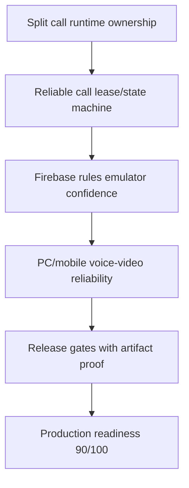

# Critical Path

## Blocking Chain

## Non-Negotiable Fixes

- [[VoiceCallRuntime Refactor]]
- [[Lease Management]]
- [[Call State Machine]]
- [[Presence Management]]
- [[Emulator Coverage]]
- [[Release Gates]]

Related: [[Master Roadmap]], [[Production Readiness]], [[BLOCKERS]].
