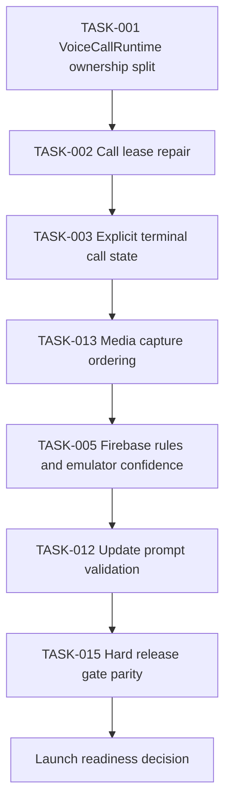

# Critical Path

Last updated: 2026-06-03

## Purpose

Identify the audit-derived dependency chain that blocks launch. This is the work that cannot be skipped or parallelized away.

Related: [[Master Roadmap]], [[Launch Blockers]], [[High-Risk Work]], [[Production Readiness]], [[Risk Register]].

## Blocking Chain

## Critical Items

| Item | Priority | Dependencies | Estimated Effort | Success Criteria | Definition Of Done |
| --- | --- | --- | --- | --- | --- |
| TASK-001: [[VoiceCallRuntime Refactor]] | P0 | [[Current Architecture]] | 5 days | Call runtime responsibilities split into testable coordinators. | Coordinator tests pass and docs update. |
| TASK-002: [[CallLeaseManager]] | P0 | TASK-001 | 4 days | False busy is repaired or proven live. | Lock repair tests pass. |
| TASK-003: [[Call State Machine]] | P0 | TASK-002 | 4 days | Terminal state always clears local/remote call. | Runtime terminal tests pass. |
| TASK-013: [[CallMediaCoordinator]] | P0 | TASK-003 | 4 days | Media permission/capture failure cleans leases and UI. | Media failure tests pass. |
| TASK-005: [[Rules Strategy]] and [[Emulator Coverage]] | P0 | TASK-002 | 4 days | Rules reject malformed/unauthorized signaling writes. | Emulator rules tests pass. |
| TASK-012: [[Version And Updates]] | P0 | [[Release Gates]] | 2 days | Old versions show correct update state. | Version/update tests pass. |
| TASK-015: [[Release Gates]] | P1 | TASK-005, TASK-012 | 2 days | Release artifacts cannot bypass hard gates. | Workflow gate evidence exists. |

## Critical Path Definition Of Done

- Every P0 item above is complete or explicitly deferred with owner acceptance.
- [[Launch Blockers]] has no unresolved P0 blocker.
- [[Audit Resolution Tracker]] maps each critical finding to completed tasks.
- [[Production Readiness]] is updated with evidence.
