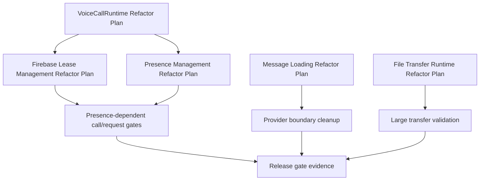

# Architecture Refactor Plan Index

Last updated: 2026-06-03

## Purpose

This index is the Phase 7 architecture refactor planning entrypoint. It turns [[Original Audit]], [[Master Roadmap]], [[Technical Debt Register]], and [[Risk Register]] into concrete refactor plans for the highest-risk systems.

Related: [[Refactoring Strategy]], [[Target Architecture]], [[Current Architecture]], [[Critical Path]], [[High-Risk Work]], [[Decision Map]].

## Refactor Plans

| System | Plan | Primary Tasks | Primary Debt | Primary Risks |
| --- | --- | --- | --- | --- |
| Voice call runtime | [[VoiceCallRuntime Refactor Plan]] | TASK-001, TASK-003, TASK-013 | TD-001, TD-004 | R-001, R-004, R-007, R-009 |
| Firebase lease management | [[Firebase Lease Management Refactor Plan]] | TASK-002, TASK-005 | TD-003, TD-011 | R-002, R-014 |
| Presence management | [[Presence Management Refactor Plan]] | TASK-006, TASK-023 | TD-002, TD-012, TD-020 | R-003, R-016, R-020 |
| Message loading | [[Message Loading Refactor Plan]] | TASK-008, TASK-009, TASK-020 | TD-006, TD-007, TD-014 | R-012, R-013 |
| File transfer runtime | [[File Transfer Runtime Refactor Plan]] | TASK-010, TASK-011 | TD-008 | R-011 |

## Refactor Order

## Decision Records

- [[ADR-004]] - Call runtime uses coordinator architecture.
- [[ADR-005]] - Firebase call lease manager is the single lease authority.
- [[ADR-006]] - Presence resolver is the source of peer availability truth.
- [[ADR-007]] - Message loading uses bounded live tail and pagination.
- [[ADR-008]] - File transfer uses streaming sinks and backpressure.

## Planning Rules

- Refactor by strangler pattern, not a rewrite.
- Keep existing behavior covered before deleting old paths.
- Do not combine media/signaling changes with UI polish in the same implementation task.
- Every new component must have contract tests before it becomes the production path.
- Every rollout plan must define rollback or containment behavior.

