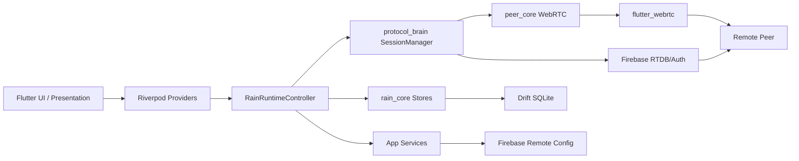
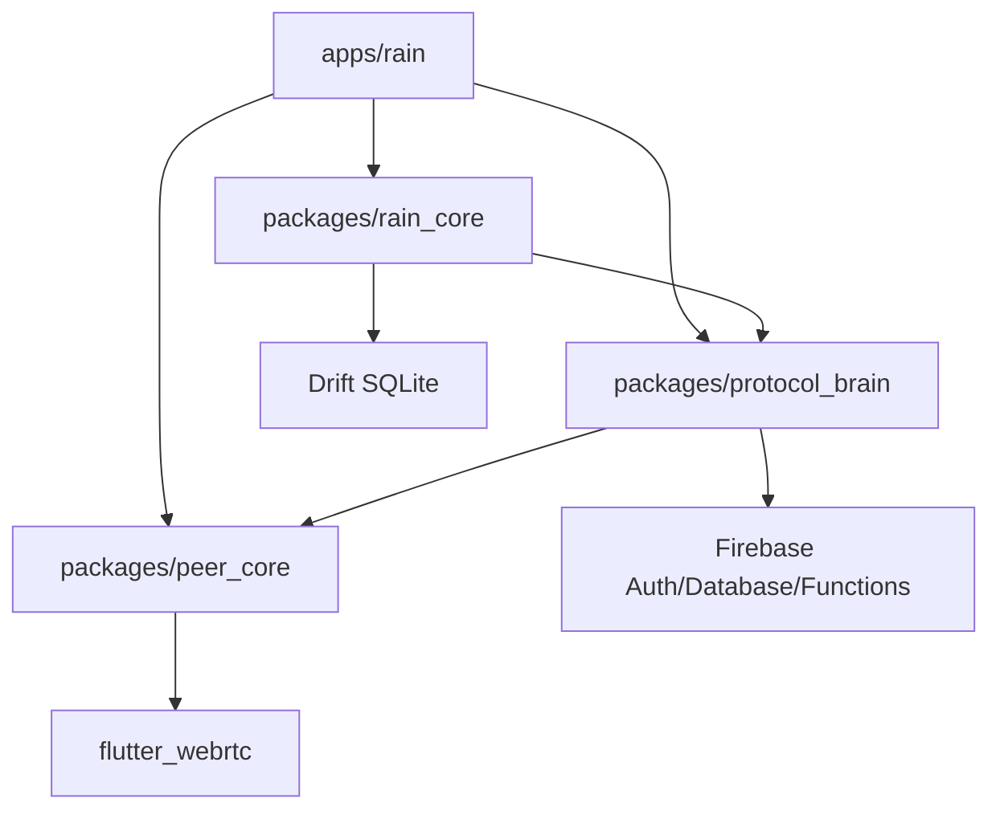

# Current Architecture

Last updated: 2026-06-04

## Purpose

This note is the Phase 2 repository discovery snapshot. It documents the current system structure without prescribing refactors.

Related: [[System Architecture]], [[Target Architecture]], [[Repository Map]], [[System Ownership Map]], [[Domain Map]], [[Dependency Map]], [[Feature Map]], [[Project Memory]].

## System Overview

Rain is a Flutter/Dart workspace for a private peer-to-peer communication app on Android and Windows.

The workspace is organized around one Flutter app and three local packages:

- `apps/rain` - app entrypoint, UI, Riverpod state, runtime orchestration, Firebase infrastructure, local services, and platform shell integration.
- `packages/peer_core` - WebRTC peer primitives, data channels, media track handling, backpressure, routes, platform bridge, and WebRTC state machine.
- `packages/protocol_brain` - signaling/session manager, Firebase signaling adapter, encrypted signaling envelopes, call signaling contracts, connection request protocol, retry policy, ICE batching, and signaling budget logic.
- `packages/rain_core` - Drift database, local domain stores, identity/friend/message/file models, offline queue, message delivery, and file transfer protocol.
- `backend/firebase` - Firebase Realtime Database rules, Remote Config template, optional Cloud Functions code, and backend tests.
- `obsidian-vault` - project knowledge graph, architecture notes, roadmap, risk/debt/blocker registers, decisions, progress, lessons, and AI memory.

## Feature Inventory

The discovered feature set maps to [[Feature Index]] and [[Feature Map]]:

- [[Authentication]] - username/password auth, cached identity validation, logout/reset, and account deletion through the signaling adapter and Firebase Auth when Firebase backend is active.
- [[Friendship And Blocking]] - friend requests, friendships, block lists, and local friend records.
- [[Presence And Direct Connect]] - Firebase presence, heartbeat, peer connect/disconnect, direct WebRTC data sessions, recovery, and manual disconnect intent.
- [[Peer Chat]] - text messages over WebRTC data channel with local Drift storage, offline queue, sequence tracking, and delivery service.
- [[File Transfer]] - file metadata and binary chunk transfer over WebRTC data channels with local transfer records.
- [[Voice Calls]] - Firebase voice call signaling plus WebRTC audio media through `VoiceCallRuntime` and protocol voice call contracts.
- [[Video Calls]] - shares the voice call runtime/signaling path with video media mode, video renderers, call workspace, and call suite widgets.
- [[Connection Request Notifications]] - offline-only connection request protocol backed by RTDB or optional Cloud Functions mode.
- [[Version And Updates]] - Remote Config update manifest/fallback checks through `ForceUpdateService`.
- [[Diagnostics And Logging]] - crash diagnostics, debug logging facade, provider observer, signaling adapter debug wrapper, export path, and frame timing diagnostics.
- [[Sound System]] - sound event router and sound effects service using app settings and audio assets.
- [[Branding And UI]] - Rain visual system, brand assets, ripple halo surfaces, splash, navigation shell, theme, and call surfaces.

## Module Inventory

### App Module: `apps/rain`

Layer structure:

- `lib/main.dart` - initializes Flutter binding, app environment, performance profile, crash diagnostics, debug logging, desktop shell, and startup bootstrap.
- `lib/application/bootstrap` - `AppBootstrapper`, Firebase initialization, Drift database construction, signaling adapter selection, Remote Config service construction, optional smoke identity provisioning.
- `lib/application/runtime` - main runtime layer for presence, connections, calls, file transfers, connection requests, lifecycle, media settings, retry policies, interaction guard, serialized mutations, diagnostics, and renderers.
- `lib/application/state` - Riverpod providers/controllers and app state models.
- `lib/core/config` - runtime environment and compile-time/environment variable parsing.
- `lib/infrastructure/firebase` - generated Firebase options.
- `lib/infrastructure/signaling` - app-local Firebase/noop/debug signaling adapters.
- `lib/infrastructure/services` - settings, diagnostics, force update, network status, sound effects, TURN credentials, received-file export, background services.
- `lib/infrastructure/notifications` - local notification abstraction for connection requests.
- `lib/infrastructure/window` - desktop shell/window integration.
- `lib/presentation` - screens, navigation, theme, branding, call widgets, chat widgets, settings, search, splash, update banner, and performance profile UI behavior.

Key app runtimes/controllers:

- `RainRuntimeController` - central app runtime for presence, friends, sessions, messages, files, calls, network loss, app exit, and shutdown.
- `VoiceCallRuntime` - large call runtime extension/path for voice/video call state, signaling, media setup, terminal reconciliation, and renderer handling.
- `ConnectionAttemptCoordinator` - peer connect/retry/disconnect intent and recovery state.
- `RuntimeInteractionGuard` - typed action guard for connect, call, and file-transfer conflicts.
- `ConnectionRequestRuntime` - offline connection request workflow.
- `FileTransferRuntime` - file send/accept/reject/cancel handling.
- `MediaDeviceSettings` - hardware/media capability discovery and settings state.
- `AppExitCoordinator` - app close/logout/provider-dispose shutdown coordination.
- `SerializedRuntimeMutations` - runtime mutation serialization.

Key Riverpod systems:

- `appBootstrapProvider`, `appEnvironmentProvider`, `databaseProvider`, `adapterProvider`, `forceUpdateServiceProvider`.
- `networkStatusProvider`, `soundEffectsProvider`, `mediaDeviceSettingsProvider`, `turnCredentialServiceProvider`.
- `identityProvider`, `friendsProvider`, `messagesProvider`, `fileTransfersProvider`.
- `runtimeControllerProvider`, `connectionsProvider`, `voiceCallProvider`, `videoCallRenderersProvider`.
- `connectionRequestProvider`, `connectionRequestAdapterProvider`.
- `forceUpdateProvider`, `optionalUpdateDismissalProvider`.
- `callSurfaceProvider`, `callEndPresentationProvider`.
- Settings providers for theme, searches, microphone, video input, voice audio, connection request settings, call processing, and audio output capability.

### Package: `packages/peer_core`

Purpose: WebRTC primitive abstraction used by [[Signaling Architecture]], [[Voice Calls]], [[Video Calls]], [[File Transfer]], and [[Presence And Direct Connect]].

Discovered components:

- `PeerCore` interface - offer/answer, ICE, data channels, media renegotiation, route inspection, and event streams.
- `DefaultPeerCore` - concrete WebRTC implementation.
- `PeerConfig`, `PeerMessage`, `PeerRemoteTrack`, `PeerConnectionRoute`, `PeerRouteKind`.
- `PeerStateMachine` and `PeerState`.
- `PlatformBridge` and `FlutterWebRTCBridge` - wraps `flutter_webrtc` media/device/platform APIs.
- `VoiceMediaConnection` and `CallMediaConnection` - audio/video media abstractions.
- `DataChannelBackpressure` - data-channel buffered-amount guard.
- Media models: call media config, diagnostics, interruption, processing, and adaptive video profile support.

External dependency: `flutter_webrtc`.

### Package: `packages/protocol_brain`

Purpose: signaling, session orchestration, connection memory, retry policy, encrypted envelopes, voice/video signaling contracts, connection request protocol, and Firebase adapters.

Discovered components:

- `SessionManager`/`ProtocolBrain` - peer registration, connect/disconnect, recovery, data-channel send/open, buffered amount, media offer/answer, local audio, and remote track events.
- `Session`, `SessionState`, `SessionPhase`, `SessionChannel`.
- `ProtocolBrainImpl` and `createDefaultProtocolBrain`.
- `SignalingAdapter` - auth, reauthentication, account deletion, identity, relationship, presence, room, offer/answer, ICE, and voice signaling surface.
- `FirebaseSignalingAdapter` - RTDB-backed implementation and `VoiceSignalingAdapter`.
- `SignalingCipher` - encrypted signaling envelope helper.
- `IceCandidateBatcher`, `IceCandidatePolicy`, `SignalingCostBudgetExceeded`.
- Voice/call types: `VoiceCallFrame`, `CallMediaMode`, `VoiceCallSession`, `VoiceSignalingAdapter`, `VoiceCallRoom`, `VoiceCallInboxEntry`, `VoiceActivePairLock`, `VoiceActiveUserLock`, `VoiceCallIceCandidateRecord`, `VoiceCallCleanupJanitor`.
- Connection request types: `ConnectionRequestAdapter`, `RtdbOnlyConnectionRequestAdapter`, `ConnectionRequestPayload`, quota/status/action models, fake adapters for tests.
- Testing helpers: fake voice signaling, fake connection request adapter, live smoke peer core.

External dependencies: Firebase Auth, Firebase Database, Cloud Functions dependency, `cryptography`, `flutter_webrtc`, and `peer_core`.

### Package: `packages/rain_core`

Purpose: local persistence and domain data for identity, friends, messages, file transfers, offline queue, and connection memory.

Discovered components:

- `RainDatabase` - Drift SQLite database.
- `IdentityRepository` and `RainIdentity`.
- `FriendStore`, `FriendRecord`, `FriendState`.
- `MessageStore`, `StoredMessage`, `MessageEnvelope`, message status/type models, sequence tracking.
- `MessageDeliveryService` - outgoing/incoming delivery, ack tracking, offline queue integration.
- `OfflineQueueStore`.
- `FileTransferProtocol`, `FileTransferFrame`, `FileMessageContent`, `FileTransferChunkPacket`.
- `FileTransferStore`, `FileTransferRecord`, transfer state/direction models.
- `DriftConnectionMemoryStore`.
- `InputValidator`.

External dependencies: Drift, SQLite, `path_provider`, `uuid`, and `protocol_brain`.

### Backend Module: `backend/firebase`

Purpose: Firebase rules and optional backend support.

Discovered assets:

- `database.rules.json` - RTDB security rules.
- `remoteconfig.template.json` - Remote Config template.
- `firebase.json` - Firebase project config for this backend folder.
- `functions/connectionRequests.js`, `connectionRequestGuardrails.js`, `connectionRequestCleanup.js`, `index.js` - optional connection request function support.
- `functions/test/*` - Node test harness for connection request functions.

## Service Inventory

App infrastructure services:

- `AppSettingsStore` - shared preferences for theme, audio, media devices, connection request settings, and call processing.
- `CrashDiagnosticsService` - crash/error/event capture, export, frame timing stats, call summaries, Firebase cost counters.
- `RainDebugLogService` and `RainDebugProviderObserver` - local debug logging facade and Riverpod observer.
- `ForceUpdateService` - Remote Config update checking and version policy.
- `NetworkStatusService` - connectivity and backend reachability.
- `TurnCredentialService` - base ICE server list and optional TURN broker cache.
- `SoundEffectsService` - sound event playback and diagnostics.
- `RainNotificationService` - local notification abstraction for connection request notifications.
- `ReceivedFileExportService` - save/export received files.
- `BackgroundServices` - currently represented as a service surface, with runtime providers disabling background behavior in current controller code.
- `DesktopShellController` - desktop window shell integration, including bounded close/destroy handling and a Windows process-exit fallback after close handling.

## Controller Inventory

Riverpod controllers:

- `IdentityController`
- `FriendsController`
- `MessagesController`
- `FileTransfersController`
- `FileTransferViewsController`
- `RuntimeController`
- `ConnectionsController`
- `VoiceCallController`
- `ConnectionRequestController`
- `ForceUpdateController`
- `OptionalUpdateDismissalController`
- `ThemeModeController`
- `RecentSearchesController`
- `MicrophoneSelectionController`
- `VideoInputCapabilityController`
- `VoiceAudioSettingsController`
- `ConnectionRequestSettingsController`
- `CallProcessingSettingsController`
- `AudioOutputCapabilityController`
- `BackgroundServiceController`
- `CallSurfaceController`
- `CallEndPresentationController`

UI controllers are mostly Flutter `State` objects inside screens/widgets and consume Riverpod state instead of owning backend logic.

## Runtime Inventory

Runtime state domains:

- App startup/bootstrap runtime: environment, database, Firebase, adapters, update service.
- Identity runtime: local identity, backend auth state, logout/reset.
- Friend runtime: relationship refresh, accept/reject/block/unblock/unfriend.
- Peer session runtime: `SessionManager`, active sessions, manual disconnect intent, reconnect/recovery, data channels.
- Message runtime: send/resend, incoming delivery, ack tracking, offline queue.
- File transfer runtime: send/accept/reject/cancel, progress batching, metadata, chunk transfer.
- Voice/video runtime: global one-call policy, invite/accept/reject/busy/hangup, media setup, terminal state publication, bounded terminal cleanup, mute/deafen/output/camera controls, renderer handling.
- Connection request runtime: offline notification request, confirmation, quota/cooldown, inbound/outbound UI state.
- Presence runtime: Firebase presence, heartbeats, lifecycle online/offline, freshness checks.
- Network runtime: connectivity status, backend probe, network lost/available handling.
- Update runtime: required/optional/check-unavailable update states.
- Diagnostics runtime: crash/global error handlers, debug events, network/signaling metadata, frame timing summaries.

Known high-risk runtime concentration:

- `RainRuntimeController` centralizes many domains.
- `VoiceCallRuntime` remains a very large call path and is already tracked in [[VoiceCallRuntime Refactor]].

## State Management Systems

Rain uses Riverpod 3 as the primary application state system.

State sources:

- Providers over bootstrap dependencies: environment, database, adapter, services.
- Async notifiers over persistent data: identity, friends, messages, files, update checks.
- Notifiers over runtime streams: connections, calls, connection requests, call surface.
- Stores over Drift streams: friends, messages, file transfers.
- Runtime stream controllers inside `RainRuntimeController` and call/request runtimes.

Important state boundaries:

- `RainRuntimeController` owns runtime truth for peer sessions, call state, file state, and connection request state.
- Riverpod controllers expose runtime truth to UI.
- Drift stores own local persistent truth for identity, friends, messages, file transfers, queued messages, and connection memory.
- Firebase owns backend truth for auth, presence, relationships, signaling rooms, voice call rooms/locks/inboxes, and connection request artifacts.

## Dependency Inventory

### Workspace Dependency Graph

### App Dependencies

Main app dependencies discovered from `apps/rain/pubspec.yaml`:

- Firebase: `firebase_core`, `firebase_auth`, `firebase_database`, `firebase_remote_config`.
- WebRTC: `flutter_webrtc`.
- State/router/UI: `flutter_riverpod`, `go_router`, `freezed_annotation`, `google_fonts`, `flutter_svg`.
- Local persistence/settings/files: `shared_preferences`, `path_provider`, `file_picker`, `open_filex`, Drift as dev/runtime through local package.
- Device/platform: `connectivity_plus`, `flutter_local_notifications`, `window_manager`, `package_info_plus`, `url_launcher`.
- Media/sound: `audioplayers`.
- Local packages: `peer_core`, `protocol_brain`, `rain_core`.

### Build Dependencies

- Root Dart workspace uses `pubspec.yaml` `workspace` entries.
- Melos commands are defined under root `pubspec.yaml`:
  - `dart run melos exec -- flutter pub get`
  - `dart run melos exec -- flutter analyze`
  - `dart run melos exec --concurrency=1 -- flutter test`
- Flutter Android and Windows platform projects exist under `apps/rain`.
- Release scripts exist under `scripts`.

## Data Flow Inventory

### Startup Flow

1. `main.dart` initializes Flutter bindings.
2. `AppEnvironment.fromEnvironment()` reads compile-time and runtime configuration.
3. `RainPerformanceProfile.detect()` determines runtime performance tier.
4. `CrashDiagnosticsService` initializes and installs global handlers.
5. `CrashDiagnosticsDebugLogService` optionally enables debug/demo logging.
6. `DesktopShellController` initializes desktop window shell behavior.
7. `AppBootstrapper.bootstrap()` creates `RainDatabase`, initializes Firebase when enabled, creates signaling cipher, selects Firebase or noop adapter, wraps adapter with debug logging, creates `ForceUpdateService`, and optionally seeds smoke identity.
8. `ProviderScope` receives bootstrap overrides and starts `RainApp`.
9. `AppStartupState` composes Remote Config update status, validated local/backend identity, runtime startup, session-expired reset, failed, and ready phases.
10. `RainApp` owns the global startup surface. While `AppStartupState.usesRoutedAppShell` is false, `MaterialApp.router.builder` prevents the normal shell from rendering. Loading, required-update, failed, and session-expired states render `RainStartupSurface`; signed-out auth renders through a standalone Navigator/Overlay.
11. Protected route readiness is explicit. `AppStartupState.canRenderProtectedRoutes` is true only for `ready`; settings/search/friend routes redirect to `/` while unresolved and are also wrapped by a route-local guard that renders the startup/auth surface instead of protected content.

### Authentication And Identity Flow

1. UI/auth screens call identity/runtime providers.
2. `SignalingAdapter` performs register/login/current UID operations.
3. Local `IdentityRepository` stores identity in Drift.
4. Backend user identity is stored under Firebase `users`.
5. Presence begins after runtime startup.
6. Delete account from Settings requires confirmation plus password reauthentication before destructive cleanup.
7. Once deletion enters the destructive path, runtime shutdown runs best-effort, backend account data is cleaned/tombstoned while ownership still exists, Firebase Auth deletion runs last, and local Drift/authenticated-session state is cleared.
8. Tombstoned backend identities are not restored during cached identity validation.
9. Login refuses to recreate missing or tombstoned backend identity after Firebase Auth succeeds; it signs out and leaves Drift identity empty.

Related: [[Authentication]], [[Firebase Architecture]], [[Database Schema]].

### Presence And Direct Connect Flow

1. `RainRuntimeController.start()` sets presence online and starts heartbeat.
2. `FirebaseSignalingAdapter` writes `presence/{username}` with `uid`, `online`, `lastHeartbeat`, `lastSeen`, `updatedAt`, `sessionId`, `platform`, and optional state.
3. `ConnectionsController.connect()` calls `RainRuntimeController.connectPeer()`.
4. `SessionManager.connect()` uses Firebase signaling rooms plus `PeerCore` WebRTC offer/answer/ICE.
5. Session events update `ConnectionsState`.
6. Manual disconnect records intent and prevents automatic recovery for that peer.

Related: [[Presence And Direct Connect]], [[Presence Management]], [[Signaling Architecture]].

### Chat Message Flow

1. UI sends through `Voice/Chat` controllers to `RainRuntimeController.sendMessage()`.
2. `MessageDeliveryService` creates/stores message envelopes and queues when needed.
3. Connected `SessionManager` sends on `SessionChannel.chat`.
4. Remote receives data-channel message and stores via `MessageStore`.
5. Acknowledgement/status updates flow back to local stores and UI.

Related: [[Peer Chat]], [[Database Schema]], [[Signaling Architecture]].

### File Transfer Flow

1. UI file action calls `RainRuntimeController.sendFile()` or accept/reject/cancel methods.
2. Runtime checks call/file conflicts with `RuntimeInteractionGuard`.
3. `FileTransferStore` records metadata and progress.
4. File metadata uses message/file protocol frames.
5. Binary chunks flow over WebRTC data channel.
6. Progress is batched by `FileTransferProgressBatcher`.
7. Received files can be exported through `ReceivedFileExportService`.

Related: [[File Transfer]], [[Streaming Architecture]], [[Backpressure Strategy]].

### Voice/Video Call Flow

1. UI calls `VoiceCallController.start()` or `startVideo()`.
2. `RainRuntimeController` delegates to call runtime path.
3. Presence and conflict checks run before signaling.
4. `VoiceSignalingAdapter.createOutgoingCall()` creates or repairs Firebase `activeVoiceUsers`, `activeVoicePairs`, `voiceCalls`, and `voiceCallInboxes`.
5. Callee watches `voiceCallInboxes/{username}` and then `voiceCalls/{callId}`.
6. Accept/reject/busy/hangup frames and SDP/ICE use Firebase voice signaling artifacts.
7. Media uses WebRTC through `peer_core` voice/call media connection abstractions.
8. Firebase terminal room state is authoritative for ending/failed calls. Runtime publishes terminal failed/idle UI state before awaiting WebRTC/session cleanup so file-transfer and call guards cannot observe a stale active phase.
9. WebRTC/session/renderer cleanup is best-effort and bounded; cleanup failures are diagnostics, not a reason to keep a terminal call active in UI state.
10. UI state is exposed through `voiceCallProvider`, `videoCallRenderersProvider`, and call surface providers.

Related: [[Voice Calls]], [[Video Calls]], [[Call State Machine]], [[Lease Management]], [[CallMediaCoordinator]].

### Connection Request Notification Flow

1. User direct-connect action can route to offline connection request workflow when the peer is offline.
2. `ConnectionRequestController` calls `RainRuntimeController.sendConnectionRequest()`.
3. `RtdbOnlyConnectionRequestAdapter` is used in Spark/free-tier mode when configured.
4. RTDB artifacts include request, outbox, pair lock, quota/usage summaries, target usage, mutes, reservations, and audit/config paths.
5. Local notification service surfaces inbound requests while app/runtime is active.

Related: [[Connection Request Notifications]], [[Firebase Architecture]], [[Rules Strategy]].

### Update Check Flow

1. `ForceUpdateController` calls `ForceUpdateService.check()`.
2. `ForceUpdateService` reads Firebase Remote Config when available.
3. The app compares current version/build/channel/platform against release policy.
4. A warning or gate only appears when the remote manifest advertises a newer semantic version or build than the installed package metadata for the same channel/platform; equal metadata is intentionally `current`.
5. Required updates block through the global `RainStartupSurface`; optional updates show banner state and can be dismissed.
6. Diagnostics record update status.

Related: [[Version And Updates]], [[Release Gates]], [[Production Readiness]].

### Diagnostics Flow

1. `CrashDiagnosticsService` captures Dart zone errors, Flutter errors, runtime events, update diagnostics, call summaries, cost counters, and frame timings.
2. `RainDebugLogService` provides a sanitized event/error facade.
3. `RainDebugProviderObserver` logs provider-level metadata.
4. `DebugSignalingAdapter` logs signaling operation metadata.
5. Exported diagnostics stay local.

Related: [[Diagnostics And Logging]], [[Diagnostics Sanitization]], [[Privacy Review]].

## External Integration Inventory

### Firebase

Firebase products discovered:

- Firebase Auth
- Firebase Realtime Database
- Firebase Remote Config
- Optional Cloud Functions support for connection requests

RTDB top-level paths discovered from rules:

- `users`
- `presence`
- `friendRequests`
- `outgoingFriendRequests`
- `friendships`
- `blocks`
- `blockedBy`
- `userSearch`
- `rooms`
- `voiceCalls`
- `voiceCallInboxes`
- `activeVoicePairs`
- `activeVoiceUsers`
- `connectionRequests`
- `connectionRequestOutboxes`
- `connectionRequestPairLocks`
- `connectionRequestUsage`
- `connectionRequestTargetUsage`
- `connectionRequestQuotaSummaries`
- `connectionNotificationUsage`
- `connectionNotificationTargetUsage`
- `connectionNotificationConfig`
- `connectionNotificationEntitlements`
- `connectionNotificationReservations`
- `connectionNotificationMutes`
- `connectionNotificationAudit`
- `connectionNotificationAuditSummary`

Related: [[Firebase Architecture]], [[Rules Strategy]], [[Emulator Coverage]].

### WebRTC

WebRTC surfaces discovered:

- `flutter_webrtc` dependency in app, `peer_core`, and `protocol_brain`.
- `PeerCore` offer/answer/ICE and data-channel API.
- `SessionManager` media renegotiation API.
- Voice media connection and call media connection abstractions.
- Video renderer handles in app runtime.
- ICE servers from `AppEnvironment.iceServers`.
- Optional TURN broker URL via `TurnCredentialService`.

Related: [[Signaling Architecture]], [[Voice Calls]], [[Video Calls]], [[File Transfer]].

### Local Persistence

Drift/SQLite database:

- Schema version: 5.
- Tables: `messages`, `friends`, `queued_messages`, `file_transfers`, `connection_memory_table`, `identity_table`, `message_seq_tracker`.
- SQLite settings: busy timeout, WAL journal mode, normal synchronous mode, foreign keys on.
- Serialized write queue and busy/locked retry logic exist in `RainDatabase`.

Related: [[Database Architecture]], [[Database Schema]], [[Migration Plan]], [[Index Strategy]], [[Pagination Strategy]].

## Database Structure Inventory

| Table | Purpose | Primary Key |
| --- | --- | --- |
| `messages` | Stored chat/file/system messages by peer | `id` |
| `friends` | Local friend records, state, online flag, unread count | `username` |
| `queued_messages` | Offline/outgoing queued messages | `id` |
| `file_transfers` | Incoming/outgoing transfer metadata/progress | `id` |
| `connection_memory_table` | Per-peer connection memory/failure cache | `peerId` |
| `identity_table` | Local identity profile | auto `id` |
| `message_seq_tracker` | Last sequence number per peer | `peerId` |

Migration history from source:

- Version 2: `identity_table.gender`
- Version 3: `friends.online`
- Version 4: `friends.gender`
- Version 5: `file_transfers`

## Build System Inventory

Local build/test scripts:

- `scripts/build_release.ps1`
- `scripts/build_stable_test_pair.ps1`
- `scripts/check_obsidian_vault.ps1`
- `scripts/ci_run_firebase_emulators.ps1`
- `scripts/ci_run_firebase_emulators.sh`
- `scripts/clean_workspace.ps1`
- `scripts/flutter_analyze.ps1`
- `scripts/generate_rain_platform_icons.ps1`
- `scripts/sync_app_icons.ps1`
- `scripts/test_all.ps1`

CI/CD workflows:

- `ci.yml` - main CI/CD checks: dependency review, workflow lint, quality gate, static analysis, tests, Firebase backend/emulator tests, Android build, release artifacts, required checks.
- `main-merge-gate.yml` - PR/main merge validation with workspace, Firebase, Android debug ABI, Windows demo, Android demo artifacts.
- `build-artifacts.yml` - workflow-dispatch build for Rain apps with hard release gate, Windows build, Android build, and optional direct test release.
- `fast-release.yml` - workflow-dispatch fast release artifacts with target/platform/profile inputs.
- `validated-release.yml` - workflow-dispatch validated release with workflow lint, workspace validation, Firebase backend/emulator tests, build jobs, and publish.
- `release.yml` - release build/publish workflow for tags or dispatch.
- `documentation-vault.yml` - Obsidian vault validation workflow.

Related: [[CI-CD Roadmap]], [[Release Gates]], [[Coverage Dashboard]].

## Test Inventory

Test surfaces discovered:

- `apps/rain/test` - app services, runtime, UI widgets, call suite, update prompt, settings, sound, diagnostics, network, integration harness tests.
- `apps/rain/integration_test/smoke_test.dart` - Flutter integration smoke.
- `packages/peer_core/test` - WebRTC/media/core tests.
- `packages/protocol_brain/test` - signaling, connection request, Firebase contract, voice signaling/session, release/workspace contract tests.
- `packages/rain_core/test` - database, messages, files, session reset, voice call frame tests.
- `backend/firebase/functions/test` - Node tests for connection request functions.

Related: [[Test Strategy]], [[Coverage Dashboard]], [[Emulator Test Matrix]].

## Current Failure-Prone Areas

This discovery does not re-audit, but the current structure confirms the already tracked risk areas:

- `VoiceCallRuntime` centralizes too many responsibilities and is tracked in [[VoiceCallRuntime Refactor]].
- `RainRuntimeController` owns many runtime domains at once.
- Firebase call lease flow depends on sequential client-side operations and lock repair.
- UI state, signaling state, media state, and terminal call state require strict reconciliation. Terminal room state must clear UI-facing call state before asynchronous media/session cleanup.
- Presence, direct connect, call eligibility, and offline request notification all depend on fresh backend presence.
- File transfer has data-channel backpressure support, but end-to-end large-transfer behavior remains a known area for [[Backpressure Strategy]].
- Release workflows are numerous and need clear ownership in [[CI-CD Roadmap]] and [[Release Gates]].

Related: [[Technical Debt Register]], [[Risk Register]], [[Audit Resolution Tracker]].
