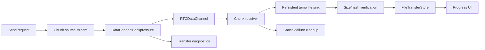

# File Transfer Runtime Refactor Plan

Last updated: 2026-06-03

## Purpose

Define the target architecture for safe large-file transfer over WebRTC data channels with persistent streaming, backpressure, progress batching, and cleanup.

Related: [[File Transfer]], [[Streaming Architecture]], [[Backpressure Strategy]], [[ADR-008]], [[File Transfer Optimization Epic]], [[Scalability Debt]].

## Current State

File transfer uses metadata and binary chunks over WebRTC data channels. Local transfer records are stored in Drift, and runtime state updates progress to UI. Existing notes identify repeated list copies on send and per-chunk sink open/close on receive.

## Problems

- Incoming chunks can cause excessive file I/O if sink lifecycle is per chunk.
- Outgoing chunks can pressure memory and RTCDataChannel buffer if send loop is not backpressure-aware.
- Cancellation/failure cleanup must remove temp files and close resources deterministically.
- Progress updates must be batched to avoid UI/database churn.

## Risks

| Risk | Severity | Link |
| --- | --- | --- |
| Large transfers overload memory or data-channel buffers. | High | R-011 |
| File transfer pressure affects peer connection stability. | High | R-011 |

## Target Architecture

## New Components

- `TransferSendPipeline`
- `TransferReceivePipeline`
- `TransferSinkRegistry`
- `TransferBackpressureGate`
- `TransferCleanupCoordinator`
- `TransferProgressBatcher`

## Migration Strategy

1. Characterize current file transfer behavior with small and large transfer tests.
2. Introduce receive sink registry and keep one sink open per active transfer.
3. Add temp file lifecycle and cleanup coordinator.
4. Replace send list-copy loop with stream slicing.
5. Wire data-channel send loop through backpressure high/low water marks.
6. Batch progress updates and diagnostics.
7. Remove old per-chunk sink/list-copy paths after tests pass.

## Testing Strategy

- Large receive writes to temp file without holding full payload in memory.
- Cancel closes sink and removes temp file.
- Failed transfer closes sink and records terminal state.
- Slow receiver triggers sender pause/resume.
- Data-channel close during transfer terminates safely.
- Progress batching does not flood UI/database.
- Final size and hash verification where available.

## Rollout Plan

1. Add receive pipeline behind existing runtime API.
2. Add cleanup coordinator and tests.
3. Add send backpressure gate.
4. Enable diagnostics for buffer pressure and cleanup results.
5. Keep release artifacts test-only until large transfer smoke passes.

## Definition Of Done

- TASK-010 and TASK-011 validation passes.
- Large file transfer no longer depends on unbounded memory growth.
- Slow receiver behavior is deterministic.
- Transfer cleanup is idempotent and observable.

