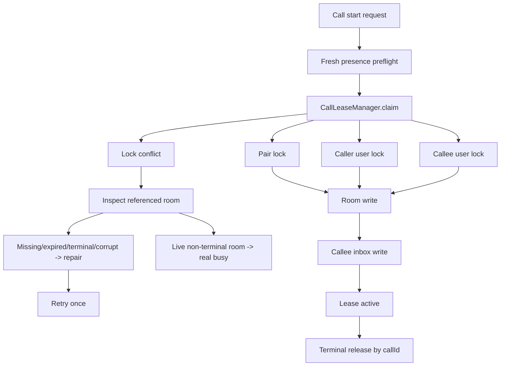

# Firebase Lease Management Refactor Plan

Last updated: 2026-06-03

## Purpose

Define the target architecture for Firebase voice/video call leases, stale lock repair, and terminal cleanup.

Related: [[CallLeaseManager]], [[Lease Management]], [[Firebase Architecture]], [[Rules Strategy]], [[Emulator Coverage]], [[ADR-005]], [[Signaling Reliability Epic]].

## Current State

Call signaling uses Firebase room and lock artifacts:

- `voiceCalls/{callId}`,
- `voiceCallInboxes/{callee}/{callId}`,
- `activeVoicePairs/{pairId}`,
- `activeVoiceUsers/{username}`.

The app claims multiple artifacts during outgoing call setup and releases them on terminal paths.

## Problems

- Multi-artifact client-side claim can leave partial state after network or rules failures.
- Busy state can be returned before validating whether the referenced room is still live.
- Cleanup can be repeated by local hangup, remote terminal room, session frame, watcher cleanup, or retry logic.
- Rules must protect against malformed or unauthorized writes without Cloud Functions authority.

## Risks

| Risk | Severity | Link |
| --- | --- | --- |
| Stale locks report false busy. | Critical | R-002 |
| Terminal state has multiple truths. | Critical | R-009 |
| Firebase rules allow malformed or deny valid writes. | Critical | R-014 |
| Spark/free-tier constraints limit backend cleanup. | High | R-017 |

## Target Architecture

`CallLeaseManager` becomes the single lease authority. It classifies every lock conflict before reporting busy.

## New Components

- `CallLeaseManager.claim(...)`
- `CallLeaseManager.inspectConflict(...)`
- `CallLeaseManager.repairStaleLease(...)`
- `CallLeaseManager.releaseMatchingLease(...)`
- `CallLeaseDiagnostics`
- `CallLeaseRepairResult`

## Migration Strategy

1. Add fake adapter tests for current lock states.
2. Create lease manager as a wrapper around existing adapter behavior.
3. Move conflict inspection into the manager.
4. Add repair-once semantics for stale locks.
5. Move release logic into matching-`callId` cleanup.
6. Update rules tests after behavior is locked in fake tests.

## Testing Strategy

- Fake adapter tests:
  - missing room,
  - expired room,
  - terminal room,
  - corrupt room,
  - caller-owned failed setup,
  - live connected room,
  - newer lock.
- Firebase emulator tests:
  - valid room/lock/inbox writes,
  - unauthorized lock writes denied,
  - malformed timestamps denied,
  - stale cleanup only allowed for matching `callId`.
- Diagnostics tests for lock path, call id, pair id, room status, repair action, rollback result.

## Rollout Plan

1. Implement fake adapter contract first.
2. Implement lease manager behind existing `VoiceSignalingAdapter` calls.
3. Deploy rules only after emulator test coverage is complete.
4. Keep old cleanup as best-effort fallback during transition.
5. Remove duplicate cleanup paths after terminal reconciliation tests pass.

## Definition Of Done

- TASK-002 and TASK-005 validation passes.
- BLK-002 exit criteria are met.
- No stale lock produces busy before room inspection.
- Newer/live locks are never deleted by stale cleanup.

