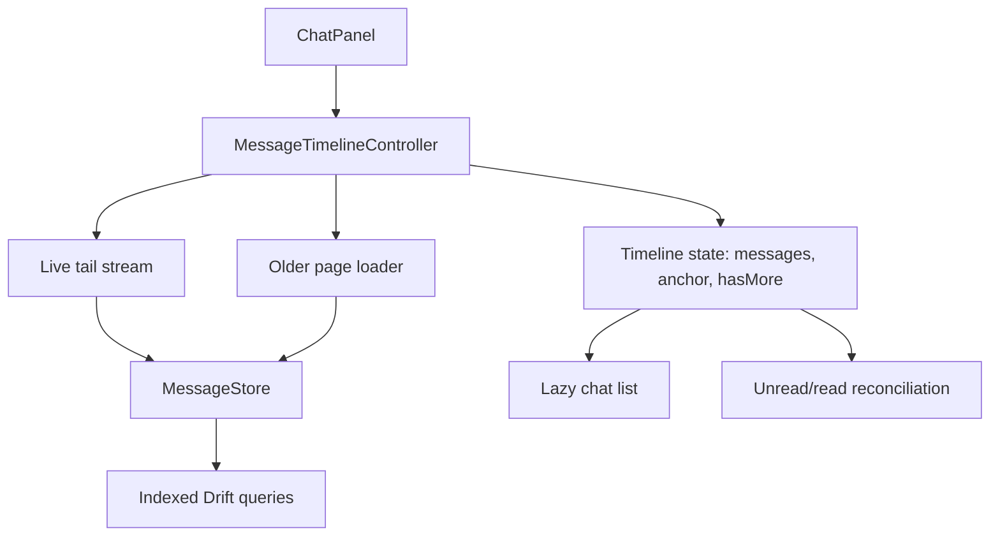

# Message Loading Refactor Plan

Last updated: 2026-06-03

## Purpose

Define the target architecture for scalable message loading, conversation pagination, unread correctness, and rebuild isolation.

Related: [[Pagination Strategy]], [[Index Strategy]], [[Database Architecture]], [[Peer Chat]], [[Frontend Architecture]], [[ADR-007]], [[Database Scalability Epic]].

## Current State

Messages are stored in Drift and exposed through app state providers. The audit notes that conversation loading needs index and pagination validation before large conversation histories.

## Problems

- Full ordered conversation streams do not scale to large histories.
- Message append/page-load behavior can rebuild too much UI.
- Unread counters must stay correct when selected/open chat is visible.
- Query paths need explicit index coverage.

## Risks

| Risk | Severity | Link |
| --- | --- | --- |
| Local database queries do not scale. | High | R-012 |
| Conversation loading is memory-heavy. | High | R-013 |
| Provider boundaries rebuild too broadly. | Medium | R-010 |

## Target Architecture

Use a bounded live tail plus explicit older-page loading.

## New Components

- `MessageTimelineController`
- `MessagePageCursor`
- `ConversationWindow`
- `LiveTailSubscription`
- `UnreadReconciliationService`

## Migration Strategy

1. Add Drift index migration and tests.
2. Add bounded query APIs without removing current stream.
3. Build timeline controller around new query APIs.
4. Move chat UI to timeline state.
5. Keep old full stream available until widget/provider tests pass.
6. Remove eager full conversation loading from production path.

## Testing Strategy

- Drift migration tests from current schema.
- Query tests for newest page, older page, stable ordering by `sentAt` and `seq`.
- Widget tests for initial load, load older, append new message, selected chat read behavior.
- Provider tests for rebuild isolation.
- Low-power performance smoke via frame summary diagnostics where available.

## Rollout Plan

1. Ship indexes first.
2. Add paginated APIs behind current UI.
3. Enable timeline controller for one chat surface.
4. Add unread reconciliation tests.
5. Remove eager full stream only after rollback path is no longer needed.

## Definition Of Done

- TASK-008, TASK-009, and relevant TASK-020 validation passes.
- Large conversations load in bounded pages.
- Selected/open chat suppresses unread counters correctly.
- Chat list updates do not rebuild header/call controls/friends panel.

