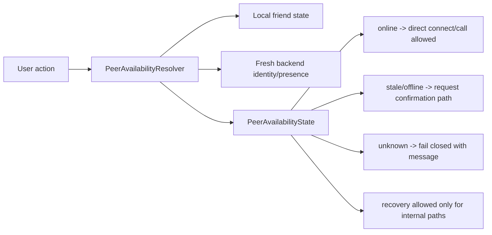

# Presence Management Refactor Plan

Last updated: 2026-06-03

## Purpose

Define the target architecture for fresh peer availability decisions across connect, call, recovery, and offline request notifications.

Related: [[Presence Management]], [[Presence And Direct Connect]], [[Connection Request Notifications]], [[Firebase Architecture]], [[ADR-006]], [[Risk Register]].

## Current State

Presence is stored in Firebase RTDB under `presence`. It includes online state, heartbeat timing, platform, and session id. Multiple features depend on this state:

- direct Connect,
- call start,
- auto recovery,
- offline connection request notifications,
- friend list online display.

## Problems

- UI can show stale online state after app close or network loss.
- Call/connect/request actions can route incorrectly if they trust stale UI state.
- Manual disconnect intent must not be confused with network loss or peer close.
- Offline request notifications must spend quota only when peer is actually offline/stale and user confirmed.

## Risks

| Risk | Severity | Link |
| --- | --- | --- |
| Presence remains online after app close. | High | R-003 |
| Offline requests are blocked or abused. | High | R-016 |
| Blocked actions have unclear messages. | Critical | R-020 |

## Target Architecture

All user actions ask a single presence resolver before continuing.

## New Components

- `PeerAvailabilityResolver`
- `PeerAvailabilityState`: `online`, `stale`, `offline`, `unknown`
- `PeerPresenceSnapshot`
- `PresenceDecisionDiagnostics`
- `ManualDisconnectIntentStore`

## Migration Strategy

1. Define availability states and freshness thresholds.
2. Route call start preflight through resolver.
3. Route connect action through resolver.
4. Route offline request notification through resolver and explicit confirmation.
5. Keep UI online display as presentation only, not action truth.
6. Keep internal recovery path explicit and separate from user Connect.

## Testing Strategy

- App close marks peer offline within freshness window.
- Expired heartbeat returns stale/offline.
- Newer session id beats old heartbeat.
- UI stale-online state still fails runtime preflight.
- Online peer uses direct connect and never spends offline request quota.
- Offline peer requires confirmation before request.
- Unknown presence shows message and creates no request/call/lock.
- Manual disconnect prevents auto recovery until explicit Connect.

## Rollout Plan

1. Introduce resolver with diagnostics only.
2. Gate calls through resolver.
3. Gate direct connect through resolver.
4. Gate connection requests through resolver.
5. Update user-message matrix and widget tests.
6. Update Firebase rules if offline request write rules depend on freshness threshold.

## Definition Of Done

- TASK-006 and TASK-023 validation passes.
- BLK-008 and BLK-009 exit criteria are met.
- All blocked connect/call/request actions show a user-facing message.
- Presence decisions are included in diagnostics without sensitive payloads.

