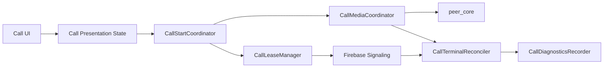

# Target Architecture

## Target Runtime Composition

## Target Principles

- One owner for call lease truth.
- One owner for media truth.
- One owner for terminal reconciliation.
- UI derives from runtime state and never invents call truth.
- Firebase watch errors are typed and observable.

## Detailed Refactor Plans

- [[Architecture Refactor Plan Index]]
- [[VoiceCallRuntime Refactor Plan]]
- [[Firebase Lease Management Refactor Plan]]
- [[Presence Management Refactor Plan]]
- [[Message Loading Refactor Plan]]
- [[File Transfer Runtime Refactor Plan]]

Related: [[Current Architecture]], [[VoiceCallRuntime Refactor]], [[Call State Machine]], [[ADR-004]], [[ADR-005]], [[ADR-006]], [[ADR-007]], [[ADR-008]].
