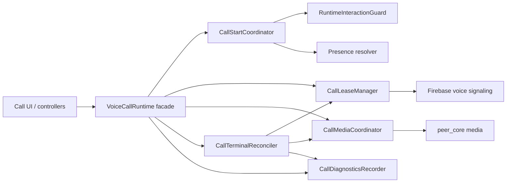

# VoiceCallRuntime Refactor Plan

Last updated: 2026-06-09

## Purpose

Define the target refactor for the call runtime without rewriting WebRTC media or Firebase signaling.

Related: [[VoiceCallRuntime Refactor]], [[Target Architecture]], [[Refactoring Strategy]], [[Call State Machine]], [[Voice Calls]], [[Video Calls]], [[ADR-004]], [[Technical Debt Register]], [[Risk Register]].

## Current State

`VoiceCallRuntime` is the central call path for voice and video. It currently owns or coordinates:

- friend and presence preflight,
- global one-call policy,
- outgoing/incoming call state,
- Firebase room and inbox watches,
- call locks and stale cleanup,
- media permission and capture,
- WebRTC media connection setup,
- video renderer handling,
- mute/camera/deafen/output route actions,
- terminal cleanup,
- UI-facing state mutation,
- diagnostics.

As of 2026-06-09, extracted stateless/pure call helpers are grouped under `apps/rain/lib/application/runtime/voice_call/`. `VoiceCallStateCoordinator` owns pure runtime state mapping and terminal reset decisions, `VoiceCallRoomCoordinator` owns room helper policy, `VoiceCallErrorCoordinator` delegates runtime error classification, `VoiceCallTerminalReconciler` owns terminal-session-state decisions, `VoiceCallPreflightCoordinator` owns call-start friend/presence availability guards plus stale retry replacement, `VoiceCallReconnectCoordinator` owns reconnecting/failure grace state, `VoiceCallMediaCoordinator` owns app-side media connection creation and renderer/resource lifecycle, `VoiceCallSessionStateCoordinator` owns protocol-session-to-runtime projection and diagnostics recording, `VoiceCallSignalingCleanupCoordinator` owns Firebase room watches, frame/ICE handling, terminal writes, stale cleanup, and bounded cleanup, and `VoiceCallDiagnostics` owns the diagnostic record shape. `voice_call_runtime.dart` is now 2,935 lines after converting runtime extension files from `part of` declarations to imported/exported Dart libraries. It remains the public command/orchestration facade.

## Problems

- Too many reasons to change in one runtime.
- Lease, media, terminal, and diagnostics failures are difficult to test separately.
- Late Firebase room events and late session frames can conflict with local state.
- PC-to-mobile and mobile-to-PC failures are hard to classify.
- Runtime state and call UI state can become coupled.

## Risks

| Risk | Severity | Link |
| --- | --- | --- |
| Call setup fails or sticks connecting. | Critical | R-001 |
| Media capture order fails. | Critical | R-004 |
| Oversized runtime causes regressions. | Critical | R-007 |
| Terminal state has multiple truths. | Critical | R-009 |

## Target Architecture

`VoiceCallRuntime` becomes an orchestration facade. Coordinators own the risky domains.

## New Components

- `CallStartCoordinator`: validates friend state, presence, global call/file conflicts, and initial call phase.
- `CallLeaseManager`: owns room, inbox, pair lock, user lock, stale repair, and release.
- `CallMediaCoordinator`: owns mic/camera permission, capture, WebRTC media connection, renderer lifecycle, and media timeout.
- `CallTerminalReconciler`: treats Firebase terminal room state as authoritative and performs idempotent cleanup.
- `CallDiagnosticsRecorder`: records sanitized call timeline and failure taxonomy.

Existing architecture notes: [[CallStartCoordinator]], [[CallLeaseManager]], [[CallMediaCoordinator]], [[CallTerminalReconciler]], [[CallDiagnosticsRecorder]].

## Migration Strategy

1. Add coordinator interfaces beside current runtime.
2. Move diagnostics taxonomy first because it observes behavior without changing it.
3. Move start/preflight logic into `CallStartCoordinator`. Partial 2026-06-08: local start-block expiry mapping moved to `VoiceCallStateCoordinator`; friend/presence availability and stale retry replacement moved to `VoiceCallPreflightCoordinator`; file/call conflict policy remains in `VoiceCallRuntime`.
4. Move lease claim/repair/release into `CallLeaseManager`.
5. Move terminal reconciliation into `CallTerminalReconciler`. Partial 2026-06-08: terminal-session decisions live in `VoiceCallTerminalReconciler`, while terminal writes, stale cleanup, room status timelines, and terminal-already-closed classification live in `VoiceCallSignalingCleanupCoordinator`; lease ownership remains.
6. Move media capture and renderer lifecycle into `CallMediaCoordinator`. Partial 2026-06-08: app-side media connection creation, renderer lifecycle, app lifecycle video failure handling, camera-muted signaling, and video resource cleanup live in `VoiceCallMediaCoordinator`; command-level start/end orchestration remains.
7. Reduce `VoiceCallRuntime` to orchestration and state emission.
8. Delete dead paths only after tests prove equivalent behavior.
9. Keep runtime extension libraries imported/exported through `rain_runtime_controller.dart` until callers are migrated to narrower feature imports.

## Testing Strategy

- Characterization tests around current call start/end behavior.
- Coordinator contract tests.
- Runtime integration tests for outgoing voice, outgoing video, incoming accept, reject, busy, timeout, and hangup.
- Failure tests for mic denied, camera denied, renderer disposed, Firebase permission denied, corrupt room, stale lock, media timeout.
- Regression tests for terminal room beating late frames.
- Coordinator tests for pure state, room, error, preflight, reconnect, media-path ownership, diagnostics contract ownership, and terminal decision policies.

## Rollout Plan

1. Land diagnostics coordinator as no-op behavior change.
2. Land start coordinator behind existing public runtime API.
3. Land lease manager with fake adapter tests before Firebase behavior changes.
4. Land terminal reconciler and verify remote hangup behavior.
5. Land media coordinator and verify voice/video setup.
6. Run hard validation gate before deleting old methods.
7. Treat all call artifacts as test builds until BLK-001 and BLK-002 exit criteria are met.

## Definition Of Done

- TASK-001, TASK-003, and TASK-013 validation passes.
- [[Call State Machine]] reflects actual allowed transitions.
- [[Risk Register]] status is updated for R-001, R-004, R-007, and R-009.
- [[Technical Debt Register]] status is updated for TD-001 and TD-004.
