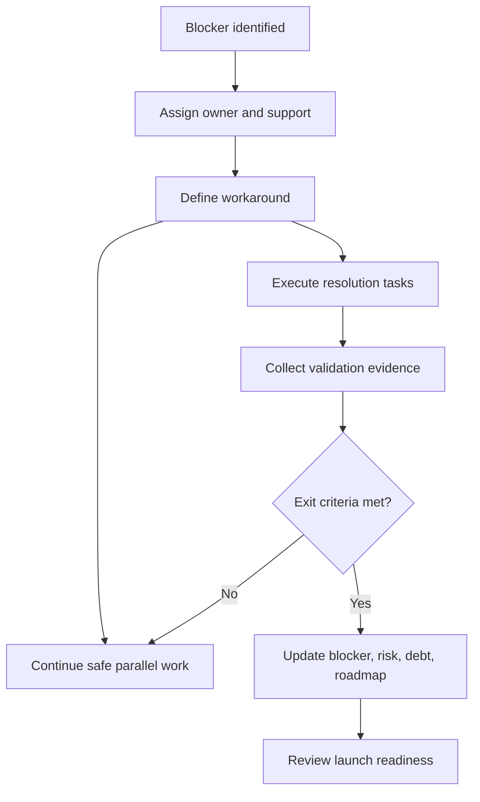

# Blocker Resolution Plan

Last updated: 2026-06-03

## Purpose

This plan defines how blockers from [[BLOCKERS]] are owned, worked around, and resolved without stopping all project progress.

Related: [[Risk Register]], [[Risk Matrix]], [[Parallel Work Streams]], [[Critical Path]], [[Launch Readiness]], [[Technical Debt Register]].

## Operating Rule

A blocker blocks unsafe release, not all work.

When a blocker is active:

1. Keep release/promotion blocked.
2. Continue safe parallel work from [[Parallel Work Streams]].
3. Keep the blocker owner accountable for exit criteria.
4. Keep workaround active until the blocker closes.
5. Update [[Risk Register]] and [[Technical Debt Register]] when status changes.

## Ownership Matrix

| Blocker | Owner | Support | Primary Workaround | Resolution Evidence |
| --- | --- | --- | --- | --- |
| BLK-001 Call setup reliability | Engineering | QA, Product | Test builds only; require diagnostics for failed calls. | Runtime tests and call setup diagnostics. |
| BLK-002 False busy/stale locks | Engineering | Security | Inspect room before busy; do not treat busy as final without lock evidence. | Fake/emulator lock repair tests. |
| BLK-003 Spark-safe Firebase rules | Security/Engineering | DevOps | RTDB rules and client TTL cleanup; no paid backend dependency. | Emulator rules matrix. |
| BLK-004 Update prompt reliability | Product/DevOps | Engineering | Manual direct downloads; avoid incompatible rule deployments. | Version/update tests. |
| BLK-005 Diagnostics safety and usefulness | Security/Engineering | QA | Local-only exports and manual schema review. | Sanitizer and taxonomy tests. |
| BLK-006 Release gate evidence | DevOps | QA | Treat artifacts as test builds until hard gate passes. | Workflow evidence and artifact metadata. |
| BLK-007 Appium QA instability | QA/DevOps | Engineering | Use Flutter tests and cloud artifacts while harness stabilizes. | Repeatable smoke run artifacts. |
| BLK-008 Presence staleness | Engineering/Product | Security | Fresh backend preflight before connect/call/request. | Presence state tests and diagnostics. |
| BLK-009 Offline request guardrails | Product/Security | Engineering | Disable/avoid release candidate offline requests until tested. | Runtime, adapter, rules, and widget tests. |

## Parallel Work While Blocked

| Active Blocker | Work That Can Continue |
| --- | --- |
| BLK-001 | [[Version And Updates]], [[Rules Strategy]], [[Diagnostics Sanitization]], [[Index Strategy]], [[Backpressure Strategy]] |
| BLK-002 | [[CallDiagnosticsRecorder]], [[Version And Updates]], [[Emulator Coverage]], [[Release Gates]] |
| BLK-003 | [[VoiceCallRuntime Refactor]], [[Call State Machine]], [[Diagnostics Sanitization]], [[Frontend Architecture]] |
| BLK-004 | [[VoiceCallRuntime Refactor]], [[Rules Strategy]], [[File Transfer]], [[Database Architecture]] |
| BLK-005 | [[Call State Machine]], [[Lease Management]], [[Version And Updates]], [[Release Gates]] |
| BLK-006 | [[Test Strategy]], [[Emulator Coverage]], [[Technical Debt Register]], [[Risk Register]] |
| BLK-007 | [[Release Gates]], [[Coverage Dashboard]], [[Emulator Coverage]], [[Backlog]] |
| BLK-008 | [[CallMediaCoordinator]], [[Version And Updates]], [[Diagnostics Sanitization]], [[Release Gates]] |
| BLK-009 | [[Presence Management]], [[Rules Strategy]], [[Connection Request Notifications]], [[Firebase Architecture]] |

## Resolution Flow

## Escalation

- A Critical blocker older than one sprint must be reviewed in [[Launch Readiness]].
- A blocker without a workaround must be treated as an execution process failure.
- A blocker with unclear owner must be assigned before any related implementation begins.
- A blocker that needs paid Firebase services conflicts with the current free-tier constraint and must be redesigned before proceeding.

## Definition Of Done

- Every blocker in [[BLOCKERS]] has an owner.
- Every blocker has a workaround.
- Every blocker links to risks, roadmap tasks, and debt.
- Every blocker has explicit exit criteria.
- Closed blockers update [[Risk Register]], [[Technical Debt Register]], [[Audit Resolution Tracker]], and [[Project Memory]] when durable facts change.

