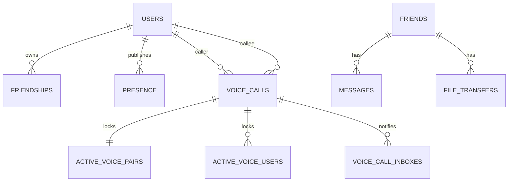

# Entity Relationships

## Local Entities

- `messages`
- `friends`
- `queued_messages`
- `file_transfers`
- `connection_memory_table`
- `identity_table`
- `message_seq_tracker`

## Remote Entities

- `users`
- `presence`
- `friendships`
- `rooms`
- `voiceCalls`
- `voiceCallInboxes`
- `activeVoicePairs`
- `activeVoiceUsers`
- `connectionRequests`

Related: [[Database Schema]], [[Backend Architecture]].
