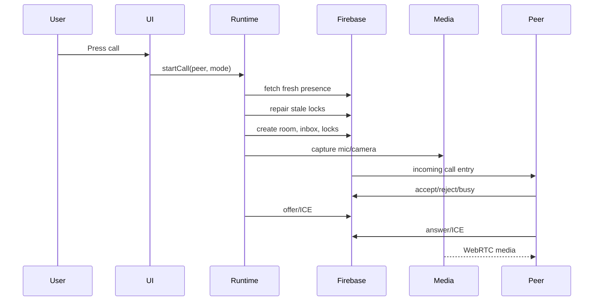
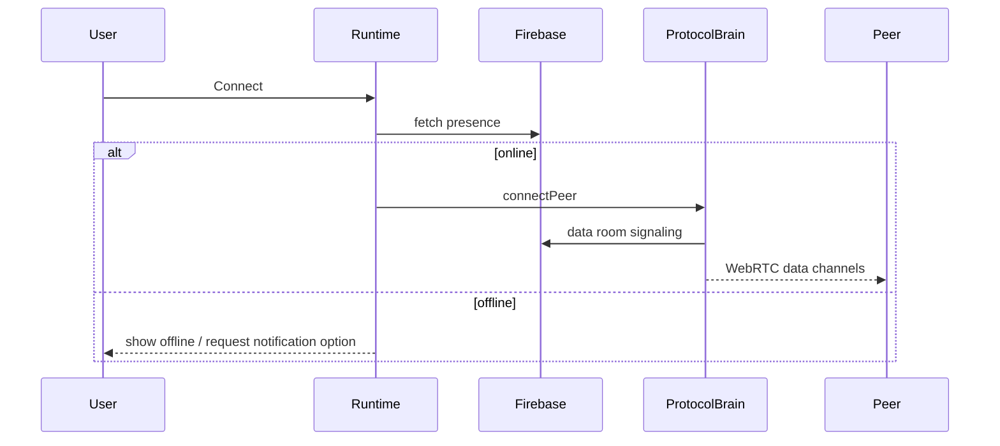

# Sequence Diagrams

## Outgoing Call

```mermaid
sequenceDiagram
  participant U as User
  participant UI as UI
  participant R as Runtime
  participant F as Firebase
  participant M as Media
  participant P as Peer

  U->>UI: Press call
  UI->>R: startCall(peer, mode)
  R->>F: fetch fresh presence
  R->>F: repair stale locks
  R->>F: create room, inbox, locks
  R->>M: capture mic/camera
  F->>P: incoming call entry
  P->>F: accept/reject/busy
  R->>F: offer/ICE
  P->>F: answer/ICE
  M-->>P: WebRTC media
```

## Direct Connect

```mermaid
sequenceDiagram
  participant U as User
  participant R as Runtime
  participant F as Firebase
  participant B as ProtocolBrain
  participant P as Peer

  U->>R: Connect
  R->>F: fetch presence
  alt online
    R->>B: connectPeer
    B->>F: data room signaling
    B-->>P: WebRTC data channels
  else offline
    R-->>U: show offline / request notification option
  end
```

Related: [[Voice Calls]], [[Presence And Direct Connect]].
