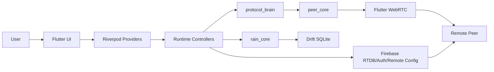

# System Diagrams

## Runtime Architecture

```mermaid
flowchart LR
  User["User"] --> UI["Flutter UI"]
  UI --> Providers["Riverpod Providers"]
  Providers --> Runtime["Runtime Controllers"]
  Runtime --> RainCore["rain_core"]
  Runtime --> Brain["protocol_brain"]
  Brain --> Peer["peer_core"]
  Runtime --> Firebase["Firebase RTDB/Auth/Remote Config"]
  RainCore --> Drift["Drift SQLite"]
  Peer --> WebRTC["Flutter WebRTC"]
  WebRTC --> Remote["Remote Peer"]
  Firebase --> Remote
```

Related: [[System Architecture]], [[Sequence Diagrams]].
