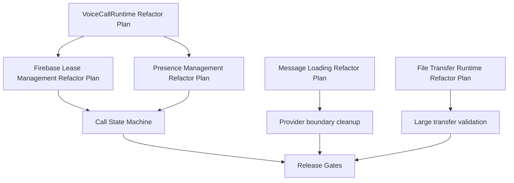

# Dependency Map

Last updated: 2026-06-03

## Purpose

Track dependencies between features, architecture systems, validation gates, and release readiness.

## Initial Dependency Groups

- [[Voice Calls]] depends on [[Signaling Architecture]], [[Call State Machine]], [[Lease Management]], and [[CallMediaCoordinator]].
- [[Video Calls]] depends on [[Voice Calls]], [[CallMediaCoordinator]], and [[Release Gates]].
- [[File Transfer]] depends on [[Streaming Architecture]] and [[Backpressure Strategy]].
- [[Production Readiness]] depends on [[Risk Register]], [[Technical Debt Register]], [[Coverage Dashboard]], and [[Release Gates]].

## Refactor Dependencies

## Future Population

Phase 2 and Phase 4 will replace these starter links with verified dependency edges.

Related: [[Knowledge Graph Index]], [[Critical Path]], [[Master Roadmap]], [[Audit Resolution Tracker]].
