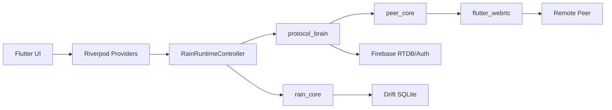

# Project Memory

Last updated: 2026-06-03

## Purpose

This is the primary context source for future AI sessions. Read this first after root `AGENTS.md` and `CONTINUITY.md`.

It compresses Rain's purpose, architecture, constraints, risks, roadmap, and known pitfalls into one durable memory note. For detail, follow the linked vault notes.

Related: [[Project Home]], [[Current Architecture]], [[Repository Map]], [[AI Context]], [[AI Memory Index]], [[Risk Register]], [[Technical Debt Register]], [[Master Roadmap]].

## Project Purpose

Rain is a private peer-to-peer communication app for Android and Windows.

The product lets accepted friends:

- Chat directly.
- Connect peer-to-peer.
- Transfer files.
- Start voice calls.
- Start video calls.
- Send offline connection request notifications.
- Export local diagnostics for debugging.
- Receive app update prompts through release policy.

Core principle: Firebase coordinates identity, presence, rules, update policy, and signaling. WebRTC carries peer data and media.

## Business Goals

- Deliver a trusted private chat app for known friends.
- Keep direct peer communication usable across Android and Windows.
- Keep Firebase cost low and compatible with Spark/free-tier constraints where possible.
- Provide fast test builds for device testing.
- Make failures diagnosable through local, sanitized diagnostics.
- Build a repository that future AI/human sessions can understand quickly through the Obsidian vault.

## Core Features

- [[Authentication]] - username/password account flow through the signaling backend.
- [[Friendship And Blocking]] - friend requests, accepted friends, block/unblock, local friend state.
- [[Presence And Direct Connect]] - presence heartbeat, online/offline status, manual connect/disconnect, WebRTC data sessions.
- [[Peer Chat]] - text chat over WebRTC data channels with local Drift persistence.
- [[File Transfer]] - file metadata and chunks over WebRTC data channels.
- [[Voice Calls]] - Firebase call signaling plus WebRTC audio media.
- [[Video Calls]] - shared call signaling path with video media, renderers, fullscreen/minimized UI.
- [[Connection Request Notifications]] - offline-only connection requests with RTDB/free-tier mode and optional function-backed mode.
- [[Version And Updates]] - Remote Config release manifest and update gates.
- [[Diagnostics And Logging]] - crash diagnostics, debug facade, provider observer, signaling metadata, export.
- [[Sound System]] - app sound events and sound effects service.
- [[Branding And UI]] - Rain visual system, ripple halos, call suite widgets, splash, navigation.

## Architecture Summary

Rain is a Flutter/Dart workspace with one app and three local packages.

Main ownership:

- `apps/rain` owns app startup, UI, Riverpod state, runtime orchestration, infrastructure services, Firebase wiring, and platform shell.
- `packages/peer_core` owns WebRTC primitives, media, data channels, state machine, route info, and platform bridge.
- `packages/protocol_brain` owns signaling, sessions, retry, Firebase adapters, voice call signaling contracts, connection request protocol, and encrypted envelopes.
- `packages/rain_core` owns Drift database, stores, identity/friends/messages/files, delivery service, offline queue, and local connection memory.
- `backend/firebase` owns RTDB rules, Remote Config template, optional functions, and backend tests.
- `obsidian-vault` owns project knowledge, architecture docs, roadmap, risk/debt/blocker tracking, AI memory, decisions, and lessons.

Primary architecture source: [[Current Architecture]].

## Technologies

Language/runtime:

- Dart/Flutter workspace.
- Flutter app targets Android and Windows.
- Riverpod 3 for app state.
- GoRouter for navigation.

Local storage:

- Drift SQLite.
- SharedPreferences for settings.

Backend/integration:

- Firebase Auth.
- Firebase Realtime Database.
- Firebase Remote Config.
- Optional Firebase Cloud Functions code exists for connection request support.

Realtime/media:

- `flutter_webrtc`.
- WebRTC data channels for chat and file transfer.
- WebRTC media tracks for voice/video.
- ICE servers from environment config and optional TURN broker.

Build/automation:

- Root Dart workspace.
- Melos scripts through root `pubspec.yaml`.
- GitHub Actions for CI, merge gates, releases, fast artifacts, validated releases, and vault validation.
- Windows PowerShell local QA/tooling.

## Domain Concepts

- Accepted friend: only accepted friends should communicate.
- Presence: backend online/offline heartbeat with session ownership and freshness.
- Direct connect: WebRTC data session between accepted peers.
- Manual disconnect: user intent that must block automatic recovery until explicit connect.
- Session: protocol-brain peer connection state with chat/control/file channels.
- Voice call room: Firebase call signaling record under `voiceCalls`.
- Voice call inbox: callee-facing Firebase invite record under `voiceCallInboxes`.
- Active voice locks: Firebase pair/user locks under `activeVoicePairs` and `activeVoiceUsers`.
- Call media mode: audio or video, using shared voice-call signaling naming.
- Connection request notification: offline-only request to ask another accepted peer to open/connect.
- Offline request quota: request limits should apply to offline notification requests, not normal online direct connect.
- Diagnostics export: local sanitized failure report, not remote telemetry.

## Firebase Usage

RTDB paths discovered:

- `users`
- `presence`
- `friendRequests`
- `outgoingFriendRequests`
- `friendships`
- `blocks`
- `blockedBy`
- `userSearch`
- `rooms`
- `voiceCalls`
- `voiceCallInboxes`
- `activeVoicePairs`
- `activeVoiceUsers`
- `connectionRequests`
- `connectionRequestOutboxes`
- `connectionRequestPairLocks`
- `connectionRequestUsage`
- `connectionRequestTargetUsage`
- `connectionRequestQuotaSummaries`
- `connectionNotificationUsage`
- `connectionNotificationTargetUsage`
- `connectionNotificationConfig`
- `connectionNotificationEntitlements`
- `connectionNotificationReservations`
- `connectionNotificationMutes`
- `connectionNotificationAudit`
- `connectionNotificationAuditSummary`

Firebase rule strategy: enforce ownership, valid state shape, blocked UID checks, and bounded signaling payloads. See [[Firebase Architecture]], [[Rules Strategy]], and [[Emulator Coverage]].

## WebRTC Usage

WebRTC is abstracted by `peer_core`.

Current surfaces:

- `PeerCore` for offer/answer/ICE/data-channel/media operations.
- `DefaultPeerCore` as concrete implementation.
- `SessionManager` in `protocol_brain` orchestrates peer sessions.
- Data channels: chat, control, file.
- Media: voice and video connections through media-specific abstractions.
- Route diagnostics: direct/relay route information.
- Backpressure: `DataChannelBackpressure` exists for buffered data-channel management.

Important rule: Firebase does not carry audio/video packets. Firebase is signaling only.

## Database Structure

Drift database schema version: 5.

Tables:

- `messages` - stored chat/file/system messages.
- `friends` - local friend records, online flag, unread count.
- `queued_messages` - offline/outgoing queue.
- `file_transfers` - transfer metadata, paths, progress, state.
- `connection_memory_table` - per-peer ICE/fingerprint/failure memory.
- `identity_table` - local account profile.
- `message_seq_tracker` - last sequence per peer.

SQLite settings:

- WAL journal mode.
- Busy timeout.
- Normal synchronous mode.
- Foreign keys enabled.
- Serialized write queue and retry on busy/locked writes.

See [[Database Architecture]], [[Database Schema]], [[Migration Plan]], [[Index Strategy]], and [[Pagination Strategy]].

## Current Priorities

Highest-priority engineering areas:

1. Make voice/video calls reliable in both PC-to-mobile and mobile-to-PC directions.
2. Split and stabilize `VoiceCallRuntime` through [[VoiceCallRuntime Refactor]].
3. Harden Firebase call lease creation, repair, cleanup, and terminal reconciliation through [[CallLeaseManager]] and [[CallTerminalReconciler]].
4. Ensure update prompts work correctly for old versions through [[Version And Updates]] and [[Release Gates]].
5. Keep Firebase Spark/free-tier compatibility unless owner changes the constraint.
6. Improve diagnostics so user reports identify permission, Firebase, ICE/TURN, WebRTC, media, or UI state failures separately.
7. Keep the Obsidian vault current as the project knowledge graph.

## Technical Debt

Primary debt items:

- `VoiceCallRuntime` centralizes too much call logic.
- `RainRuntimeController` owns too many domains: presence, friends, sessions, files, calls, lifecycle, messages.
- Call lock repair and terminal state reconciliation are complex and failure-prone.
- Presence freshness affects connect, call, recovery, and offline request eligibility.
- Release workflows are numerous and need clear ownership.
- Local database indexes/pagination need production validation.
- File transfer large-file backpressure and persistence need hard proof.
- Diagnostics must stay useful without exposing private payloads.
- Call UI has had multiple iterations; it needs one stable presentation source of truth.

Source of truth: [[Technical Debt Register]].

## Risks

Current top risks:

- Voice/video call setup can fail or stick in connecting.
- Stale Firebase locks can cause false busy.
- Peer presence can be stale after app close or network loss.
- Update checks have been reported unreliable for old-version prompts.
- Firebase free-tier constraint limits backend cleanup/authoritative guardrails.
- Large file transfer can stress memory and data-channel buffers.
- Diagnostics can become privacy risk if sanitization regresses.
- Release workflows can publish artifacts if gates are weak or bypassed.

Source of truth: [[Risk Register]] and [[BLOCKERS]].

## Roadmap Memory

Completed foundation phases:

- Phase 0 - Operating Model Foundation.
- Phase 1 - Obsidian Vault Bootstrap.
- Phase 2 - Repository Discovery.
- Phase 3 - Project Memory Generation.
- Phase 4 - Audit to Roadmap Conversion.
- Phase 5 - Technical Debt System.
- Phase 6 - Risk and Blocker Intelligence.
- Phase 7 - Architecture Refactor Planning.
- Phase 8 - Self-Improvement Engine.

Current roadmap source:

- [[Master Roadmap]]
- [[30 Day Plan]]
- [[60 Day Plan]]
- [[90 Day Plan]]
- [[Critical Path]]
- [[Parallel Work Streams]]
- [[Launch Blockers]]
- [[Quick Wins]]
- [[High-Risk Work]]
- [[Technical Debt Register]]
- [[Debt Categories]]
- [[Debt Prioritization]]
- [[Risk Register]]
- [[Risk Categories]]
- [[Risk Matrix]]
- [[BLOCKERS]]
- [[Blocker Resolution Plan]]
- [[Architecture Refactor Plan Index]]
- [[VoiceCallRuntime Refactor Plan]]
- [[Firebase Lease Management Refactor Plan]]
- [[Presence Management Refactor Plan]]
- [[Message Loading Refactor Plan]]
- [[File Transfer Runtime Refactor Plan]]
- [[ADR-004]]
- [[ADR-005]]
- [[ADR-006]]
- [[ADR-007]]
- [[ADR-008]]
- [[Lessons Learned]]
- [[Engineering Insights]]
- [[Continuous Learning Rules]]
- [[Improvement Backlog]]
- [[Optimization Opportunities]]
- [[Project Metrics]]
- [[Recommended Next Actions]]

Next expected phases:

- Phase 9 - Codex Automation Layer.
- Phase 10 - Continuous Project Evolution.

Roadmap source: [[Master Roadmap]] and root `PHASES.md`.

## Constraints

Hard constraints:

- Do not touch `D:\old project\Rain`.
- Active repo is `C:\Users\eslam\OneDrive\Desktop\GoodStuff\Rain` unless user changes it.
- Use PowerShell for local commands.
- Do not modify app code for documentation-only phases.
- Do not hardcode secrets or credentials.
- Do not introduce paid Firebase requirements unless owner explicitly changes the free-tier constraint.
- No raw SDP, ICE candidate strings, tokens, passwords, ciphertext, message text, or file bytes in diagnostics.
- Commit every completed change when work is done, unless user says not to.

Validation defaults:

- Docs: `.\scripts\check_obsidian_vault.ps1`
- Code: `dart pub get`, `dart run melos run analyze`, `dart run melos run test`

## Known Pitfalls

- Creating duplicate Project Memory notes splits context. This file is the primary memory note.
- Generic call errors hide root causes; classify signaling, permission, ICE/TURN, media, and terminal-state failures separately.
- False busy usually means stale or partial Firebase call locks.
- Firebase is signaling only; do not describe voice/video media as passing through Firebase.
- Unit tests alone are not enough for WebRTC confidence.
- Old app versions can become incompatible with backend rules, so update validation must work.
- Manual disconnect must not silently auto-reconnect.
- Online direct connect must not consume offline notification quota.
- Closed app currently means offline; closed-app call/ring reliability is out of scope until push/foreground-service architecture exists.
- Obsidian links must remain valid; run the vault checker after documentation changes.

## Quick Start For Future AI Sessions

1. Read root `AGENTS.md`.
2. Read root `CONTINUITY.md`.
3. Read this note.
4. Read [[Current Architecture]] for discovered structure.
5. Read [[Project Home]] for command-center links.
6. Check `git status --short --branch`.
7. For implementation work, inspect code before planning or editing.

## Related Primary Notes

- [[Project Home]]
- [[Current Status]]
- [[Current Architecture]]
- [[Repository Map]]
- [[System Ownership Map]]
- [[Feature Map]]
- [[Risk Register]]
- [[Technical Debt Register]]
- [[Audit Resolution Tracker]]
- [[Release Gates]]
- [[AI Memory Index]]
- [[Session Handoff]]
