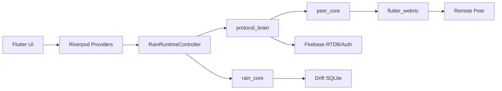

# Project Memory

Last updated: 2026-08-29

## Purpose

This is the primary context source for future AI sessions. Read this first after root `AGENTS.md` and `CONTINUITY.md`.

It compresses Rain's purpose, architecture, constraints, risks, roadmap, and known pitfalls into one durable memory note. For detail, follow the linked vault notes.

Related: [[Project Home]], [[Current Architecture]], [[Repository Map]], [[AI Context]], [[AI Memory Index]], [[Risk Register]], [[Technical Debt Register]], [[Master Roadmap]].

## Project Purpose

Rain is a private peer-to-peer communication app for Android and Windows.

The product lets accepted friends:

- Chat directly.
- Connect peer-to-peer.
- Transfer files.
- Start voice calls.
- Start video calls.
- Send offline connection request notifications.
- Export local diagnostics for debugging.
- Receive app update prompts through release policy.

Core principle: Firebase coordinates identity, presence, rules, update policy, and signaling. WebRTC carries peer data and media.

## Business Goals

- Deliver a trusted private chat app for known friends.
- Keep direct peer communication usable across Android and Windows.
- Keep Firebase cost low and compatible with Spark/free-tier constraints where possible.
- Provide fast test builds for device testing.
- Make failures diagnosable through local, sanitized diagnostics.
- Build a repository that future AI/human sessions can understand quickly through the Obsidian vault.

## Core Features

- [[Authentication]] - username/password account flow through the signaling backend.
- [[Friendship And Blocking]] - friend requests, accepted friends, block/unblock, local friend state.
- [[Presence And Direct Connect]] - presence heartbeat, online/offline status, manual connect/disconnect, WebRTC data sessions.
- [[Peer Chat]] - text chat over WebRTC data channels with local Drift persistence.
- [[File Transfer]] - file metadata and chunks over WebRTC data channels.
- [[Voice Calls]] - Firebase call signaling plus WebRTC audio media.
- [[Video Calls]] - shared call signaling path with video media, renderers, fullscreen/minimized UI.
- [[Connection Request Notifications]] - offline-only connection requests with RTDB/free-tier mode and optional function-backed mode.
- [[Version And Updates]] - Remote Config release manifest and update gates.
- [[Diagnostics And Logging]] - crash diagnostics, debug facade, provider observer, signaling metadata, export.
- [[Sound System]] - app sound events and sound effects service.
- [[Branding And UI]] - Rain visual system, static status accents, call suite widgets, splash, navigation.

## Architecture Summary

Rain is a Flutter/Dart workspace with one app and three local packages.

Main ownership:

- `apps/rain` owns app startup, UI, Riverpod state, runtime orchestration, infrastructure services, Firebase wiring, and platform shell.
- `packages/peer_core` owns WebRTC primitives, media, data channels, state machine, route info, and platform bridge.
- `packages/protocol_brain` owns signaling, sessions, retry, Firebase adapters, voice call signaling contracts, connection request protocol, and encrypted envelopes.
- `packages/rain_core` owns Drift database, stores, identity/friends/messages/files, delivery service, offline queue, and local connection memory.
- `backend/firebase` owns RTDB rules, Remote Config template, optional functions, and backend tests.
- `obsidian-vault` owns project knowledge, architecture docs, roadmap, risk/debt/blocker tracking, AI memory, decisions, and lessons.

2026-06-05 Phase 1 senior audit remediation: chat/connect/call/offline-request action authority is runtime-backed `PeerConnectivitySnapshot`, not local `friend.isOnline`. Snapshots carry backend presence freshness, heartbeat age, state, observation time, freshness window, and backend presence session id. Local app/provider proof passed; Firebase emulator/device proof remains separate release evidence.

2026-06-05 Phase 2 senior audit remediation: Firebase call lock/rule proof is locally complete. Emulator tests cover terminal leftover locks, missing inbox cleanup, malformed voice lock/inbox writes, unauthorized transitions, oversized terminal payload denial, and denied-write state preservation. Contract tests lock server-authoritative voice lock transactions and compare-delete fallback behavior. Device media-direction proof remains separate Phase 10 evidence.

2026-06-06 Phase 3 combined remediation: peer UI status now comes from one `ConnectionDiagnostics` projection exposed by `peerConnectionDiagnosticsProvider`, combining data session, backend presence freshness, manual disconnect intent, connection coordinator state, and active call state. Stale presence plus open data lane renders as `Data lane only`, not `Connected`, while messaging can still be allowed through `canSendData`. Failed/terminal state, manual disconnect, recovering, out-of-sync, connected, data-lane-only, and ready/offline precedence is covered by focused tests. Video renderer failure is terminal for live video calls: local renderer failure fails start with `videoRendererFailed`, remote renderer attach failure writes terminal failed Firebase room state, and failed terminal UI state cannot be overwritten by late local session idle during cleanup. Split call/data-session truth records `peer_ui_state_split_detected`. Full `VoiceCallRuntime` command, lock, and room reconciliation extraction remains open.

2026-06-08 Phase 3a coordinator layout update: extracted voice-call helper files now live under `apps/rain/lib/application/runtime/voice_call/`. The folder contains `VoiceCallRoomCoordinator`, `VoiceCallErrorCoordinator`, `VoiceCallDiagnostics`, `VoiceCallTerminalReconciler`, and the recreated `VoiceCallStateCoordinator`. `VoiceCallStateCoordinator` owns pure call-state mapping for start-block expiry, protocol session phase/detail/failure mapping, remote media permission mapping, terminal-write failure state, same-live-session guards, and local-end terminal state reset. `VoiceCallRuntime` still owns command orchestration, Firebase room watches/reconciliation, lock coordination, media/session orchestration, and most cleanup.

2026-06-08 Phase 3b coordinator extraction update: `VoiceCallPreflightCoordinator` now owns call-start peer availability, accepted-friend validation, backend presence guard conversion, and stale retry replacement cleanup. `VoiceCallReconnectCoordinator` now owns peer failure/reconnecting state mutation, reconnect session markers, and reconnect grace timer arming/cancel guards. Both coordinators are stateless and receive runtime maps, timers, sessions, and callbacks through method parameters. `voice_call_runtime.dart` is now 4,189 lines; command orchestration, Firebase room reconciliation, lock coordination, media/session orchestration, terminal cleanup, and full call-start conflict policy remain in `VoiceCallRuntime`.

2026-06-08 Phase 3c coordinator extraction update: `VoiceCallMediaCoordinator` now owns app-side audio/video media connection creation, renderer state/failure handling, app lifecycle video failure handling, camera-muted signaling, and video resource cleanup. `VoiceCallSessionStateCoordinator` owns protocol-session-to-runtime projection, failed session finalization, runtime/session/start failure diagnostics, diagnostics payload construction, and peer UI split diagnostics. `VoiceCallSignalingCleanupCoordinator` owns Firebase room watch setup, room/envelope/frame handling, terminal-sensitive send preflight, ICE queue/batch/write diagnostics, stale artifact cleanup, subscription cancellation, terminal room writes, bounded cleanup, room status timelines, and terminal-already-closed classification. `voice_call_runtime.dart` is now 2,917 lines; command orchestration, full call/file conflict policy, and lock/lease orchestration remain in `VoiceCallRuntime`.

2026-06-09 Phase 4 runtime extension import update: `voice_call_runtime.dart`, `connection_request_runtime.dart`, `file_transfer_runtime.dart`, and `friend_runtime.dart` no longer use `part of 'rain_runtime_controller.dart'`. `rain_runtime_controller.dart` imports and exports these extension libraries so existing public extension methods remain available through the controller import, and exposes explicit internal accessors/wrappers for extension-library state while backing fields remain private. Current line counts are `rain_runtime_controller.dart` 2,573; `voice_call_runtime.dart` 2,935; `connection_request_runtime.dart` 870; `file_transfer_runtime.dart` 1,166; and `friend_runtime.dart` 565. Local validation passed with `dart analyze`, focused diagnostics contract test, and full Melos tests.

2026-06-07 Phase 10 device/media update: Android emulator single-device media proof passed through the real `FlutterWebRTCBridge` and `DefaultCallMediaConnection`. `device_media_reality_proof_test.dart` passed audio-only mode with `RAIN_DEVICE_MEDIA_REQUIRE_VIDEO=false`, and passed audio+video mode after granting `CAMERA` and `RECORD_AUDIO` to `com.rainapp.rain`. Rain now has a native Android `rain/media_permissions` channel in `MainActivity`, and the proof requests/verifies microphone/camera permission before WebRTC capture. `scripts/run_device_media_proof.ps1` automates emulator launch, debug APK install, permission pregrant, and opt-in media proof execution, but the latest runner validation lost the emulator/Flutter tool connection before test execution and is not pass evidence. Windows host proof, cross-peer Android/Windows call direction proof, and a stable Android runner artifact remain required before BLK-001/BLK-007 can close.

Primary architecture source: [[Current Architecture]].

## Technologies

Language/runtime:

- Dart/Flutter workspace.
- Flutter app targets Android and Windows.
- Riverpod 3 for app state.
- GoRouter for navigation.

Local storage:

- Drift SQLite.
- SharedPreferences for settings.
- Local Drift/SQLite database encryption is not implemented. As of [[ADR-010]], Rain accepts plaintext local storage for the current scope and must not claim encrypted local message history.

Backend/integration:

- Firebase Auth.
- Firebase Realtime Database.
- Firebase Remote Config.
- Optional Firebase Cloud Functions code exists for connection request support.

Realtime/media:

- `flutter_webrtc`.
- WebRTC data channels for chat and file transfer.
- WebRTC media tracks for voice/video.
- ICE servers from environment config and optional TURN broker.

Build/automation:

- Root Dart workspace.
- Melos scripts through root `pubspec.yaml`.
- GitHub Actions for CI, merge gates, releases, fast artifacts, validated releases, and vault validation.
- 2026-06-04 cloud gate evidence: `Build Rain Apps` run 26957834309 passed the hard release gate, explicit auth lifecycle scenario tests, Firebase emulator integration including account deletion, Obsidian vault validation, Android APK artifacts, Windows demo portable artifact, and `rain-test-108-1` pre-release publication for pushed `dev` SHA `883886a`.
- 2026-06-04 gate integration update: `build-artifacts.yml` and `validated-release.yml` run explicit `SCN-AUTH-001` through `SCN-AUTH-004` auth lifecycle tests and Obsidian vault validation. Firebase emulator scripts include `integration_account_deletion_emulator_test.dart`, covering account tombstone cleanup and surviving-Auth no-recreate behavior.
- 2026-06-05 Phase 8 release gate update: `release.yml` is no longer a direct tag-push publish path. It is manual-only, validates before build/publish, requires Remote Config deploy/readback evidence, and publishes `rain-release-metadata.json`. `build-artifacts.yml`, `fast-release.yml`, and `validated-release.yml` also attach metadata. `rain-test-*` releases are test artifacts only; production fast/validated/stable publishing requires Remote Config evidence. Fresh cloud workflow proof remains required before promoting any specific artifact.
- 2026-06-05 Phase 9 vault enforcement update: `scripts/check_obsidian_vault.ps1` now performs semantic validation for operational register fields in [[Audit Resolution Tracker]], [[Technical Debt Register]], [[Risk Register]], [[BLOCKERS]], [[Project Metrics]], [[Recommended Next Actions]], and [[Repository Map]]. It fails missing owner/priority/evidence/review fields, unsupported active risk/debt statuses, closed blockers without evidence, evidence-ledger gaps, and P0/P1 items without next-action-equivalent fields.
- 2026-06-06 Phase 3 release proof: `Build Rain Apps` run 27051067657 passed against pushed `dev` SHA `71f02e5b16614fe4c8b40fb9b6ba32ebf8f009cb` and published the Phase 3 call state projection/renderer failure slice. Duplicate dispatch attempts from that session were canceled.
- 2026-06-06 direct-connect ICE release proof: `Build Rain Apps` run 27052313608 passed against pushed `dev` SHA `ff4e10b7b89533a4bdbdac5cb3d412795a9e6a82` and published `rain-test-116-1` with Android v7/v8-v9 APKs, Windows x64 ZIP, and `rain-release-metadata.json`.
- 2026-06-06 update warning follow-up: current app metadata is `1.0.8+9`, and both release manifests advertise `1.0.8+9`. `rain-test-116-1` and `rain-test-117-1` were both `1.0.7+8`, so installed `1.0.7+8` clients correctly evaluated live `1.0.7+8` Remote Config as `current`. `version_metadata_test.dart` proves the checked-in Remote Config template returns `updateRequired` for previous `1.0.6+7` and `1.0.7+8` stable/demo Android/Windows installs. `Build Rain Apps` run 27062729519 passed for SHA `06e878e550879f787c84ca254d0bc325befc93e4` and published `rain-test-118-1`; live Remote Config version 9 now advertises `1.0.8+9`.
- 2026-06-06 Android build-log follow-up: Rain's app module no longer applies the Kotlin Gradle Plugin. `MainActivity` is Java under `apps/rain/android/app/src/main/java/com/rainapp/rain/MainActivity.java`; `settings.gradle.kts` still pins `org.jetbrains.kotlin.android` `2.2.20` with `apply false` for third-party plugin modules. `flutter build apk --debug` passed after this migration and now leaves only plugin-owned KGP warnings. Remote Config's Android `Could not update ABT experiments` warning is non-blocking for update checks while Rain does not use Firebase Analytics/A-B Testing.
- Windows PowerShell local QA/tooling.

## Domain Concepts

- Accepted friend: only accepted friends should communicate.
- Presence: backend online/offline heartbeat with session ownership and freshness.
- Direct connect: WebRTC data session between accepted peers.
- Direct connect ICE role rule: `callerICE` is canonical `userA` only and `calleeICE` is canonical `userB` only. Do not fix `writeICE` permission-denied diagnostics by allowing both participants to write both buckets unless the room role model is redesigned and rules/tests are updated.
- Manual disconnect: user intent that must block automatic recovery until explicit connect.
- Peer connection UI projection: `ConnectionDiagnostics` is the app-level status projection for link/chat/call/file gates. It separates visual `isConnected` from `canSendData`, so stale data-lane-only states can still send messages without showing false connected UI.
- Session: protocol-brain peer connection state with chat/control/file channels.
- Voice call room: Firebase call signaling record under `voiceCalls`.
- Voice call inbox: callee-facing Firebase invite record under `voiceCallInboxes`.
- Active voice locks: Firebase pair/user locks under `activeVoicePairs` and `activeVoiceUsers`.
- Voice lock reclaim policy: an internal `protocol_brain` policy decides whether a blocked call should keep reporting real busy, reclaim only the stale lock, or reclaim the lock and delete old room artifacts. Production Firebase signaling and the fake voice adapter must use the same policy.
- Call media mode: audio or video, using shared voice-call signaling naming.
- Connection request notification: offline-only request to ask another accepted peer to open/connect.
- Offline request quota: request limits should apply to offline notification requests, not normal online direct connect.
- Diagnostics export: local sanitized failure report, not remote telemetry.
- Diagnostics export keeps summaries plus the 200 most recent raw event records after sanitizer processing. Do not allow generic list caps to truncate top-level `events` to 20 records; that loses causal call/failure evidence behind heartbeat/UI tails.
- Android diagnostics export must not use `dart:io` for SAF/content handles. With `file_picker 12.0.0-beta.3`, Rain bypasses the Android Dart wrapper and sends bytes through the plugin method channel because the wrapper can return `/document/...` and then fail on a second `File` write. Returned `content://`, `/document/...`, `/tree/...`, and newline-split handles are platform-managed documents; fallback JSON is only for wrapper/file-system failure paths.
- Voice-call diagnostic taxonomy distinguishes `peer_busy_response` from `real_busy_lock`. A plain terminal `Busy.` response from the callee is not proof of a Firebase active voice lock conflict.

## Firebase Usage

RTDB paths discovered:

- `users`
- `presence`
- `friendRequests`
- `outgoingFriendRequests`
- `friendships`
- `blocks`
- `blockedBy`
- `userSearch`
- `rooms`
- `voiceCalls`
- `voiceCallInboxes`
- `activeVoicePairs`
- `activeVoiceUsers`
- `connectionRequests`
- `connectionRequestOutboxes`
- `connectionRequestPairLocks`
- `connectionRequestUsage`
- `connectionRequestTargetUsage`
- `connectionRequestQuotaSummaries`
- `connectionNotificationUsage`
- `connectionNotificationTargetUsage`
- `connectionNotificationConfig`
- `connectionNotificationEntitlements`
- `connectionNotificationReservations`
- `connectionNotificationMutes`
- `connectionNotificationAudit`
- `connectionNotificationAuditSummary`

Firebase rule strategy: enforce ownership, valid state shape, blocked UID checks, and bounded signaling payloads. The `users/{username}` rule binds account ownership to Firebase Auth email plus uid; rows with an existing `uid` cannot be retargeted, while legacy rows missing `uid` can be tombstoned only by the matching `$username@rain.local` auth user writing the current auth uid. See [[Firebase Architecture]], [[Rules Strategy]], and [[Emulator Coverage]].

## WebRTC Usage

WebRTC is abstracted by `peer_core`.

Current surfaces:

- `PeerCore` for offer/answer/ICE/data-channel/media operations.
- `DefaultPeerCore` as concrete implementation.
- `SessionManager` in `protocol_brain` orchestrates peer sessions.
- Data channels: chat, control, file.
- Media: voice and video connections through media-specific abstractions.
- Route diagnostics: direct/relay route information.
- Backpressure: `DataChannelBackpressure` exists for buffered data-channel management.

Important rule: Firebase does not carry audio/video packets. Firebase is signaling only.

## Database Structure

Drift database schema version: 6.

Tables:

- `messages` - stored chat/file/system messages.
- `friends` - local friend records, online flag, unread count.
- `queued_messages` - offline/outgoing queue.
- `file_transfers` - transfer metadata, paths, progress, state.
- `connection_memory_table` - per-peer ICE/fingerprint/failure memory.
- `identity_table` - local account profile.
- `message_seq_tracker` - last sequence per peer.

SQLite settings:

- WAL journal mode.
- Busy timeout.
- Normal synchronous mode.
- Foreign keys enabled.
- Serialized write queue and retry on busy/locked writes.

Phase 6 database scalability progress 2026-06-05:

- Schema v6 adds named secondary indexes for message conversation reads, queued-message drain/recovery, file-transfer peer/message/state lookup, and friend display ordering.
- `MessageStore.watchConversationTail` watches the newest bounded page, default 50 messages.
- `MessageStore.loadConversationPage` loads older history before a stable `MessagePageCursor(sentAt, seq, id)`.
- `MessagesController` starts chat state from the bounded live tail and merges older local pages on demand.
- Remaining database scalability evidence is low-power/device frame-budget proof, not missing local query/index structure.

Phase 7 file-transfer scalability progress 2026-06-05:

- Incoming accepted file transfers now keep one persistent temp-file `IOSink` per active transfer.
- Complete, cancel, failure, network loss, and runtime shutdown close receive sinks.
- Hash mismatch, disk write failure, invalid chunks, and cancellation clean temp files when a temp path exists.
- Outgoing file sends carry one partial chunk between stream events instead of growing and front-removing from a pending list.
- `rain_core` now owns the file-transfer chunk/backpressure contract: 32 KiB chunks, 4 MiB high watermark, 1 MiB low watermark, 25 ms poll interval, and 30 second congestion timeout.
- Sender-side backpressure waits on file-channel `bufferedAmount` before each binary chunk and records privacy-safe wait/complete/timeout diagnostics.
- Focused local validation passed for large receive, scripted slow receiver/backpressure, cancel cleanup, hash mismatch cleanup, disk write failure, and protocol constants. Remaining evidence is real-network/device-scale large-transfer proof, not missing local runtime mechanics.

Local data security decision 2026-06-05: `messages.content`, `queued_messages.content`, `file_transfers.fileName`, and `file_transfers.localPath` are stored as normal Drift/SQLite fields. Rain does not currently protect those local records from device compromise or direct app-data access. Future local database encryption requires a separate implementation plan with key management and migration tests. See [[ADR-010]] and [[Privacy Review]].

See [[Database Architecture]], [[Database Schema]], [[Migration Plan]], [[Index Strategy]], and [[Pagination Strategy]].

## Current Priorities

Highest-priority engineering areas:

0. Fix auth/session startup correctness: local Drift identity, Firebase Auth, RTDB user profile, runtime state, and router state currently act as separate truths. Latest investigation files are [AUTHENTICATION_AUDIT.md](../../AUTHENTICATION_AUDIT.md), [ACCOUNT_LIFECYCLE_ANALYSIS.md](../../ACCOUNT_LIFECYCLE_ANALYSIS.md), [STARTUP_SEQUENCE_ANALYSIS.md](../../STARTUP_SEQUENCE_ANALYSIS.md), [SPLASH_SCREEN_INVESTIGATION.md](../../SPLASH_SCREEN_INVESTIGATION.md), [NAVIGATION_INITIALIZATION_AUDIT.md](../../NAVIGATION_INITIALIZATION_AUDIT.md), [STATE_MANAGEMENT_FAILURE_ANALYSIS.md](../../STATE_MANAGEMENT_FAILURE_ANALYSIS.md), and [ROOT_AUTH_STARTUP_REMEDIATION_ROADMAP.md](../../ROOT_AUTH_STARTUP_REMEDIATION_ROADMAP.md). Local identity must become a session candidate, not authenticated truth; app shell/navigation must render only after a validated session and runtime readiness.
   - Phase 1 progress 2026-06-03: `IdentityController` now validates cached Drift identity against backend user existence and current auth uid ownership before restoring signed-in state. Deleted backend accounts and uid mismatches clear local session data; backend profile fields refresh stale local cache; login/register write backend identity/presence before local cache.
   - Phase 2 progress 2026-06-03: logout/reset is deterministic at the runtime level. `RainRuntimeController` clears local Drift session data before best-effort backend sign-out, failed `adapter.signOut()` is diagnostic-only after local clear, logout after an existing app-exit shutdown future still clears local session, and `RuntimeController.logOut()` ends the authenticated session from `finally`.
   - Phase 3 progress 2026-06-03: startup readiness now has one typed state model in `AppStartupState`. Update loading/required-update, identity validation, signed-out, runtime loading, session-expired reset, failed, and ready phases are explicit; `RootScreen`, shell navigation visibility, and router refresh consume that model; tests cover every phase.
   - Phase 4 progress 2026-06-03: startup visual ownership moved above the routed shell. `RainApp` uses `MaterialApp.router.builder` and `AppStartupState.blocksRoutedSurface` to replace the routed child with `RainStartupSurface` while startup is loading, required-update, failed, or session-expired. Route tests prove no `RainNavigationShell`, bottom navigation, or rail is inserted during blocked startup.
   - Phase 5 progress 2026-06-03: protected navigation readiness is explicit. `AppStartupState.canRenderProtectedRoutes` guards protected content, settings/search/friend pages use a route-local protected gate, unresolved protected paths redirect to `/`, and signed-out auth renders outside the app shell through a standalone Navigator/Overlay.
   - Phase 6 progress 2026-06-03: state lifecycle hardening is complete. `AuthenticatedSession.sessionGeneration` is the account-scope boundary; runtime reuse requires matching username and generation; protocol brain, connection request, voice call, connection view, message, file transfer, user search, and recent search providers reset or reject stale runtime generations when the session ends/changes. This left account deletion and hard-release-gate integration; the 2026-06-04 account deletion progress below closes the local implementation gap.
   - Registration conflict progress 2026-06-04: live Firebase rules allowed a fresh random registration, while `users/eslam` already existed. Registration now treats RTDB permission denied before the primary username row is created as an account conflict, rolls back the just-created Auth user, shows a friendly conflict message, and leaves Drift identity uncached. If the durable username row was already created and a later registration step fails, Rain signs out instead of deleting Auth so it does not create an unrecoverable Auth/RTDB orphan.
   - Account deletion progress 2026-06-04/07: first-class account deletion is implemented. Settings prompts for confirmation and password reauthentication; bad password/non-destructive reauth failures leave the signed-in session intact and must keep Settings mounted so the modal error can render. After reauth, backend deletion writes the required `users/{username}` tombstone, removes search and relationship/request/block mirrors where authorized on a best-effort basis, sets presence offline best-effort, ends active calls best-effort, cancels runtime-owned account RTDB listeners and active protocol/data-room sessions at the pre-Auth-deletion boundary, and deletes Firebase Auth last. Runtime shutdown and local Drift/authenticated-session clear happen only after successful deletion or a post-tombstone destructive failure. Required tombstone failure preserves the active session/local identity and surfaces a modal error instead of acting like logout, showing splash, or returning to Settings as an invisible no-op. Verified destructive deletion now switches to a full-screen `deletingAccount` overlay with navigation hidden while preserving the route for backend-failure recovery. Follow-up hardening prevents a surviving Firebase Auth user from recreating a missing/tombstoned backend account through login, identity upsert, or `userSearch`. Successful deletion records a same-device deleted-username marker so a later invalid-credential login can show deleted-account copy without making tombstones publicly readable. The 2026-06-07 live follow-up deployed/read back `rain-8fb4b-default-rtdb` rules so legacy backend rows missing `uid` can be tombstoned only by the matching Firebase Auth email/current uid. Validation evidence includes targeted account-deletion runtime/settings/provider, deleting-account startup phase, account-listener/protocol-session pre-Auth-deletion cancellation, Firebase contract, Firebase emulator account-deletion, and auth source-of-truth tests plus full Melos gates from prior passes.
   - Pending teardown progress 2026-06-06/07: logout clears local session data before waiting on runtime/Firebase cleanup, detaches protected-session authority, and renders signed-out while cleanup continues best-effort. Destructive account deletion reauthenticates and invokes the backend/Auth delete path before runtime/local teardown. `AppStartupState` treats runtime loading/null runtime as blocked startup instead of ready, but `RuntimeController.deleteAccount` must not publish that global loading during non-destructive password/tombstone preflight. After password verification succeeds, `accountDeletionInProgressProvider` drives `AppStartupPhase.deletingAccount`, hides navigation, and shows a full-screen overlay. Before Firebase Auth deletion, runtime cancels heartbeat, active protocol/data-room sessions, friend/relationship, presence, voice signaling, and connection-request listeners while auth still exists. `RainRuntimeController` rejects direct connect after shutdown starts. Bad-password and required tombstone failures restore the active runtime/session. Local tests cover cleanup-blocked logout reaching signed-out, cleanup-blocked destructive delete invoking backend delete, bad-password restoration, Settings staying mounted while password verification is pending, required tombstone failure restoration, the full-screen deleting-account phase, route preservation, same-device deleted-login copy, optional cleanup separation from the all-or-nothing tombstone write, pre-Auth-deletion listener/protocol-session cancellation, and shutdown connect rejection. The remaining proof for the latest report is a retry on the user's Android emulator account against the deployed live rules and new build.
1. Make voice/video calls reliable in both PC-to-mobile and mobile-to-PC directions.
2. Split and stabilize `VoiceCallRuntime` through [[VoiceCallRuntime Refactor]].
3. Harden Firebase call lease creation, repair, cleanup, and terminal reconciliation through [[CallLeaseManager]] and [[CallTerminalReconciler]].
4. Ensure update prompts work correctly for old versions through [[Version And Updates]] and [[Release Gates]].
5. Keep Firebase Spark/free-tier compatibility unless owner changes the constraint.
6. Improve diagnostics so user reports identify permission, Firebase, ICE/TURN, WebRTC, media, or UI state failures separately.
7. Keep the Obsidian vault current as the project knowledge graph.

Latest evidence lock: [ROOT_CAUSE_ANALYSIS.md](../../ROOT_CAUSE_ANALYSIS.md) correlates the 2026-06-03 Windows diagnostic export, Android screenshot, and manual failure report. Confirmed root causes are split call terminal authority, Android `signaling.endCall` permission denial, presence freshness races, terminal inbox exposure before cleanup, Android diagnostics export path failure, and platform build-number inconsistency in update policy. Mitigations completed on 2026-06-03: late voice signaling frames after a terminal room are now logged as `late_frame_ignored` diagnostics only, not as `lastCrash` Flutter errors; Firebase `endCall` terminal room writes no longer depend on the callee inbox row still existing; Android SAF `/document/...` diagnostics export handles no longer get opened as raw files; backend presence is resolved through one 30 second `online + lastHeartbeat + state` freshness window before local friend seeding, direct Connect, chat Connect routing, connection-request routing, call start, or network auto-recovery; failed call setup diagnostics now include a bounded Firebase room status timeline and remote terminal-room failure reconciliation emits `VoiceCallDiagnostics`; update checks classify stale Remote Config policy as `remotePolicyOutdated`, same-version minimum-build upgrades become required updates, and optional update prompts render from the root app surface before login/home; Phase 08 added targeted regressions for call failure messages, failed call surfaces, compact video dock behavior, terminal write ordering, already-terminal cleanup, and session-owned Firebase presence. `presenceExpired` is now retained as a terminal peer intent until a later successful explicit reconnect. 2026-06-04 evidence update: `rain-diagnostics-2026-06-04T021020-922123Z.json` showed `signaling.writeVoiceOffer` throwing because the Firebase room was already `ended` while the PC was still in `_createAndSendOffer`. Runtime now preflights terminal-sensitive media signaling sends (`accept`, `offer`, `answer`, `mute`) with `fetchCall`; missing or terminal rooms are cleanup/reconciliation events before `writeVoiceOffer`/`writeVoiceAnswer` can hit the debug signaling adapter. The same pass added explicit rules-contract coverage that voice terminal fields stay writable by either participant, diagnostics export created a fallback JSON file for Android SAF/content wrapper failures, and file-transfer view speed samples reset when the peer lane is not connected. 2026-06-07 update: diagnostics export now writes Android SAF saves natively through the `file_picker` method channel with `bytes` included, because the beta wrapper can throw `PathNotFoundException` on `/document/12` before Rain can process the result.

2026-06-04 diagnostics update: `rain-diagnostics-2026-06-04T144952-237539Z.json` showed mobile-to-PC voice setup reaching WebRTC media `connected`, then the Firebase room failing as `busy` while local cleanup/disposal stalled. The stale local call phase made accept show "Voice call session is unavailable", made file transfer report "Finish the call before sending files", and left Windows shutdown stuck after `shutdown_started`. The runtime contract is now: publish terminal failed/idle call state before awaiting WebRTC/session cleanup; clear current session resources before disposal; bound cleanup/cancel/hangup/renderer disposal steps; and keep terminal cleanup diagnostic-only if disposal times out. The desktop shell close path also bounds close/destroy work and uses a Windows process-exit fallback after close handling. Validation evidence: targeted call/file/shutdown contract tests passed, targeted terminal `friend_flow_test.dart` cases passed, `dart run melos run analyze` passed, and full `dart run melos run test` passed.

2026-06-05 false busy update: call creation now routes `activeVoicePairs`, `activeVoiceUsers`, and referenced `voiceCalls` through a shared `VoiceLockReclaimPolicy`. The policy reclaims expired locks, caller-owned or orphan-aged missing-room locks, terminal rooms, caller-owned setup rooms, and expired setup rooms; it does not reclaim live connected rooms, fresh other-owned setup rooms, mismatched participant pairs, or rooms whose call id no longer matches the lock. Firebase claim now retries exactly once after compare-delete cleanup and reports "old call state was cleaned" if a newer lock wins after cleanup so existing retry classification treats it as retryable cleanup, not real busy. A related terminal cleanup fix ignores locally initiated terminal Firebase room echoes while the latched local hangup is still ending/ended, preventing the echo watcher from returning before the original hangup path awaits session/media disposal. Validation evidence: focused protocol policy/signaling tests passed; previously failing hangup/media cleanup cases passed; workspace analyze passed; full `dart run melos run test` passed; Obsidian vault validation passed.

2026-06-06 direct-connect ICE diagnostics update: `rain-diagnostics-2026-06-06T034623-022529Z.json` showed nonfatal `signaling.writeICE` permission denied shortly before a reconnect that stayed in `waitingForOffer`. The checked-in RTDB rules intentionally bind `callerICE` to canonical `userA` and `calleeICE` to canonical `userB`; loosening those buckets to either participant would weaken role integrity. The implemented mitigation is lifecycle ordering: disconnect disposes/cancels peer bindings before deleting the room, and local ICE callbacks must match the active session, peer generation, room id, peer instance, binding state, and non-failed state before writing Firebase. Diagnostics now include sanitized ICE path templates in debug events and `lastCrash.context`. Validation passed: focused protocol ICE, debug-log, and crash-diagnostics tests; `dart pub get`; `dart run melos run analyze`; full `dart run melos run test`; vault validation; and `Build Rain Apps` run 27052313608 for SHA `ff4e10b7b89533a4bdbdac5cb3d412795a9e6a82`. Follow-up from `rain-diagnostics-2026-06-06T170224-576454Z.json`: a direct data lane can reach connected before all local trickle ICE has arrived, so deleting the active data-peer room at connected is too early. Rain now keeps the active data-peer signaling room alive until disconnect/failure/session cleanup, and a regression test proves late connected-session ICE writes the canonical bucket without failing the session.

2026-08-29 trace-context wiring (PR1+PR3 of `docs/plans/2026-08-27-rain-tracing-implementation-guide.md`, scope-cut to `register` and `_startCall` per [[ADR-011]]): the four tracing scaffolds (`TraceContext`, `InteractionTrace`, `AppNavigationObserver`, `ThrottledProviderObserver`) now live under `apps/rain/lib/infrastructure/diagnostics/tracing/`. `IdentityController.register` and `RainRuntimeController._startCall` (covers voice and video) wrap their body in `TraceContext.runAsync`, so every `auth/*` and `call/*` event inside shares one `traceId`. `AppNavigationObserver` is registered on the `GoRouter` `observers` list and emits `interaction/navigation` events with the active `traceId` when one exists. `RainStartupApp` swaps `RainDebugProviderObserver` for `ThrottledProviderObserver`. The `voice_call_tracing_patch.dart` file is intentionally not imported; its `VoiceFailureTaxonomy` enum would compete with the 2026-06-08 `CallErrorClassifier`, and the design's SDP fix predates the `VoiceCallStateCoordinator` work that owns call state. Heartbeat, presence, signaling writes, and file transfer are still uncorrelated (TD-024). Workspace validation: `dart pub get` succeeded, `dart run melos run analyze` reported "No issues found!" for all 4 packages (`peer_core`, `protocol_brain`, `rain_core`, `rain`), and `dart run melos run test` reported SUCCESS for all 4 packages: `peer_core` 75 tests, `protocol_brain` 267, `rain` 742 (was 741, +1 from the registration-conflict test added in `c1e4820`), `rain_core` 51. Total 1135 tests passed, 0 failed. Cloud CI on PR #19: 40 SUCCESS, 0 FAILURE, `mergeable: MERGEABLE`, `mergeStateStatus: CLEAN` after merging 4 Dependabot PRs (#15 body-parser, #16 brace-expansion+google-gax, #17 brace-expansion, #18 websocket-driver) and applying `npm audit fix` for transitive `@grpc/grpc-js` 1.14.3->1.14.4 and `protobufjs` 7.5.8->7.6.6. PR #19 squash-merged to `main` as commit `da55e3b` on 2026-08-29 11:58:25Z. `scripts/check_obsidian_vault.ps1` passed 199 markdown files. Follow-up work tracked in [[Master Roadmap]] Phases 12-14.

2026-08-29 tracing Phase 13 (provider throttle hardening): `ThrottledProviderObserver.hashForDedupe` is a `@visibleForTesting` static helper that produces structural hashes for `ConnectionDiagnostics`, `PeerConnectivitySnapshot`, and `Map<String, PeerConnectivitySnapshot>`, then falls back to `Object.hashCode` for other value types. Map hashing canonicalizes by sorted keys. 10 new tests in `apps/rain/test/throttled_provider_observer_test.dart` lock structural equality for both value types, the map canonicalization across insertion order, status-key changes, `peerId` changes, `manualDisconnected` changes, and `null` handling. `dart run melos run analyze` and `dart run melos run test` SUCCESS across all 4 packages; `rain` test count went 742 -> 752. [[Risk Register|R-023]] status moved from Open to Mitigating. Follow-up work in Phase 14 (Drift event persistence and `/debug/traces` debug overlay) and Phase 12 (traceId coverage for heartbeat, presence, signaling writes, file transfer).

## Technical Debt

Primary debt items:

- `VoiceCallRuntime` centralizes too much call logic.
- `RainRuntimeController` owns too many domains: presence, friends, sessions, files, calls, lifecycle, messages.
- Call lock repair and terminal state reconciliation are complex and failure-prone.
- Presence freshness affects connect, call, recovery, and offline request eligibility.
- Release workflows are numerous and need clear ownership.
- Local database indexes/pagination need production validation.
- File transfer large-file backpressure and persistence need hard proof.
- Diagnostics must stay useful without exposing private payloads.
- Call UI has had multiple iterations; it needs one stable presentation source of truth.

Source of truth: [[Technical Debt Register]].

## Risks

Current top risks:

- Voice/video call setup can fail or stick in connecting.
- Stale Firebase locks can cause false busy.
- Local Drift/SQLite storage is plaintext by accepted current scope; strong local privacy claims are blocked until encrypted storage is implemented and migration-tested.
- Peer presence can be stale after app close or network loss.
- Update checks now distinguish required, optional, current, unavailable, invalid config, and stale Remote Config policy. Remote Config still must be deployed after each release for old clients to discover new builds.
- Update warnings require release metadata and deployed Remote Config to be newer than the installed package metadata. Equality means `current` by design.
- 2026-06-06 live Remote Config deploy/readback evidence: project `rain-8fb4b`, version 8, update time `2026-06-06T04:43:11.527989Z`, manifest stable/demo Android/Windows all `1.0.7+8`, legacy `min_required_version=1.0.7`, evidence folder `artifacts\remoteconfig\2026-06-06-live-policy-fix`. Later on 2026-06-06, after `rain-test-118-1` published matching `1.0.8+9` artifacts, Remote Config version 9 was deployed/read back; manifest stable/demo Android/Windows all `1.0.8+9`, legacy `min_required_version=1.0.8`, evidence folder `artifacts\remoteconfig\2026-06-06-update-warning-1.0.8`.
- Firebase free-tier constraint limits backend cleanup/authoritative guardrails.
- Firebase rules changes that affect account lifecycle need live deploy/readback evidence. The 2026-06-07 delete-account denial was fixed by deploying/readback of `users/{username}` ownership rules, not by weakening account ownership.
- Large file transfer local runtime pressure is mitigated by persistent receive sinks, bounded send chunk assembly, and backpressure constants; real-network/device-scale proof is still needed before closing release-scale risk.
- Diagnostics can become privacy risk if sanitization regresses.
- Release workflows can publish artifacts if gates are weak or bypassed.

Source of truth: [[Risk Register]] and [[BLOCKERS]].

## Roadmap Memory

Completed foundation phases:

- Phase 0 - Operating Model Foundation.
- Phase 1 - Obsidian Vault Bootstrap.
- Phase 2 - Repository Discovery.
- Phase 3 - Project Memory Generation.
- Phase 4 - Audit to Roadmap Conversion.
- Phase 5 - Technical Debt System.
- Phase 6 - Risk and Blocker Intelligence.
- Phase 7 - Architecture Refactor Planning.
- Phase 8 - Self-Improvement Engine.

Current roadmap source:

- [[Master Roadmap]]
- [[30 Day Plan]]
- [[60 Day Plan]]
- [[90 Day Plan]]
- [[Critical Path]]
- [[Parallel Work Streams]]
- [[Launch Blockers]]
- [[Quick Wins]]
- [[High-Risk Work]]
- [[Technical Debt Register]]
- [[Debt Categories]]
- [[Debt Prioritization]]
- [[Risk Register]]
- [[Risk Categories]]
- [[Risk Matrix]]
- [[BLOCKERS]]
- [[Blocker Resolution Plan]]
- [[Architecture Refactor Plan Index]]
- [[VoiceCallRuntime Refactor Plan]]
- [[Firebase Lease Management Refactor Plan]]
- [[Presence Management Refactor Plan]]
- [[Message Loading Refactor Plan]]
- [[File Transfer Runtime Refactor Plan]]
- [[ADR-004]]
- [[ADR-005]]
- [[ADR-006]]
- [[ADR-007]]
- [[ADR-008]]
- [[Lessons Learned]]
- [[Engineering Insights]]
- [[Continuous Learning Rules]]
- [[Improvement Backlog]]
- [[Optimization Opportunities]]
- [[Project Metrics]]
- [[Recommended Next Actions]]
- [[Engineering System Flaw Remediation Plan]]

Next expected phases:

- Phase 9 - Codex Automation Layer.
- Phase 10 - Continuous Project Evolution.

Roadmap source: [[Master Roadmap]] and root `PHASES.md`.

## Constraints

Hard constraints:

- Do not touch `D:\old project\Rain`.
- Active repo is `C:\Users\eslam\OneDrive\Desktop\GoodStuff\Rain` unless user changes it.
- Use PowerShell for local commands.
- Do not modify app code for documentation-only phases.
- Do not hardcode secrets or credentials.
- Do not introduce paid Firebase requirements unless owner explicitly changes the free-tier constraint.
- Do not claim local database encryption or encrypted local message history unless [[ADR-010]] is superseded by an implemented, migration-tested encryption phase.
- No raw SDP, ICE candidate strings, tokens, passwords, ciphertext, message text, or file bytes in diagnostics.
- Sanitized path templates such as `rooms/{roomId}/callerICE/{candidateId}` are allowed in diagnostics; real Firebase ids and candidate payloads are not.
- Commit every completed change when work is done, unless user says not to.

Validation defaults:

- Docs: `.\scripts\check_obsidian_vault.ps1`
- Code: `dart pub get`, `dart run melos run analyze`, `dart run melos run test`

Governance update 2026-06-04:

- Non-trivial Rain work must identify the active Rain Autonomous Engineering System workflow node.
- Repository implementation, root `AGENTS.md`, and root `CONTINUITY.md` outrank vault summaries, user-provided phase text, and external examples when sources conflict.
- Agents must not claim file changes, tests, builds, validation, CI, git commits, or vault updates unless those actions were actually executed.
- Documentation/vault changes require `.\scripts\check_obsidian_vault.ps1` or an explicit `Vault validation not executed.` report.

AI tooling overlay update 2026-06-05:

- The active Rain repo now contains `.ai/` overlay guidance and `scripts/ai/` helper commands.
- Context7 is the expected route for current third-party docs.
- OpenViking is the expected route for private/project context, with separate imports for repository files and `obsidian-vault/`.
- Promptfoo is intentionally opt-in until Rain contains concrete prompts, agents, RAG retrieval, model calls, generated text behavior, or eval targets.
- The overlay must not alter app runtime code, Flutter/Firebase dependencies, CI gates, hooks, release workflows, or deployment behavior unless explicitly requested.

Senior audit Phase 3 first-slice update 2026-06-05:

- `CallErrorClassifier` is the current owner of voice/video call failure reason codes, user-facing failure messages, retry/failure taxonomy, Firebase signaling snapshot classification, busy user extraction, and local media failure classification.
- `call_media_session_coordinator.dart` is the current owner of app-side `CallVoiceMediaConnection`, `VideoVoiceMediaConnection`, `VideoCallRendererException`, and voice media diagnostics mapping.
- `VoiceCallStateCoordinator` is the current owner of pure runtime call-state mapping and reset policy after the 2026-06-08 Phase 3a slice. `VoiceCallPreflightCoordinator` owns call-start availability/friend/presence guards and stale retry replacement after the Phase 3b slice. `VoiceCallReconnectCoordinator` owns peer reconnecting/failure grace state after the Phase 3b slice. `VoiceCallMediaCoordinator` owns app-side media connection creation and renderer/resource lifecycle, `VoiceCallSessionStateCoordinator` owns protocol-session-to-runtime projection and diagnostics recording, and `VoiceCallSignalingCleanupCoordinator` owns Firebase room watches, frame/ICE handling, terminal writes, stale cleanup, and bounded cleanup after the Phase 3c slice. The extracted voice-call coordinators and diagnostics are grouped under `apps/rain/lib/application/runtime/voice_call/`.
- `VoiceCallRuntime` still owns public command orchestration, full call/file conflict policy, lock/lease orchestration, and some local end-state sequencing. Its extension file is now a proper imported/exported library, not a `part` file. Continue Phase 3 with command and lease orchestration extraction before calling SAR-001 mitigated.
- Validation passed for focused classifier/media/failure-message tests, the 2026-06-08 focused state/room/terminal coordinator tests, the 2026-06-08 focused reconnect/preflight coordinator tests, the Phase 3c diagnostics-contract/media-path ownership tests, `dart analyze`, `dart pub get`, `dart run melos run analyze`, and full `dart run melos run test`. Vault validation must be rerun after every documentation sync.

Senior audit Phase 4 diagnostics privacy update 2026-06-05:

- `DiagnosticsSanitizer` is the current central sanitizer for crash diagnostics, debug logs, event contexts, event coalescing records, write-failure debug output, and final diagnostics export payloads.
- Diagnostic exports pseudonymize peer/call/room/user/caller/callee/pair identifiers, file names, local paths, and Firebase paths, and redact secrets, message-like content, SDP, ICE candidates, ciphertext, nonces/MACs, and file bytes while preserving useful status/taxonomy/counter metadata.
- `CallErrorClassifier.failureTaxonomy` now separates Firebase permission denial, local media permission denial, room terminal state, stale lock repair, malformed remote data, ICE failure, and TURN unavailability for focused diagnostics.
- Focused validation passed for `flutter test test\crash_diagnostics_service_test.dart test\rain_debug_log_service_test.dart test\call_error_classifier_test.dart --reporter expanded` from `apps/rain`; broad `dart run melos run analyze`, full `dart run melos run test`, and `.\scripts\check_obsidian_vault.ps1` also passed.
- Future diagnostic fields that can carry identifiers, paths, content, signaling frames, files, or secrets require sanitizer regression samples before release claims.

Senior audit Phase 5 local-data decision 2026-06-05:

- [[ADR-010]] accepts plaintext local Drift/SQLite storage for the current implementation.
- Message content, queued message content, file-transfer names, and local file paths are not app-layer encrypted at rest.
- Local device compromise is outside Rain's current implemented protection scope.
- Strong local privacy claims remain blocked until encrypted storage, key management, and plaintext migration proof are implemented.

Scenario intelligence update 2026-06-04:

- Testing/intelligence agents should use [[Scenario Intelligence Agent]] after the normal startup set.
- Scenario generation must be derived from [[System Model]], [[Feature Map]], [[Dependency Map]], [[State Graph]], [[Business Rule Graph]], [[Assumption Register]], [[Failure Graph]], and [[Scenario Coverage Matrix]].
- Every testing cycle should violate relevant assumptions, trace downstream failure chains, and convert uncovered gaps into deterministic tests, risks, debt, blockers, or recommended next actions.
- [[Scenario Coverage Matrix]] is the current applied pass over launch-blocker scenarios. It marks auth/account deletion, stale presence, terminal call races, Firebase mirror cleanup, diagnostics export, update policy, connection request quota, and file-transfer cases as covered, partially covered, or gaps.

Multi-issue stability investigation update 2026-06-04:

- [[2026-06-04 Multi-Issue Stability Investigation]] documents the reported connection-status, Windows shutdown, splash flash, PC restart presence desync, desktop camera, delayed call-end, and mobile gender-avatar issues.
- The investigation phase made no production code changes. It found a shared root in split runtime/provider/presence/call state ownership, plus local call terminal UI being delayed by cleanup/write waits.
- Recommended next implementation order: authoritative peer/call capability snapshot, immediate local call-ended presentation before cleanup waits, shutdown critical-vs-best-effort split with timing diagnostics, desktop video preflight, Android startup theme alignment, and gender-avatar data-path proof.
- Phase E splash remediation 2026-06-04: Android `LaunchTheme` and `NormalTheme` in both `values` and `values-night` now use `@drawable/launch_background`; the default and v21 launch drawables remain dark `#061017`. `apps/rain/test/android_splash_resources_test.dart` locks the platform theme/drawable contract and passed locally with `flutter test test/android_splash_resources_test.dart --reporter expanded` from `apps/rain`.

2026-08-26 cross-platform remediation start: [CROSS_PLATFORM_REMEDIATION_PLAN.md](../../CROSS_PLATFORM_REMEDIATION_PLAN.md) now orchestrates the audited cross-platform fixes. Slice A1+A2 moved receiver file-hash verification into `Isolate.run` and introduced an incoming-transfer record cache whose single invalidation funnel is `clearTransferRuntimeState`; any future code path that mutates incoming transfer state outside that funnel must also invalidate the cache or the chunk hot loop will act on stale state. Sender-side incremental hashing intentionally remains on the main isolate (micro-scale per-event cost, loop yields every chunk). Two pre-existing HEAD defects were found and fixed during the slice: 254 files had doc headers without `library;` directives failing CI `--fatal-infos`, and `_runtimeProviderContainer` in `runtime_startup_test.dart` omitted a non-demo `RAIN_SIGNALING_ENCRYPTION_KEY`, so the hard cipher-key rejection broke 7 account-deletion/logout tests. Any session running tests locally must not assume environment variables fix the cipher check; test environments must pass explicit keys.

## Known Pitfalls

- Creating duplicate Project Memory notes splits context. This file is the primary memory note.
- Auth/session bug pattern: deleting RTDB account data externally does not delete local Drift identity or Firebase Auth. Current runtime startup can recreate RTDB profile/presence from local identity after Firebase ownership validation. Do not treat local `RainIdentity?` as authenticated truth in future fixes.
- Registration bug pattern: an existing or locked RTDB `users/{username}` row can appear as `[firebase_database/unknown] Permission denied` during account creation even when general registration rules are valid. Treat this as an account/username conflict, not as proof that rules globally deny registration.
- Startup bug pattern: `AppStartupState` now centralizes post-bootstrap readiness. Phase 4 moved the visual startup gate above routed content, Phase 5 added protected-route redirects plus route-local guards for settings/search/friend pages, Phase 6 scoped account-owned provider state by `AuthenticatedSession.sessionGeneration`, account deletion added the destructive lifecycle path plus no-recreate guards for missing/tombstoned backend accounts after Auth succeeds, and pending logout teardown now clears local session and reaches signed-out without waiting for best-effort cleanup. Delete-account teardown must invoke backend/Auth deletion before local sign-out, preserve the session on bad password and required tombstone failure, avoid global loading during non-destructive delete preflight, use a full-screen `deletingAccount` overlay with navigation hidden after password verification, show a visible delete error, keep optional RTDB cleanup out of the required tombstone write, cancel account-scoped RTDB listeners and active protocol/data-room sessions before Firebase Auth deletion, record local same-device deleted-account hints for post-delete login copy, and verify live RTDB rules when tombstone denial is reported. Remaining startup/auth risk is user Android retry evidence and release-gate/device proof for account deletion cleanup.
- Data-peer ICE bug pattern: stale callbacks after disconnect must be generation/room/binding guarded, but current-session late ICE after `connected` is valid. Do not delete the active data-peer signaling room at connected; cleanup owns deletion after disconnect/failure/retry/timeout.
- Generic call errors hide root causes; classify signaling, permission, ICE/TURN, media, and terminal-state failures separately.
- Expected terminal races must not call the crash/error recorder; otherwise diagnostics show a benign late-frame cleanup event as the "last Flutter error" and hide the real failure.
- Terminal call state must be published to the UI before awaiting media/session cleanup. Otherwise a hung WebRTC disposal can leave `VoiceCallState` active and falsely block file transfers or later accept actions.
- False busy can mean stale or partial Firebase call locks. New lock handling must go through `VoiceLockReclaimPolicy`; do not add ad hoc busy/reclaim predicates in Firebase or fake adapters.
- Firebase is signaling only; do not describe voice/video media as passing through Firebase.
- Private peer-to-peer communication does not mean encrypted local database history. Keep local-at-rest claims aligned with [[ADR-010]].
- Unit tests alone are not enough for WebRTC confidence.
- Old app versions can become incompatible with backend rules, so update validation must work.
- Manual disconnect must not silently auto-reconnect.
- Online direct connect must not consume offline notification quota.
- Closed app currently means offline; closed-app call/ring reliability is out of scope until push/foreground-service architecture exists.
- Obsidian links must remain valid; run the vault checker after documentation changes.
- Isolated app tests that touch Drift/SQLite must run from `apps/rain` or through `scripts/run_rain_app_test.ps1`; root-level `flutter test apps\rain\test\...` can fail to resolve SQLite native assets on Windows.
- The vault has completed the governance checks needed for senior audit Phase 9: canonical source notes are documented, uncontrolled duplicate titles fail validation, and operational register semantics are checked by `scripts/check_obsidian_vault.ps1`. Remaining governance hardening is generated metric reconciliation and release-artifact evidence automation.

## Quick Start For Future AI Sessions

1. Read root `AGENTS.md`.
2. Read root `CONTINUITY.md`.
3. Read this note.
4. Read [[Master Roadmap]].
5. Read [[Technical Debt Register]].
6. Read [[Risk Register]].
7. Read [[BLOCKERS]].
8. Read [[Current Architecture]] and affected linked architecture notes.
9. For testing, QA, scenario generation, or failure analysis, read [[Scenario Intelligence Agent]], [[System Model]], [[State Graph]], [[Business Rule Graph]], [[Assumption Register]], [[Failure Graph]], and [[Scenario Coverage Matrix]].
10. Review relevant ADRs in [[Decision Map]].
11. Check `git status --short --branch`.
12. For implementation work, inspect code before planning or editing.

## Implementation Completion Rule

No implementation is complete until affected Obsidian vault notes are updated. After code changes, update architecture, roadmap progress, technical debt, risks, blockers, lessons learned, project memory when needed, and [[Recommended Next Actions]].

## Related Primary Notes

- [[Project Home]]
- [[Current Status]]
- [[Current Architecture]]
- [[Repository Map]]
- [[System Ownership Map]]
- [[Feature Map]]
- [[Risk Register]]
- [[Assumption Register]]
- [[Technical Debt Register]]
- [[Audit Resolution Tracker]]
- [[Release Gates]]
- [[Scenario Intelligence Agent]]
- [[System Model]]
- [[Failure Graph]]
- [[Scenario Coverage Matrix]]
- [[AI Memory Index]]
- [[Session Handoff]]
